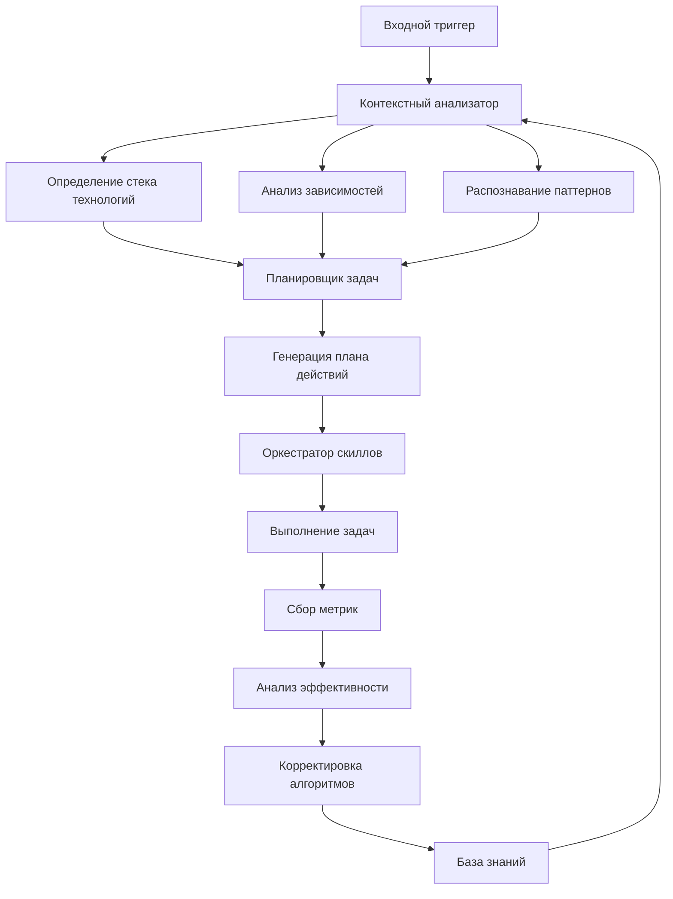

# Cognitive Automation Agent (CAA)

## Возможности

### Интеллектуальные функции
* **Контекстное понимание**: Анализ технологического стека, зависимостей, архитектурных паттернов
* **Проактивное планирование**: Предсказание задач до их явного запроса
* **Автономное выполнение**: Самостоятельное решение проблем с механизмом отката
* **Самообучение**: Улучшение алгоритмов на основе метрик эффективности
* **Экосистемная интеграция**: Работа с Git, CI/CD, мониторингом, облачными сервисами

### Автоматические триггеры
* Открытие проекта в VS Code
* Клонирование репозитория
* Изменение конфигурационных файлов
* Обнаружение проблем в коде
* Запуск тестов
* Коммиты в Git

## Архитектура агента



## Порядок выполнения задач

### Фаза 1: Контекстный анализ (автоматически)
1. **Сканирование проекта**: Определение языков, фреймворков, инструментов
2. **Анализ зависимостей**: Выявление уязвимостей, устаревших пакетов
3. **Архитектурный аудит**: Проверка соответствия best practices
4. **Исторический анализ**: Изучение Git истории для выявления паттернов

### Фаза 2: Интеллектуальное планирование
1. **Предсказание задач**: На основе контекста и исторических данных
2. **Расчет приоритетов**: Бизнес-логика + техническая критичность
3. **Оптимизация последовательности**: Минимизация времени выполнения
4. **Распределение ресурсов**: Параллельное выполнение где возможно

### Фаза 3: Автономное выполнение
1. **Параллельное выполнение**: Запуск независимых задач одновременно
2. **Мониторинг прогресса**: Отслеживание статуса выполнения
3. **Обработка ошибок**: Автоматическое исправление или откат
4. **Валидация результатов**: Проверка корректности выполненных действий

### Фаза 4: Самообучение и адаптация
1. **Сбор метрик**: Эффективность, точность, время выполнения
2. **Анализ результатов**: Выявление успешных и неудачных стратегий
3. **Корректировка алгоритмов**: Обновление моделей предсказания
4. **Обновление базы знаний**: Добавление новых паттернов

## Команды для автоматизации

### Автоматическая настройка проекта
```bash
# Полная автоматизация при открытии проекта
python -m agents.cognitive_agent --trigger=project_open --autonomy=high

# Интеллектуальное сканирование
python -m agents.scanner --mode=deep --output=report.json

# Проактивная оптимизация
python -m agents.optimizer --areas=performance,security,maintenance
```

### Интеграция с Git (автоматические хуки)
```bash
# pre-commit: автоматические проверки
#!/bin/bash
python -m agents.hooks.pre_commit "$@"

# post-merge: обновление после слияния
#!/bin/bash
python -m agents.hooks.post_merge "$@"

# pre-push: валидация перед отправкой
#!/bin/bash
python -m agents.hooks.pre_push "$@"
```

### Мониторинг и самообучение
```bash
# Сбор метрик производительности
python -m agents.metrics.collect --interval=300

# Анализ эффективности агента
python -m agents.learning.analyze --period=7d

# Обновление моделей предсказания
python -m agents.models.retrain --data=metrics/latest.json
```

## Конфигурация автономности

```yaml
# .agents/config/autonomy.yaml
autonomy_levels:
  high:
    approval_required: false
    allowed_actions:
      - dependency_updates
      - code_formatting
      - test_execution
      - security_fixes
      - performance_optimization
    risk_tolerance: medium

  medium:
    approval_required: true
    allowed_actions:
      - dependency_updates
      - code_formatting
      - test_execution
    risk_tolerance: low

  low:
    approval_required: true
    allowed_actions:
      - code_formatting
    risk_tolerance: very_low

trusted_patterns:
  - "*.test.*"  # Автоматическое выполнение тестов
  - "requirements*.txt"  # Автоматическое обновление зависимостей
  - ".github/workflows/*"  # Автоматическая настройка CI/CD
```

## Интеграции

### Поддерживаемые системы
- **Системы контроля версий**: Git, SVN
- **CI/CD**: GitHub Actions, GitLab CI, Jenkins, CircleCI
- **Мониторинг**: Prometheus, Grafana, Sentry, Datadog
- **Облачные платформы**: AWS, Azure, Google Cloud, DigitalOcean
- **Системы управления проектами**: Jira, Trello, Asana, Linear
- **Коммуникации**: Slack, Microsoft Teams, Discord, Telegram

### Автоматическая настройка интеграций
```python
# Автоматическое обнаружение и настройка интеграций
def setup_integrations(project_context):
    if detect_github():
        setup_github_actions()
    if detect_docker():
        setup_docker_integration()
    if detect_kubernetes():
        setup_k8s_monitoring()
```

## Требования

### Обязательные
* Python 3.9+
* Git 2.30+
* VS Code 1.85+ или IDE с поддержкой Language Server Protocol
* Доступ к интернету для загрузки моделей и обновлений

### Рекомендуемые
* GitHub Copilot или аналогичный AI-ассистент
* 8+ GB RAM для работы моделей ML
* SSD для быстрого анализа больших проектов
* Docker для изолированного выполнения задач

## Рекомендации по использованию

### Для максимальной автономности
1. Настройте уровень автономности `high` в конфигурации
2. Определите доверенные паттерны для автоматического выполнения
3. Настройте интеграции с внешними системами
4. Регулярно обновляйте модели машинного обучения

### Для безопасности
1. Начинайте с уровня автономности `low`
2. Внимательно проверяйте доверенные паттерны
3. Используйте механизм отката для критических операций
4. Регулярно просматривайте логи действий агента

### Для производительности
1. Настройте параллельное выполнение задач
2. Используйте кэширование результатов анализа
3. Оптимизируйте частоту сканирования проекта
4. Мониторьте использование ресурсов

## Метрики и мониторинг

### Ключевые показатели эффективности
- **Автономность**: % задач, выполненных без вмешательства
- **Точность**: % успешно выполненных задач
- **Эффективность**: Среднее время выполнения задачи
- **Самообучение**: Улучшение показателей за период
- **Интеграция**: Количество активных интеграций

### Дашборды мониторинга
```yaml
dashboards:
  - name: "Autonomy Dashboard"
    metrics:
      - autonomy_rate
      - task_success_rate
      - average_execution_time

  - name: "Learning Progress"
    metrics:
      - model_accuracy
      - pattern_recognition_rate
      - error_reduction_rate

  - name: "Integration Health"
    metrics:
      - active_integrations
      - integration_success_rate
      - sync_latency
```

## Устранение неполадок

### Частые проблемы и решения
1. **Агент не активируется**: Проверьте триггеры в конфигурации
2. **Низкая автономность**: Увеличьте доверенные паттерны
3. **Ошибки выполнения**: Проверьте логи в `.agents/logs/`
4. **Медленная работа**: Оптимизируйте настройки параллелизма

### Логи и отладка
```bash
# Просмотр логов агента
tail -f .agents/logs/cognitive_agent.log

# Детальная отладка
python -m agents.cognitive_agent --debug --log-level=DEBUG

# Генерация отчета о проблемах
python -m agents.diagnostics.generate_report
```

## Развитие и расширение

### Добавление новых скиллов
1. Создайте папку в `.agents/skills/`
2. Реализуйте логику в Python
3. Добавьте конфигурацию в `config/skills.yaml`
4. Протестируйте на изолированном проекте

### Обучение новых моделей
1. Соберите данные в `.agents/data/training/`
2. Обучите модель с помощью `agents.models.train`
3. Валидируйте на тестовом наборе
4. Разверните в продакшн

---

**Примечание**: Агент предназначен для максимальной автоматизации рутинных задач.
Для критически важных операций рекомендуется использовать уровень автономности `medium`
с обязательным подтверждением или предварительным тестированием на staging-окружении.
