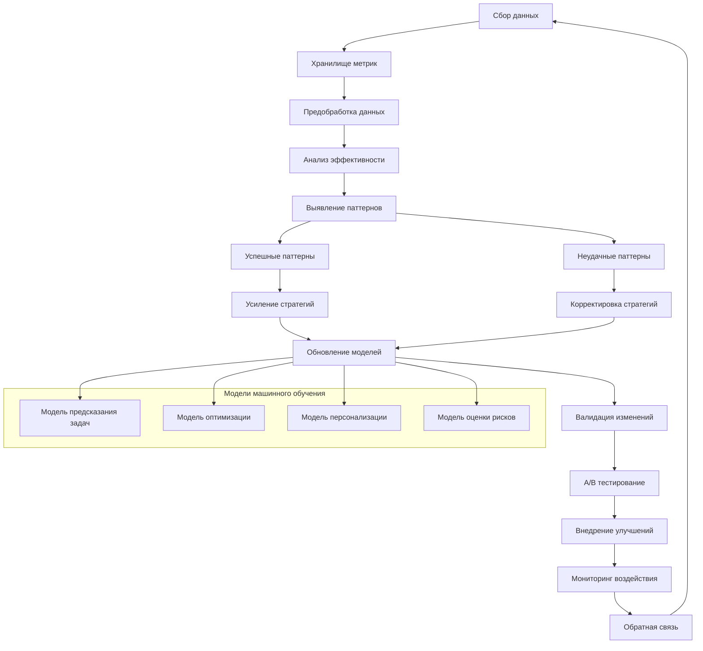

# Learning System Skill

## Возможности

### Сбор и анализ данных
* **Метрики выполнения**: Время, успешность, ресурсы, эффективность задач
* **Контекстные данные**: Условия выполнения, состояние системы, внешние факторы
* **Пользовательская обратная связь**: Явные и неявные оценки работы агента
* **Исторические паттерны**: Анализ успешных и неудачных стратегий

### Машинное обучение и оптимизация
* **Адаптивные алгоритмы**: Корректировка параметров на основе результатов
* **Предсказательные модели**: Улучшение точности предсказания задач
* **Оптимизация планирования**: Улучшение последовательности и приоритизации
* **Персонализация**: Адаптация к стилю работы конкретного пользователя/проекта

### Непрерывное улучшение
* **Автоматическое обновление моделей**: Регулярное переобучение на новых данных
* **A/B тестирование стратегий**: Сравнение разных подходов к решению задач
* **Генерация новых паттернов**: Обнаружение и внедрение эффективных стратегий
* **Удаление неэффективного**: Фазовый отказ от непродуктивных подходов

## Архитектура системы самообучения



## Алгоритм самообучения

### Шаг 1: Сбор и агрегация данных
```python
def collect_metrics(task_execution_data, context_data, user_feedback):
    # 1. Метрики выполнения задач
    execution_metrics = extract_execution_metrics(task_execution_data)

    # 2. Контекстные метрики
    context_metrics = extract_context_metrics(context_data)

    # 3. Метрики пользовательской обратной связи
    feedback_metrics = extract_feedback_metrics(user_feedback)

    # 4. Системные метрики
    system_metrics = collect_system_metrics()

    return {
        "execution": execution_metrics,
        "context": context_metrics,
        "feedback": feedback_metrics,
        "system": system_metrics,
        "timestamp": datetime.now(),
        "session_id": generate_session_id()
    }
```

### Шаг 2: Анализ эффективности
```python
def analyze_effectiveness(metrics_data, historical_data):
    # 1. Расчет ключевых показателей эффективности
    kpis = calculate_kpis(metrics_data)

    # 2. Сравнение с историческими данными
    trends = analyze_trends(metrics_data, historical_data)

    # 3. Выявление корреляций
    correlations = find_correlations(metrics_data)

    # 4. Анализ причинно-следственных связей
    causality = analyze_causality(metrics_data)

    # 5. Оценка удовлетворенности пользователя
    user_satisfaction = assess_user_satisfaction(metrics_data["feedback"])

    return {
        "kpis": kpis,
        "trends": trends,
        "correlations": correlations,
        "causality": causality,
        "user_satisfaction": user_satisfaction,
        "overall_effectiveness": calculate_overall_effectiveness(kpis, user_satisfaction)
    }
```

### Шаг 3: Выявление паттернов
```python
def identify_patterns(effectiveness_analysis, historical_patterns):
    # 1. Кластеризация успешных выполнений
    successful_clusters = cluster_successful_executions(effectiveness_analysis)

    # 2. Выявление общих характеристик успешных задач
    success_patterns = extract_success_patterns(successful_clusters)

    # 3. Анализ неудачных выполнений
    failure_analysis = analyze_failures(effectiveness_analysis)

    # 4. Выявление паттернов неудач
    failure_patterns = extract_failure_patterns(failure_analysis)

    # 5. Обновление базы знаний паттернов
    updated_patterns = update_pattern_database(
        historical_patterns,
        success_patterns,
        failure_patterns
    )

    return {
        "success_patterns": success_patterns,
        "failure_patterns": failure_patterns,
        "updated_patterns": updated_patterns,
        "pattern_confidence": calculate_pattern_confidence(success_patterns, failure_patterns)
    }
```

### Шаг 4: Корректировка алгоритмов
```python
def adjust_algorithms(identified_patterns, current_algorithms):
    adjustments = {}

    # 1. Корректировка модели предсказания задач
    if "prediction_improvements" in identified_patterns["success_patterns"]:
        adjustments["prediction_model"] = adjust_prediction_model(
            current_algorithms["prediction_model"],
            identified_patterns["success_patterns"]["prediction_improvements"]
        )

    # 2. Корректировка планировщика задач
    if "scheduling_improvements" in identified_patterns["success_patterns"]:
        adjustments["scheduler"] = adjust_scheduler(
            current_algorithms["scheduler"],
            identified_patterns["success_patterns"]["scheduling_improvements"]
        )

    # 3. Корректировка оптимизатора ресурсов
    if "resource_improvements" in identified_patterns["success_patterns"]:
        adjustments["resource_optimizer"] = adjust_resource_optimizer(
            current_algorithms["resource_optimizer"],
            identified_patterns["success_patterns"]["resource_improvements"]
        )

    # 4. Устранение причин неудач
    for failure_pattern in identified_patterns["failure_patterns"]:
        adjustments = apply_failure_corrections(adjustments, failure_pattern)

    return {
        "adjustments": adjustments,
        "expected_improvement": estimate_improvement(adjustments),
        "validation_required": check_validation_requirements(adjustments)
    }
```

### Шаг 5: Валидация и внедрение
```python
def validate_and_deploy(algorithm_adjustments, current_system):
    # 1. Создание тестового окружения
    test_environment = create_test_environment(current_system)

    # 2. A/B тестирование изменений
    ab_test_results = run_ab_tests(test_environment, algorithm_adjustments)

    # 3. Статистическая значимость улучшений
    statistical_significance = calculate_statistical_significance(ab_test_results)

    # 4. Принятие решения о внедрении
    deployment_decision = make_deployment_decision(
        ab_test_results,
        statistical_significance,
        algorithm_adjustments["expected_improvement"]
    )

    # 5. Постепенное внедрение (canary deployment)
    if deployment_decision["deploy"]:
        deployment = deploy_gradually(
            algorithm_adjustments["adjustments"],
            deployment_decision["deployment_strategy"]
        )
    else:
        deployment = {"deployed": False, "reason": deployment_decision["reason"]}

    return {
        "ab_test_results": ab_test_results,
        "statistical_significance": statistical_significance,
        "deployment_decision": deployment_decision,
        "deployment": deployment,
        "rollback_plan": create_rollback_plan(algorithm_adjustments)
    }
```

## Формат данных обучения

### JSON метрики выполнения
```json
{
  "session_id": "session_123456",
  "timestamp": "2024-01-01T12:00:00Z",
  "task_execution": {
    "task_id": "task_001",
    "task_type": "dependency_update",
    "start_time": "2024-01-01T11:55:00Z",
    "end_time": "2024-01-01T11:57:30Z",
    "duration_seconds": 150,
    "success": true,
    "error_message": null,
    "resources_used": {
      "cpu_percent": 45.2,
      "memory_mb": 312.5,
      "disk_mb": 45.8,
      "network_mb": 12.3
    },
    "auto_approval": true,
    "rollback_attempted": false,
    "user_intervention": false
  },
  "context": {
    "project_type": "web_application",
    "tech_stack": ["python", "fastapi", "react", "postgresql"],
    "time_of_day": "morning",
    "system_load": "medium",
    "network_condition": "good"
  },
  "user_feedback": {
    "explicit_rating": 4.5,
    "implicit_feedback": {
      "time_saved_minutes": 15,
      "errors_prevented": 2,
      "satisfaction_indicators": ["no_complaints", "continued_usage"]
    },
    "manual_override": false,
    "additional_comments": null
  },
  "effectiveness_metrics": {
    "time_saved_vs_manual": 0.75,
    "accuracy": 0.95,
    "resource_efficiency": 0.82,
    "user_satisfaction_score": 0.88,
    "overall_effectiveness": 0.85
  }
}
```

### JSON паттерны обучения
```json
{
  "pattern_id": "pattern_789012",
  "discovered_at": "2024-01-01T12:00:00Z",
  "pattern_type": "success",
  "confidence": 0.92,
  "occurrences": 47,
  "conditions": {
    "task_type": "dependency_update",
    "project_type": "web_application",
    "time_of_day": "morning",
    "system_load": "low_to_medium",
    "dependencies_count": "< 50"
  },
  "actions": {
    "algorithm": "incremental_update",
    "parameters": {
      "batch_size": 5,
      "verification_enabled": true,
      "rollback_ready": true
    },
    "resources": {
      "max_cpu": 60,
      "max_memory": "512MB",
      "timeout": "300s"
    }
  },
  "results": {
    "success_rate": 0.98,
    "average_time_saved": "12.5 minutes",
    "user_satisfaction": 0.94,
    "resource_efficiency": 0.89
  },
  "applicability": {
    "similar_tasks": ["package_installation", "library_update"],
    "similar_projects": ["api_service", "microservice"],
    "exclusions": ["critical_production", "legacy_systems"]
  }
}
```

## Команды для использования

### Автоматическое самообучение
```bash
# Запуск полного цикла самообучения
python -m agents.learning --full-cycle --data-dir=apps/cognitive-agent/data/ --output=learning_report.json

# Инкрементальное обучение на новых данных
python -m agents.learning --incremental --new-data=latest_metrics.json --update-models

# Обучение с определенной целью
python -m agents.learning --target=prediction_accuracy --goal=0.95 --iterations=100
```

### Мониторинг и анализ
```bash
# Анализ эффективности агента
python -m agents.learning.analyze --period=7d --metrics=all --output=effectiveness_report.html

# Выявление паттернов в исторических данных
python -m agents.learning.patterns --data-dir=apps/cognitive-agent/data/historical/ --min-confidence=0.8

# A/B тестирование новых алгоритмов
python -m agents.learning.ab_test --algorithm-a=current --algorithm-b=proposed --duration=24h
```

### Управление моделями
```bash
# Обучение новых моделей
python -m agents.learning.train --model=task_predictor --data=training_data.json --output=model.pkl

# Валидация существующих моделей
python -m agents.learning.validate --model=model.pkl --test-data=test_data.json --threshold=0.85

# Экспорт и импорт моделей
python -m agents.learning.export --model=model.pkl --format=onnx --output=model.onnx
python -m agents.learning.import --model-file=improved_model.pkl --deploy
```

## Конфигурация

### Параметры обучения
```yaml
# apps/cognitive-agent/config/learning.yaml
learning_parameters:
  learning_rate: adaptive
  min_data_points: 100
  validation_split: 0.2
  test_split: 0.1

  # Скорость обучения для разных компонентов
  rates:
    prediction_model: 0.01
    scheduler: 0.005
    resource_optimizer: 0.008
    risk_assessor: 0.003

  # Критерии остановки обучения
  stopping_criteria:
    max_iterations: 1000
    min_improvement: 0.001
    patience: 10
    timeout_hours: 24

# Сбор данных
data_collection:
  enabled: true
  storage: "apps/cognitive-agent/data/"
  retention_days: 365
  compression: true

  # Какие данные собирать
  collect:
    execution_metrics: true
    context_data: true
    user_feedback: true
    system_metrics: true

  # Частота сбора
  frequency:
    task_completion: true
    hourly_aggregate: true
    daily_summary: true
    weekly_analysis: true

# Анализ эффективности
effectiveness_analysis:
  kpis:
    - name: "task_success_rate"
      target: 0.95
      weight: 0.3

    - name: "time_efficiency"
      target: 0.85
      weight: 0.25

    - name: "resource_efficiency"
      target: 0.80
      weight: 0.20

    - name: "user_satisfaction"
      target: 0.90
      weight: 0.25

  # Тренды и аномалии
  trend_analysis:
    window_size: 30  # дней
    min_change_for_alert: 0.1
    anomaly_detection: true

  # Цели улучшения
  improvement_goals:
    monthly_improvement: 0.1  # 10%
    quarterly_goals:
      - "prediction_accuracy > 0.92"
      - "user_satisfaction > 0.88"
      - "resource_efficiency > 0.85"

# Внедрение улучшений
deployment:
  strategy: "canary"
  canary_percentage: 10
  evaluation_period: "24h"
  rollback_automatically: true

  # Критерии успешного внедрения
  success_criteria:
    - "success_rate_improvement > 0.02"
    - "no_regression_in_other_metrics"
    - "user_feedback_positive"

  # A/B тестирование
  ab_testing:
    enabled: true
    min_sample_size: 100
    confidence_level: 0.95
    multiple_testing_correction: true
```

## Интеграции

### С другими скиллами агента
```python
# Интеграция со сканером проекта
def integrate_with_scanner(scan_results):
    # Использование результатов сканирования для контекстуализации обучения
    learning_system.add_context(scan_results)

# Интеграция с планировщиком задач
def integrate_with_planner(task_execution_data):
    # Обучение на результатах выполнения планов
    learning_system.learn_from_execution(task_execution_data)

# Интеграция с исполнителем задач
def integrate_with_executor(execution_metrics):
    # Непрерывный сбор метрик выполнения
    learning_system.collect_metrics(execution_metrics)
```

### С внешними системами аналитики
```python
# Экспорт данных в системы аналитики
def export_to_analytics(learning_data, analytics_system):
    if analytics_system == "prometheus":
        export_to_prometheus(learning_data)
    elif analytics_system == "elasticsearch":
        export_to_elasticsearch(learning_data)
    elif analytics_system == "datadog":
        export_to_datadog(learning_data)

# Импорт лучших практик
def import_best_practices(external_sources):
    for source in external_sources:
        practices = fetch_best_practices(source)
        learning_system.incorporate_practices(practices)
```

## Расширение функциональности

### Добавление новых метрик
1. Создайте класс метрики в `apps/cognitive-agent/learning/metrics/`
2. Реализуйте методы сбора и расчета
3. Зарегистрируйте метрику в `config/metrics.yaml`
4. Определите цели и веса для метрики

### Кастомные алгоритмы обучения
```python
# Реализация кастомного алгоритма обучения
class CustomLearningAlgorithm:
    def __init__(self, parameters):
        self.parameters = parameters

    def learn(self, training_data):
        # Кастомная логика обучения
        self.model = train_custom_model(training_data, self.parameters)

    def adjust(self, feedback_data):
        # Корректировка на основе обратной связи
        self.model = adjust_model(self.model, feedback_data)

    def predict_improvement(self, changes):
        # Предсказание эффекта от изменений
        return predict_improvement_effect(self.model, changes)
```

### Плагины анализа паттернов
```python
# Плагин для специфичного анализа паттернов
class PatternAnalysisPlugin:
    def analyze(self, data, context):
        # Кастомный анализ паттернов
        patterns = custom_pattern_analysis(data, context)
        return patterns

    def validate(self, patterns):
        # Валидация обнаруженных паттернов
        return validate_patterns(patterns)

    def suggest_improvements(self, patterns):
        # Предложения по улучшению на основе паттернов
        return generate_improvement_suggestions(patterns)
```

## Мониторинг и метрики

### Ключевые метрики системы самообучения
- **Скорость обучения**: Улучшение показателей за единицу времени
- **Качество моделей**: Точность предсказаний и рекомендаций
- **Эффективность корректировок**: Улучшение после внедрения изменений
- **Стабильность**: Отсутствие регрессий при обновлениях
- **Адаптивность**: Способность адаптироваться к новым условиям

### Дашборд мониторинга
```yaml
learning_dashboard:
  metrics:
    - learning_progress
    - model_accuracy
    - improvement_rate
    - pattern_discovery
    - deployment_success

  alerts:
    - learning_stalled: "improvement < 0.01 for 7 days"
    - model_degradation: "accuracy_drop > 0.05"
    - pattern_confidence_low: "confidence < 0.7"
    - deployment_failure: "success_rate < 0.8"

  visualizations:
    - learning_curve: "improvement_over_time"
    - pattern_network: "discovered_patterns"
    - effectiveness_heatmap: "kpi_performance"
    - deployment_timeline: "change_history"
```

## Устранение неполадок

### Распространенные проблемы
1. **Медленное обучение**: Увеличьте learning rate или соберите больше данных
2. **Переобучение моделей**: Добавьте регуляризацию или увеличьте набор данных
3. **Нестабильные улучшения**: Увеличьте размер выборки для A/B тестов
4. **Конфликт паттернов**: Добавьте приоритизацию или контекстные правила

### Отладка
```bash
# Подробное логирование процесса обучения
python -m agents.learning --debug --log-level=DEBUG --output=debug_log.json

# Анализ качества данных
python -m agents.learning.analyze_data --data-dir=apps/cognitive-agent/data/ --quality-report

# Тестирование алгоритмов обучения
python -m agents.learning.test_algorithm --algorithm=custom_alg --test-set=test_data.json

# Валидация паттернов
python -m agents.learning.validate_patterns --patterns=discovered_patterns.json --threshold=0.8
```

---

**Примечание**: Система самообучения предназначена для непрерывного улучшения агента.
Для критически важных систем рекомендуется использовать консервативные настройки обучения
и тщательную валидацию всех изменений перед внедрением в production.
