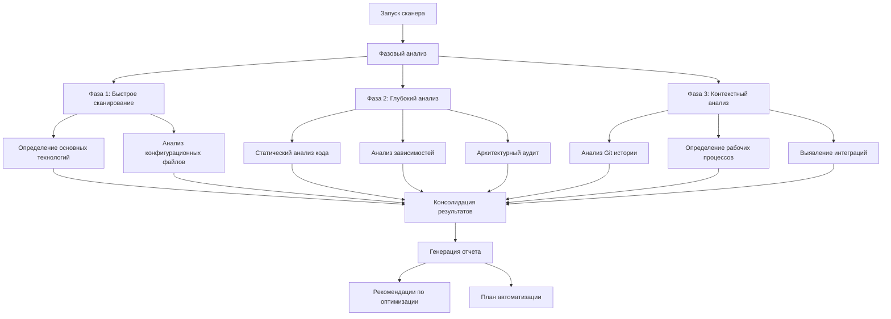

# Project Scanner Skill

## Возможности

### Автоматическое определение технологий
* **Языки программирования**: Python, JavaScript, TypeScript, Go, Java, C#, Rust и др.
* **Фреймворки**: Django, Flask, FastAPI, React, Vue, Angular, Spring, .NET Core
* **Базы данных**: PostgreSQL, MySQL, MongoDB, Redis, Elasticsearch
* **Инфраструктура**: Docker, Kubernetes, Terraform, Ansible
* **Инструменты**: Git, CI/CD, мониторинг, тестирование

### Глубокий анализ
* **Зависимости**: Анализ package.json, requirements.txt, pyproject.toml, go.mod
* **Архитектурные паттерны**: MVC, Microservices, Event-Driven, Serverless
* **Проблемы безопасности**: Уязвимости зависимостей, конфиденциальные данные
* **Производительность**: Медленные запросы, большие файлы, неоптимальные алгоритмы
* **Качество кода**: Соответствие стандартам, покрытие тестами, сложность

### Контекстное понимание
* **Бизнес-логика**: Анализ структуры проекта для понимания домена
* **Рабочие процессы**: Определение процессов разработки, тестирования, деплоя
* **Интеграции**: Выявление подключенных внешних сервисов и API
* **Исторические паттерны**: Анализ Git истории для выявления тенденций

## Архитектура сканера



## Алгоритм работы

### Шаг 1: Быстрое сканирование (5-10 секунд)
```python
def quick_scan(project_path):
    # 1. Определение основных языков по расширениям файлов
    languages = detect_languages_by_extensions(project_path)

    # 2. Поиск конфигурационных файлов
    config_files = find_config_files(project_path)

    # 3. Определение менеджеров зависимостей
    package_managers = detect_package_managers(config_files)

    # 4. Поиск Docker и инфраструктурных файлов
    infra_files = find_infrastructure_files(project_path)

    return {
        "languages": languages,
        "config_files": config_files,
        "package_managers": package_managers,
        "infrastructure": infra_files
    }
```

### Шаг 2: Глубокий анализ (30-60 секунд)
```python
def deep_analysis(project_path, quick_scan_results):
    # 1. Анализ зависимостей с проверкой уязвимостей
    dependencies = analyze_dependencies(project_path)

    # 2. Статический анализ кода
    code_quality = analyze_code_quality(project_path)

    # 3. Архитектурный аудит
    architecture = analyze_architecture(project_path)

    # 4. Анализ безопасности
    security = analyze_security(project_path)

    # 5. Анализ производительности
    performance = analyze_performance(project_path)

    return {
        "dependencies": dependencies,
        "code_quality": code_quality,
        "architecture": architecture,
        "security": security,
        "performance": performance
    }
```

### Шаг 3: Контекстный анализ (15-30 секунд)
```python
def contextual_analysis(project_path, previous_results):
    # 1. Анализ Git истории
    git_history = analyze_git_history(project_path)

    # 2. Определение рабочих процессов
    workflows = identify_workflows(project_path)

    # 3. Выявление интеграций
    integrations = detect_integrations(project_path)

    # 4. Понимание бизнес-домена
    business_domain = understand_business_domain(project_path)

    return {
        "git_history": git_history,
        "workflows": workflows,
        "integrations": integrations,
        "business_domain": business_domain
    }
```

## Формат отчета

### JSON отчет
```json
{
  "scan_id": "uuid",
  "timestamp": "2024-01-01T12:00:00Z",
  "project_info": {
    "name": "project-name",
    "path": "/path/to/project",
    "size": "150MB",
    "file_count": 1250
  },
  "technologies": {
    "languages": [
      {"name": "Python", "version": "3.11", "files": 450},
      {"name": "JavaScript", "version": "ES2022", "files": 300}
    ],
    "frameworks": [
      {"name": "FastAPI", "version": "0.104.0"},
      {"name": "React", "version": "18.2.0"}
    ],
    "databases": ["PostgreSQL", "Redis"],
    "infrastructure": ["Docker", "Kubernetes", "GitHub Actions"]
  },
  "dependencies": {
    "total": 145,
    "vulnerabilities": 3,
    "outdated": 12,
    "critical": [
      {"package": "requests", "version": "2.28.0", "issue": "CVE-2023-12345"}
    ]
  },
  "code_quality": {
    "test_coverage": 78.5,
    "complexity": "medium",
    "issues": {
      "critical": 2,
      "high": 15,
      "medium": 42,
      "low": 89
    }
  },
  "architecture": {
    "pattern": "Microservices",
    "services_count": 8,
    "communication": ["REST", "Message Queue"],
    "data_flow": "Event-Driven"
  },
  "recommendations": [
    {
      "priority": "high",
      "category": "security",
      "description": "Обновить requests до версии 2.31.0",
      "action": "dependency_update",
      "estimated_time": "5 minutes"
    },
    {
      "priority": "medium",
      "category": "performance",
      "description": "Добавить кэширование для часто запрашиваемых данных",
      "action": "code_optimization",
      "estimated_time": "2 hours"
    }
  ],
  "automation_plan": {
    "tasks": [
      {"id": 1, "description": "Установить недостающие зависимости", "skill": "dependency-manager"},
      {"id": 2, "description": "Настроить pre-commit hooks", "skill": "git-automation"},
      {"id": 3, "description": "Добавить мониторинг", "skill": "monitoring-setup"}
    ],
    "estimated_total_time": "3.5 hours",
    "autonomy_level": "high"
  }
}
```

## Команды для использования

### Автоматический запуск
```bash
# Автоматическое сканирование при открытии проекта
python -m agents.scanner --auto --output=scan_report.json

# Периодическое сканирование (каждые 6 часов)
python -m agents.scanner --schedule="0 */6 * * *" --daemon

# Сканирование при изменении файлов (inotify)
python -m agents.scanner --watch --trigger=file_change
```

### Ручной запуск
```bash
# Быстрое сканирование
python -m agents.scanner --mode=quick --format=json

# Полное сканирование с рекомендациями
python -m agents.scanner --mode=full --with-recommendations

# Сканирование определенной области
python -m agents.scanner --focus=security --output=security_report.html

# Сравнение с предыдущим сканированием
python -m agents.scanner --compare=previous_scan.json --output=diff_report.yaml
```

### Интеграция с CI/CD
```yaml
# GitHub Actions workflow
name: Project Scanner
on: [push, pull_request]
jobs:
  scan:
    runs-on: ubuntu-latest
    steps:
      - uses: actions/checkout@v4
      - name: Run Project Scanner
        run: |
          python -m agents.scanner --ci --output=scan_results.json
          python -m agents.scanner --validate --threshold=80
      - name: Upload results
        uses: actions/upload-artifact@v3
        with:
          name: scan-report
          path: scan_results.json
```

## Конфигурация

### Уровни сканирования
```yaml
# apps/cognitive-agent/config/scanner.yaml
scan_levels:
  quick:
    enabled: true
    timeout: 10s
    checks:
      - file_extensions
      - config_files
      - package_managers

  standard:
    enabled: true
    timeout: 60s
    checks:
      - dependencies
      - code_complexity
      - security_basics

  deep:
    enabled: true
    timeout: 300s
    checks:
      - architecture_analysis
      - performance_audit
      - historical_analysis
      - business_domain

triggers:
  project_open: true
  file_change: true
  git_commit: true
  schedule: "0 */6 * * *"  # Каждые 6 часов

output:
  formats: [json, yaml, html]
  directory: "apps/cognitive-agent/scans/"
  retention_days: 30
  compare_with_previous: true
```

### Настройки для разных типов проектов
```yaml
project_profiles:
  web_application:
    focus_areas:
      - frontend_frameworks
      - api_design
      - database_optimization
      - security_headers

  microservices:
    focus_areas:
      - service_discovery
      - inter_service_communication
      - distributed_tracing
      - circuit_breakers

  data_science:
    focus_areas:
      - data_pipelines
      - model_management
      - experiment_tracking
      - computational_resources

  infrastructure:
    focus_areas:
      - infrastructure_as_code
      - containerization
      - orchestration
      - monitoring
```

## Интеграции

### С другими скиллами агента
```python
# Автоматическая передача результатов сканирования другим скиллам
def distribute_scan_results(scan_results):
    # Планировщику задач для создания плана автоматизации
    task_planner.receive_scan(scan_results)

    # Системе самообучения для улучшения моделей
    learning_system.add_training_data(scan_results)

    # Интеграционному менеджеру для настройки внешних сервисов
    integration_manager.setup_integrations(scan_results)

    # Мониторингу для настройки дашбордов
    monitoring.setup_dashboards(scan_results)
```

### С внешними инструментами
- **Зависимости**: Integration with Snyk, Dependabot, Renovate
- **Безопасность**: Integration with Trivy, Bandit, Safety
- **Качество кода**: Integration with SonarQube, CodeClimate, Codacy
- **Производительность**: Integration with Lighthouse, WebPageTest
- **Инфраструктура**: Integration with Terraform Cloud, Pulumi

## Расширение функциональности

### Добавление новых детекторов
1. Создайте класс детектора в `apps/cognitive-agent/scanner/detectors/`
2. Реализуйте методы `detect()` и `analyze()`
3. Зарегистрируйте детектор в `config/detectors.yaml`
4. Протестируйте на различных проектах

### Кастомные правила анализа
```yaml
# apps/cognitive-agent/config/custom_rules.yaml
rules:
  - name: "no_hardcoded_secrets"
    pattern: "(password|secret|token|key)\\s*=\\s*['\"][^'\"]+['\"]"
    severity: "high"
    category: "security"
    message: "Обнаружены хардкодные секреты"

  - name: "large_file_warning"
    pattern: "file_size > 1000000"  # 1MB
    severity: "medium"
    category: "performance"
    message: "Файл превышает рекомендуемый размер"

  - name: "missing_error_handling"
    pattern: "try:\\s*[^\\n]*\\n\\s*except:"
    severity: "low"
    category: "code_quality"
    message: "Отсутствует специфичная обработка исключений"
```

## Производительность и оптимизация

### Кэширование результатов
```python
# Кэширование результатов сканирования для повторного использования
class ScanCache:
    def __init__(self, cache_dir="apps/cognitive-agent/cache/scans/"):
        self.cache_dir = cache_dir

    def get_cached_scan(self, project_hash):
        # Возвращает кэшированные результаты, если они актуальны
        pass

    def cache_scan(self, project_hash, scan_results):
        # Сохраняет результаты сканирования в кэш
        pass

    def is_cache_valid(self, project_hash, max_age_hours=24):
        # Проверяет актуальность кэша
        pass
```

### Инкрементальное сканирование
```python
# Сканирование только измененных файлов
def incremental_scan(project_path, previous_scan, changed_files):
    results = previous_scan.copy()

    for file in changed_files:
        if is_config_file(file):
            update_config_analysis(results, file)
        elif is_source_file(file):
            update_code_analysis(results, file)
        elif is_dependency_file(file):
            update_dependency_analysis(results, file)

    return results
```

## Мониторинг и метрики

### Ключевые метрики сканера
- **Время сканирования**: Среднее время выполнения
- **Точность определения**: % правильного определения технологий
- **Полнота анализа**: % проверенных аспектов проекта
- **Производительность**: Файлов/секунду
- **Эффективность рекомендаций**: % реализованных рекомендаций

### Дашборд мониторинга
```yaml
scanner_dashboard:
  metrics:
    - scan_duration
    - technologies_detected
    - issues_found
    - recommendations_generated
  alerts:
    - scan_timeout: "> 300s"
    - high_priority_issues: "> 10"
    - critical_vulnerabilities: "> 0"
```

## Устранение неполадок

### Распространенные проблемы
1. **Долгое сканирование**: Увеличьте timeout или используйте quick mode
2. **Неверное определение технологий**: Обновите детекторы или добавьте кастомные правила
3. **Пропущенные зависимости**: Проверьте поддержку менеджера пакетов
4. **Ложные срабатывания**: Настройте чувствительность правил

### Отладка
```bash
# Подробные логи сканирования
python -m agents.scanner --debug --log-level=DEBUG

# Тестирование отдельных детекторов
python -m agents.scanner.test_detector --detector=python_detector

# Валидация результатов
python -m agents.scanner.validate --scan-file=scan_results.json
```

---

**Примечание**: Сканер предназначен для полностью автономной работы.
Для критически важных проектов рекомендуется предварительное тестирование
на staging-окружении и настройка кастомных правил под специфику проекта.
