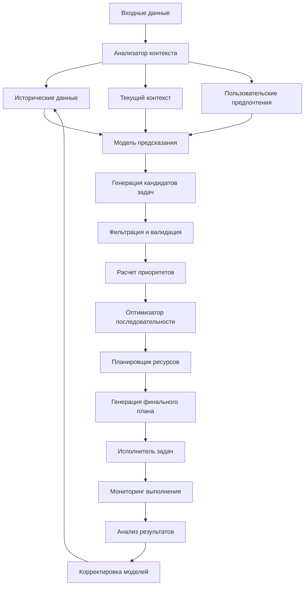

# Task Planner Skill

## Возможности

### Интеллектуальное предсказание задач
* **Контекстный анализ**: Определение необходимых задач на основе технологического стека
* **Историческое предсказание**: Использование паттернов из предыдущих проектов
* **Проактивное планирование**: Предсказание задач до их явного возникновения
* **Адаптивное обновление**: Корректировка плана при изменении контекста

### Оптимизация выполнения
* **Расчет приоритетов**: Бизнес-логика + техническая критичность
* **Параллельное планирование**: Выявление независимых задач для одновременного выполнения
* **Оптимизация ресурсов**: Распределение задач с учетом доступных ресурсов
* **Временное прогнозирование**: Оценка времени выполнения и дедлайнов

### Автономное управление
* **Динамическое перепланирование**: Адаптация к изменяющимся условиям
* **Обработка зависимостей**: Учет зависимостей между задачами
* **Механизм отката**: Планирование отката при неудачном выполнении
* **Балансировка нагрузки**: Равномерное распределение задач во времени

## Архитектура планировщика



## Алгоритм планирования

### Шаг 1: Анализ контекста
```python
def analyze_context(project_scan, historical_data, user_preferences):
    # 1. Извлечение технологического стека из сканирования
    tech_stack = extract_tech_stack(project_scan)

    # 2. Анализ исторических данных для похожих проектов
    similar_projects = find_similar_projects(historical_data, tech_stack)

    # 3. Учет пользовательских предпочтений и ограничений
    constraints = apply_user_constraints(user_preferences)

    # 4. Определение бизнес-контекста и целей
    business_context = infer_business_context(project_scan)

    return {
        "tech_stack": tech_stack,
        "similar_projects": similar_projects,
        "constraints": constraints,
        "business_context": business_context
    }
```

### Шаг 2: Генерация кандидатов задач
```python
def generate_task_candidates(context_analysis):
    candidates = []

    # 1. Задачи на основе технологического стека
    tech_tasks = generate_tech_based_tasks(context_analysis["tech_stack"])
    candidates.extend(tech_tasks)

    # 2. Задачи из исторических паттернов
    historical_tasks = extract_tasks_from_history(context_analysis["similar_projects"])
    candidates.extend(historical_tasks)

    # 3. Проактивные задачи (предсказание будущих проблем)
    proactive_tasks = predict_proactive_tasks(context_analysis)
    candidates.extend(proactive_tasks)

    # 4. Задачи на основе бизнес-контекста
    business_tasks = generate_business_tasks(context_analysis["business_context"])
    candidates.extend(business_tasks)

    return deduplicate_tasks(candidates)
```

### Шаг 3: Расчет приоритетов
```python
def calculate_priorities(task_candidates, context_analysis):
    prioritized_tasks = []

    for task in task_candidates:
        # 1. Базовый приоритет на основе категории
        base_priority = get_base_priority(task["category"])

        # 2. Корректировка на основе бизнес-критичности
        business_criticality = assess_business_criticality(task, context_analysis["business_context"])
        priority = adjust_for_business_criticality(base_priority, business_criticality)

        # 3. Корректировка на основе технической срочности
        technical_urgency = assess_technical_urgency(task, context_analysis["tech_stack"])
        priority = adjust_for_technical_urgency(priority, technical_urgency)

        # 4. Учет пользовательских предпочтений
        user_preference = get_user_preference(task, context_analysis["constraints"])
        priority = adjust_for_user_preference(priority, user_preference)

        prioritized_tasks.append({
            **task,
            "priority": priority,
            "priority_score": calculate_priority_score(priority),
            "business_criticality": business_criticality,
            "technical_urgency": technical_urgency
        })

    return sorted(prioritized_tasks, key=lambda x: x["priority_score"], reverse=True)
```

### Шаг 4: Оптимизация последовательности
```python
def optimize_sequence(prioritized_tasks, available_resources):
    # 1. Выявление зависимостей между задачами
    dependencies = identify_dependencies(prioritized_tasks)

    # 2. Группировка независимых задач для параллельного выполнения
    parallel_groups = group_parallel_tasks(prioritized_tasks, dependencies)

    # 3. Распределение по ресурсам
    resource_allocation = allocate_resources(parallel_groups, available_resources)

    # 4. Создание временного графика
    schedule = create_schedule(resource_allocation, prioritized_tasks)

    # 5. Оптимизация для минимизации общего времени
    optimized_schedule = optimize_schedule(schedule)

    return {
        "tasks": prioritized_tasks,
        "dependencies": dependencies,
        "parallel_groups": parallel_groups,
        "resource_allocation": resource_allocation,
        "schedule": optimized_schedule,
        "estimated_total_time": calculate_total_time(optimized_schedule)
    }
```

## Формат плана задач

### JSON план задач
```json
{
  "plan_id": "plan_123456",
  "generated_at": "2024-01-01T12:00:00Z",
  "context_hash": "abc123def456",
  "estimated_total_time": "3.5 hours",
  "autonomy_level": "high",
  "tasks": [
    {
      "id": "task_001",
      "description": "Установить недостающие зависимости Python",
      "category": "dependencies",
      "priority": "critical",
      "priority_score": 95,
      "estimated_time": "15 minutes",
      "dependencies": [],
      "skills_required": ["dependency-manager"],
      "resources_required": {
        "cpu": "low",
        "memory": "512MB",
        "disk": "100MB",
        "network": true
      },
      "auto_approval": true,
      "rollback_plan": {
        "enabled": true,
        "strategy": "restore_backup",
        "backup_location": ".agents/backups/deps_001/"
      }
    },
    {
      "id": "task_002",
      "description": "Настроить pre-commit hooks для автоматического форматирования",
      "category": "code_quality",
      "priority": "high",
      "priority_score": 85,
      "estimated_time": "30 minutes",
      "dependencies": ["task_001"],
      "skills_required": ["git-automation", "code-formatter"],
      "resources_required": {
        "cpu": "low",
        "memory": "256MB",
        "disk": "50MB",
        "network": false
      },
      "auto_approval": true,
      "rollback_plan": {
        "enabled": true,
        "strategy": "remove_hooks",
        "backup_location": ".git/hooks.backup/"
      }
    },
    {
      "id": "task_003",
      "description": "Добавить базовую конфигурацию мониторинга",
      "category": "monitoring",
      "priority": "medium",
      "priority_score": 70,
      "estimated_time": "2 hours",
      "dependencies": ["task_001"],
      "skills_required": ["monitoring-setup"],
      "resources_required": {
        "cpu": "medium",
        "memory": "1GB",
        "disk": "200MB",
        "network": true
      },
      "auto_approval": false,
      "approval_reason": "Требует внешних интеграций",
      "rollback_plan": {
        "enabled": true,
        "strategy": "remove_configs",
        "backup_location": ".agents/backups/monitoring_003/"
      }
    }
  ],
  "parallel_execution": {
    "groups": [
      {
        "group_id": "group_1",
        "tasks": ["task_001"],
        "estimated_time": "15 minutes",
        "resources": {"cpu": "low", "memory": "512MB"}
      },
      {
        "group_id": "group_2",
        "tasks": ["task_002", "task_003"],
        "estimated_time": "2 hours",
        "resources": {"cpu": "medium", "memory": "1.25GB"}
      }
    ],
    "total_parallel_time": "2 hours 15 minutes"
  },
  "resource_allocation": {
    "total_cpu": "medium",
    "total_memory": "1.75GB",
    "peak_usage": "2 hours",
    "optimization_score": 87
  },
  "risk_assessment": {
    "overall_risk": "low",
    "high_risk_tasks": [],
    "mitigation_plan": "Автоматический откат для всех задач"
  }
}
```

## Команды для использования

### Автоматическое планирование
```bash
# Полное автоматическое планирование на основе сканирования
python -m agents.planner --auto --scan-results=scan.json --output=plan.json

# Планирование с определенным уровнем автономности
python -m agents.planner --autonomy=high --output=high_autonomy_plan.yaml

# Инкрементальное планирование (добавление новых задач)
python -m agents.planner --incremental --previous-plan=previous_plan.json --changes=changes.json
```

### Ручное планирование с настройками
```bash
# Планирование с определенными ограничениями
python -m agents.planner --constraints='{"max_time": "4h", "max_parallel": 3}' --output=constrained_plan.json

# Планирование для определенной категории задач
python -m agents.planner --categories=security,performance --output=security_perf_plan.json

# Планирование с использованием определенной модели
python -m agents.planner --model=ml_based --training-data=historical_data.json
```

### Мониторинг и управление выполнением
```bash
# Запуск выполнения плана
python -m agents.planner --execute --plan=plan.json --monitor

# Мониторинг выполнения в реальном времени
python -m agents.planner --monitor --plan=plan.json --refresh=5

# Приостановка и возобновление выполнения
python -m agents.planner --pause --plan=plan.json
python -m agents.planner --resume --plan=plan.json

# Откат выполнения плана
python -m agents.planner --rollback --plan=plan.json --to-checkpoint=checkpoint_2
```

## Конфигурация

### Модели планирования
```yaml
# .agents/config/planner.yaml
planning_models:
  ml_based:
    enabled: true
    training_data: ".agents/data/training/planner/"
    model_path: ".agents/models/planner/ml_model.pkl"
    retrain_schedule: "0 3 * * 0"  # Каждое воскресенье в 3:00
    confidence_threshold: 0.7

  rule_based:
    enabled: true
    rules_directory: ".agents/config/planner_rules/"
    default_rules: ["tech_stack_rules", "security_rules", "performance_rules"]

  hybrid:
    enabled: true
    ml_weight: 0.6
    rule_weight: 0.4
    fallback_to_rules: true

# Приоритеты и веса
priority_calculation:
  base_weights:
    security: 1.0
    production_issues: 0.9
    performance: 0.8
    dependencies: 0.7
    code_quality: 0.6
    documentation: 0.5
    refactoring: 0.4
    optimization: 0.3

  adjustment_factors:
    business_criticality: 1.5
    technical_urgency: 1.3
    user_preference: 1.2
    resource_availability: 0.8
    time_constraints: 0.9

# Оптимизация
optimization:
  goals:
    - minimize_total_time
    - maximize_parallelization
    - balance_resource_usage
    - minimize_risk

  constraints:
    max_parallel_tasks: 5
    max_memory_mb: 2048
    max_cpu_percent: 80
    max_disk_mb: 500

  algorithms:
    schedule_optimization: "genetic_algorithm"  # genetic_algorithm, simulated_annealing, greedy
    resource_allocation: "bin_packing"
    dependency_resolution: "topological_sort"

# Автономность
autonomy_settings:
  auto_approval_threshold: 0.8  # Порог для автоматического утверждения
  risk_tolerance_levels:
    very_low: 0.3
    low: 0.5
    medium: 0.7
    high: 0.9

  trusted_patterns:
    - "*.test.*"
    - "dependency_update"
    - "code_formatting"
    - "security_patch"

  require_approval_for:
    - "production_deployment"
    - "database_migration"
    - "critical_security_change"
    - "major_refactoring"
```

## Интеграции

### С другими скиллами агента
```python
# Интеграция со сканером проекта
def integrate_with_scanner(scan_results):
    # Использование результатов сканирования для планирования
    plan = generate_plan_from_scan(scan_results)
    return plan

# Интеграция с системой самообучения
def integrate_with_learning(task_execution_results):
    # Обучение моделей на основе результатов выполнения
    learning_system.update_models(task_execution_results)

# Интеграция с исполнителем задач
def integrate_with_executor(plan):
    # Передача плана на выполнение
    executor.execute_plan(plan)
    # Мониторинг выполнения
    monitor = executor.monitor_execution(plan["plan_id"])
    return monitor
```

### С внешними системами управления проектами
```python
# Синхронизация с Jira
def sync_with_jira(plan):
    jira_tasks = convert_plan_to_jira_tasks(plan)
    jira_client.create_tasks(jira_tasks)

# Синхронизация с Trello
def sync_with_trello(plan):
    trello_cards = convert_plan_to_trello_cards(plan)
    trello_client.create_cards(trello_cards)

# Экспорт в различные форматы
def export_plan(plan, format):
    if format == "gantt":
        return generate_gantt_chart(plan)
    elif format == "markdown":
        return generate_markdown_report(plan)
    elif format == "csv":
        return generate_csv_timeline(plan)
```

## Расширение функциональности

### Добавление новых правил планирования
1. Создайте файл правил в `.agents/config/planner_rules/`
2. Реализуйте логику обнаружения и генерации задач
3. Зарегистрируйте правило в `config/planner_rules.yaml`
4. Протестируйте на различных проектах

### Кастомные модели предсказания
```python
# Реализация кастомной модели предсказания задач
class CustomPredictionModel:
    def __init__(self, model_path):
        self.model = load_model(model_path)

    def predict_tasks(self, context):
        # Кастомная логика предсказания
        predictions = self.model.predict(context)
        return convert_predictions_to_tasks(predictions)

    def train(self, training_data):
        # Обучение модели на исторических данных
        self.model.fit(training_data)
        save_model(self.model, self.model_path)
```

### Плагины оптимизации
```python
# Плагин для специфичной оптимизации
class CustomOptimizationPlugin:
    def optimize_schedule(self, schedule, constraints):
        # Кастомная логика оптимизации
        optimized = custom_optimization_algorithm(schedule, constraints)
        return optimized

    def validate(self, schedule):
        # Валидация оптимизированного расписания
        return check_constraints(schedule)
```

## Мониторинг и метрики

### Ключевые метрики планировщика
- **Точность предсказания**: % правильно предсказанных задач
- **Эффективность планирования**: Оптимальность последовательности задач
- **Время планирования**: Среднее время генерации плана
- **Качество плана**: Оценка плана по multiple критериям
- **Адаптивность**: Способность корректировать план при изменениях

### Дашборд мониторинга
```yaml
planner_dashboard:
  metrics:
    - prediction_accuracy
    - planning_efficiency
    - plan_execution_rate
    - resource_utilization
    - schedule_adherence

  alerts:
    - low_prediction_accuracy: "< 70%"
    - planning_timeout: "> 60s"
    - high_plan_rejection: "> 20%"
    - resource_overallocation: "> 90%"

  visualizations:
    - gantt_chart: "plan_schedule"
    - resource_heatmap: "resource_allocation"
    - dependency_graph: "task_dependencies"
    - priority_distribution: "task_priorities"
```

## Устранение неполадок

### Распространенные проблемы
1. **Долгое планирование**: Упростите контекст или используйте quick mode
2. **Неточные предсказания**: Обновите тренировочные данные или правила
3. **Неоптимальные планы**: Настройте параметры оптимизации
4. **Конфликты ресурсов**: Увеличьте доступные ресурсы или ограничьте параллелизм

### Отладка
```bash
# Подробное логирование процесса планирования
python -m agents.planner --debug --log-level=DEBUG --output=debug_plan.json

# Валидация правил планирования
python -m agents.planner.validate_rules --rules-dir=.agents/config/planner_rules/

# Тестирование моделей предсказания
python -m agents.planner.test_model --model=ml_based --test-data=test_data.json

# Анализ качества плана
python -m agents.planner.analyze --plan=plan.json --metrics=all
```

---

**Примечание**: Планировщик предназначен для полностью автономной работы.
Для критически важных проектов рекомендуется начать с уровня автономности `medium`
и постепенно повышать его по мере накопления доверия к системе.
