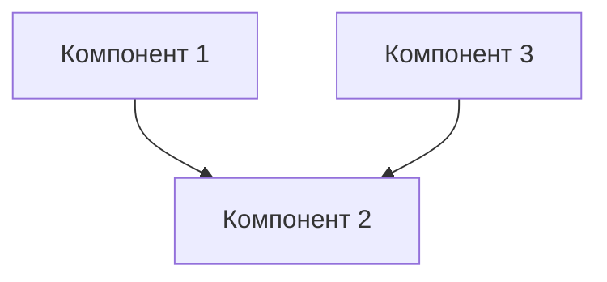

# Шаблон ARCHITECTURE.md

## Обзор

Краткое описание архитектуры проекта и ее назначения.

## Архитектурные принципы

### Принцип 1
Описание принципа и его реализации.

### Принцип 2
Описание принципа и его реализации.

### Принцип 3
Описание принципа и его реализации.

## Компоненты системы

### Компонент 1
Описание компонента, его функциональности и интерфейсов.

### Компонент 2
Описание компонента, его функциональности и интерфейсов.

## Диаграммы архитектуры

### Диаграмма компонентов

## Интерфейсы интеграции

### API компонентов
Описание API и форматов данных.

### Событийная модель
Описание событийной модели и механизмов взаимодействия.

## Масштабирование и развитие

### Горизонтальное масштабирование
Описание возможностей горизонтального масштабирования.

### Вертикальное масштабирование
Описание возможностей вертикального масштабирования.

## Безопасность и надежность

### Управление доступом
Описание системы управления доступом.

### Надежность
Описание механизмов обеспечения надежности.

## Мониторинг и логирование

### Мониторинг состояния
Описание системы мониторинга.

### Логирование
Описание системы логирования.

## Заключение

Общие выводы и направления развития.
