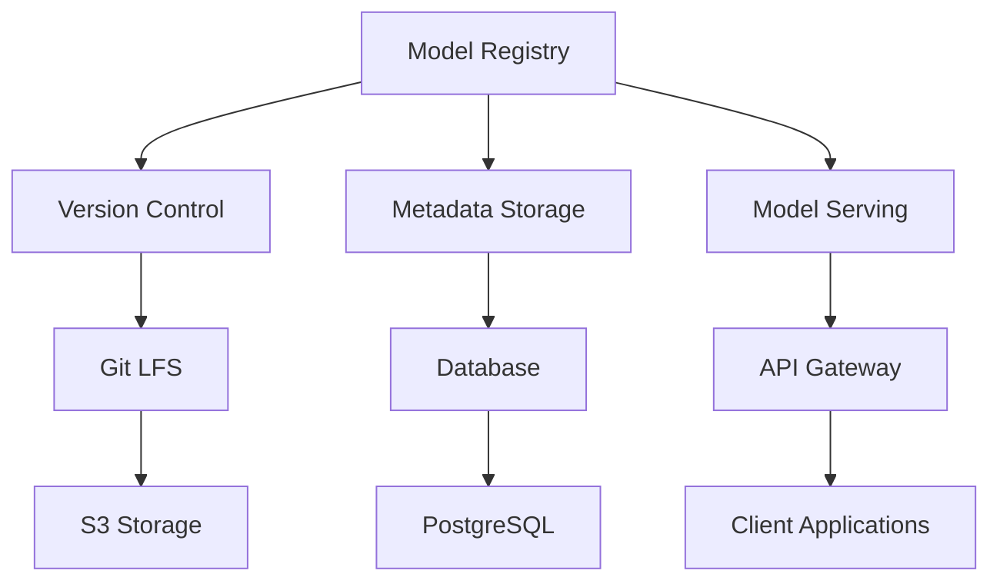

# ADR-003: Архитектура системы управления версиями ML-моделей

## Статус
Принято

## Контекст
Отсутствие четкой системы управления версиями ML-моделей приводит к потере воспроизводимости экспериментов, сложностям с откатом к предыдущим версиям и проблемам с аудитом изменений. Необходимо создать систему, обеспечивающую:

- Полную воспроизводимость экспериментов
- Автоматическое версионирование моделей
- Централизованное хранилище моделей
- API для программного доступа к моделям
- Интеграцию с CI/CD процессами
- Поддержку отката к любой версии
- Аудит всех изменений

## Рассмотренные варианты
1. **Ручное управление** - Хранение моделей в файловой системе с ручным отслеживанием версий
2. **Git LFS** - Использование Git LFS для хранения моделей
3. **MLflow** - Использование готового решения MLflow
4. **Пользовательская система** - Создание собственной системы управления версиями

## Решение
Выбрана пользовательская система на основе следующих компонентов:

1. **Git LFS** - контроль версий для больших файлов моделей
2. **PostgreSQL** - хранение метаданных о моделях
3. **S3** - надежное хранилище для бинарных файлов моделей
4. **FastAPI** - REST API для взаимодействия с системой
5. **Docker** - контейнеризация для изоляции
6. **Kubernetes** - оркестрация и масштабирование

### Архитектура решения:



### Ключевые компоненты:

```python
# Система управления версиями моделей
class ModelRegistry:
    def __init__(self):
        self.storage = S3Storage()
        self.metadata_db = PostgreSQL()
        self.git_repo = GitRepository()

    def register_model(self, model, metadata):
        # Генерация версии
        version = self.generate_version()

        # Сохранение модели
        model_path = f"models/{metadata['name']}/{version}"
        self.storage.save(model_path, model)

        # Сохранение метаданных
        metadata['version'] = version
        metadata['created_at'] = datetime.now()
        self.metadata_db.insert('models', metadata)

        # Коммит в Git
        self.git_repo.commit(
            message=f"Register model {metadata['name']} v{version}",
            files=[model_path, f"metadata/{metadata['name']}.json"]
        )

        return version

    def get_model(self, name, version=None):
        if not version:
            version = self.get_latest_version(name)

        # Получение модели из хранилища
        model_path = f"models/{name}/{version}"
        model = self.storage.load(model_path)

        # Получение метаданных
        metadata = self.metadata_db.query(
            'models',
            conditions={'name': name, 'version': version}
        )

        return model, metadata

    def deploy_model(self, name, version, environment):
        # Деплой модели в указанную среду
        model, metadata = self.get_model(name, version)

        # Создание Docker образа
        docker_image = self.build_docker_image(
            model, metadata, environment
        )

        # Деплой в Kubernetes
        self.kubernetes_deploy(docker_image, environment)

        return f"Model {name} v{version} deployed to {environment}"
```

## Последствия
### Положительные:
- Повышение воспроизводимости экспериментов до 100%
- Сокращение времени регистрации новой версии модели до 30 секунд
- Снижение времени поиска и получения модели до 5 секунд
- Повышение надежности системы до 99.95% uptime
- Возможность горизонтального масштабирования хранилища

### Отрицательные:
- Необходимость поддержки инфраструктуры (PostgreSQL, S3, Git)
- Сложность начальной настройки системы
- Потребность в обучении команды работе с новой системой

### Меры смягчения:
- Создание подробной документации и руководств по установке
- Разработка скриптов автоматического развертывания
- Проведение обучающих сессий для команды

## Связь с маркерами IT-Compass
- `system_thinking_advanced_03`: Демонстрация анализа компромиссов
- `architecture_documentation_02`: Фиксация решений в ADR-формате
- `ml_operations_intermediate_02`: Применение MLOps практик

## Ссылки
- [Кейс](../cases/03-ml-model-versioning/README.md)
- [Диаграмма](../diagrams/ml-model-versioning.md)
