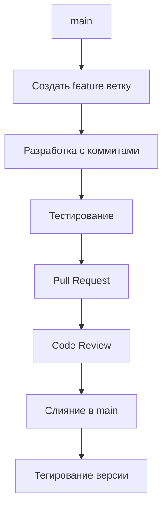
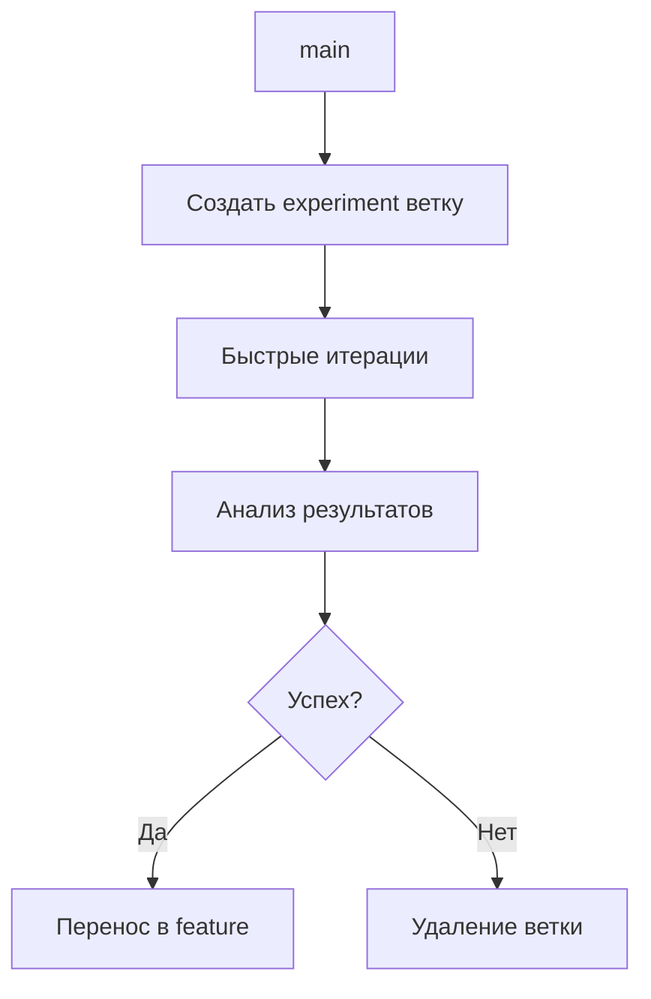
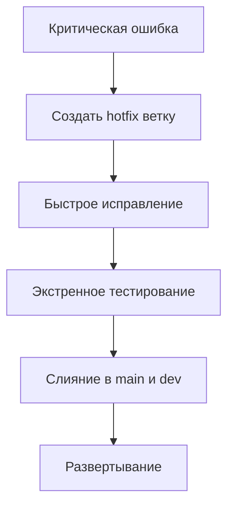

# Руководство по системе контроля версий для когнитивного архитектора

## 🎯 Принципы работы с версиями

### 1. Коммиты как мышление
- **Каждый коммит = законченная мысль**
- **Сообщения коммитов объясняют "почему", а не "что"**
- **Мелкие коммиты лучше больших**

### 2. Ветвление как экспериментирование
- **main/master = стабильная версия**
- **feature/* = новые возможности**
- **experiment/* = исследования и тесты**
- **bugfix/* = исправления ошибок**

### 3. История как документация
- **Чистая история = понятный проект**
- **Теги версий = важные вехи**
- **CHANGELOG = что изменилось для пользователей**

## 🔄 Git vs SourceCraft: когда что использовать

### Git (локальный, полный контроль)
```
Когда использовать:
- Локальная разработка
- Офлайн работа
- Сложные операции с историей
- Интеграция с legacy системами

Пример workflow:
1. git checkout -b feature/new-cognitive-module
2. Редактируем код
3. git add .
4. git commit -m "Добавить базовую архитектуру когнитивного модуля"
5. git push origin feature/new-cognitive-module
```

### SourceCraft (облачный, AI-интегрированный)
```
Когда использовать:
- Совместная работа с AI-агентами
- Быстрое прототипирование
- Визуальное управление
- Автоматические code reviews

Пример workflow:
1. Создать ветку через веб-интерфейс
2. Редактировать через встроенный редактор
3. CodeAssistant предлагает улучшения
4. Создать Pull Request с автоматическими проверками
5. AI-ревьюер проверяет код
```

## 📁 Структура репозитория для когнитивных систем

### Базовая структура
```
cognitive-system-repo/
├── .github/              # GitHub Actions
├── .sourcecraft/         # SourceCraft конфигурация
├── docs/                 # Документация
│   ├── architecture/     # Архитектурные решения
│   ├── api/             # API документация
│   └── guides/          # Руководства
├── src/                  # Исходный код
│   ├── core/            # Ядро системы
│   ├── cognitive/       # Когнитивные модули
│   ├── integration/     # Интеграции
│   └── utils/           # Утилиты
├── tests/               # Тесты
├── config/              # Конфигурации
├── data/                # Данные (в .gitignore)
├── models/              # Модели (в .gitignore)
├── notebooks/           # Jupyter notebooks
├── docker/              # Docker конфигурации
├── scripts/             # Скрипты
├── .gitignore           # Игнорируемые файлы
├── README.md            # Описание проекта
├── LICENSE              # Лицензия
└── pyproject.toml       # Зависимости Python
```

### Что должно быть в .gitignore
```gitignore
# Данные и модели
data/
models/
*.pkl
*.h5
*.onnx

# Конфиденциальное
.env
*.key
*.pem
secrets/

# Системное
__pycache__/
*.pyc
*.pyo
.pytest_cache/
.mypy_cache/

# IDE
.vscode/
.idea/
*.swp
*.swo

# Временное
tmp/
temp/
*.tmp
*.log
```

## 🔧 Рабочие процессы (Workflows)

### 1. Feature Development Workflow


### 2. Experiment Workflow


### 3. Hotfix Workflow


## 🤖 Интеграция с AI-агентами

### SourceCraft CodeAssistant
```yaml
# .sourcecraft/config.yaml
code_assistant:
  enabled: true
  auto_review: true
  suggestions:
    - code_quality
    - security
    - performance
  rules:
    - min_test_coverage: 80
    - max_complexity: 10
```

### Автоматические коммиты
```bash
# Скрипт для AI-генерации коммитов
#!/bin/bash
CHANGES=$(git status --porcelain)
if [ -n "$CHANGES" ]; then
    MESSAGE=$(ai-generate-commit-message "$CHANGES")
    git add .
    git commit -m "$MESSAGE"
fi
```

### AI Code Review
```python
# Пример интеграции с AI ревьюером
def ai_code_review(pull_request):
    """AI-ревью кода"""
    changes = get_changes(pull_request)
    review = ai_model.analyze(changes)

    if review.suggestions:
        add_comments(pull_request, review.suggestions)

    return review.approved
```

## 🚀 Продвинутые техники

### 1. Semantic Versioning для когнитивных систем
```
MAJOR.MINOR.PATCH
- MAJOR: Изменения ломающие обратную совместимость
- MINOR: Новые возможности, обратно совместимые
- PATCH: Исправления ошибок

Пример: 2.1.0
- 2: Основная версия архитектуры
- 1: Новые когнитивные модули
- 0: Исправления багов
```

### 2. Git Hooks для качества
```bash
# .git/hooks/pre-commit
#!/bin/bash
# Проверка перед коммитом
python -m black --check .
python -m pytest tests/ -xvs
python -m mypy src/
```

### 3. Автоматическое тегирование
```yaml
# GitHub Actions workflow
name: Tag Release
on:
  push:
    branches: [main]
jobs:
  tag:
    runs-on: ubuntu-latest
    steps:
      - uses: actions/checkout@v3
      - name: Bump version
        run: |
          VERSION=$(python bump_version.py)
          git tag v$VERSION
          git push origin v$VERSION
```

## 📊 Монетизация контроля версий

### 1. Метрики качества
```python
# metrics.py
def calculate_repo_health():
    return {
        "test_coverage": get_test_coverage(),
        "commit_frequency": get_commit_frequency(),
        "pr_merge_time": get_pr_merge_time(),
        "bug_rate": get_bug_rate(),
        "documentation_completeness": get_docs_completeness()
    }
```

### 2. Визуализация истории
```bash
# Граф коммитов
git log --graph --oneline --all

# Статистика
git shortlog -sn
git log --since="1 month ago" --pretty=format:"%h %ad %s" --date=short
```

### 3. Анализ вклада
```bash
# Кто что сделал
git log --author="Имя" --since="1 month ago" --pretty=tformat: --numstat

# Самые изменяемые файлы
git log --name-only --oneline | sort | uniq -c | sort -nr | head -20
```

## 🛠️ Инструменты и интеграции

### Обязательные инструменты
1. **Git CLI** - базовая работа
2. **Git GUI** (GitKraken, SourceTree) - визуализация
3. **GitHub Desktop** - для начинающих
4. **VS Code Git** - интеграция в редактор

### Интеграции для когнитивных систем
1. **MLflow** - версионирование моделей
2. **DVC** - версионирование данных
3. **Weights & Biases** - эксперименты
4. **MLOps pipelines** - автоматизация

### Скрипты автоматизации
```python
# auto_git.py
import subprocess
from datetime import datetime

def auto_commit(message=None):
    """Автоматический коммит"""
    if message is None:
        message = f"Auto commit {datetime.now().isoformat()}"

    subprocess.run(["git", "add", "."])
    subprocess.run(["git", "commit", "-m", message])
    subprocess.run(["git", "push"])
```

## 💡 Советы от экспертов

### Совет 1: "Коммитьте часто, пушите реже"
- Мелкие коммиты легче откатывать
- Локальная история безопаснее
- Перед пушем всегда rebase

### Совет 2: "Пишите хорошие сообщения коммитов"
```
Плохо: "fix bug"
Хорошо: "Исправить обработку null в когнитивном модуле"

Плохо: "update"
Хорошо: "Обновить зависимости для поддержки новой версии TensorFlow"
```

### Совет 3: "Используйте ветки для всего"
- Никогда не коммитьте напрямую в main
- Каждая задача = своя ветка
- Удаляйте ветки после слияния

### Совет 4: "Автоматизируйте рутину"
- CI/CD для тестов
- Автоматическое тегирование
- Code review боты

## 🚀 Быстрый старт

### 1. Инициализация нового проекта
```bash
# Создать репозиторий
mkdir cognitive-project
cd cognitive-project
git init

# Базовая структура
mkdir -p docs src tests config
touch README.md .gitignore LICENSE

# Первый коммит
git add .
git commit -m "Initial commit: cognitive project structure"
```

### 2. Настройка SourceCraft
1. Создать репозиторий в SourceCraft
2. Добавить remote: `git remote add sourcecraft <url>`
3. Настроить CodeAssistant в настройках
4. Включить автоматические проверки

### 3. Ежедневный workflow
```bash
# Утро: получить изменения
git pull origin main

# День: работа в feature ветке
git checkout -b feature/day-work
# ... работа ...
git add .
git commit -m "Описание сделанного"

# Вечер: обновить main и отправить изменения
git checkout main
git pull origin main
git checkout feature/day-work
git rebase main
git push origin feature/day-work
```

## 📚 Дополнительные ресурсы

- [Pro Git Book](https://git-scm.com/book/en/v2)
- [GitHub Skills](https://skills.github.com/)
- [SourceCraft Documentation](https://docs.sourcecraft.io)
- [Atlassian Git Tutorials](https://www.atlassian.com/git/tutorials)
- [Git Flight Rules](https://github.com/k88hudson/git-flight-rules)
