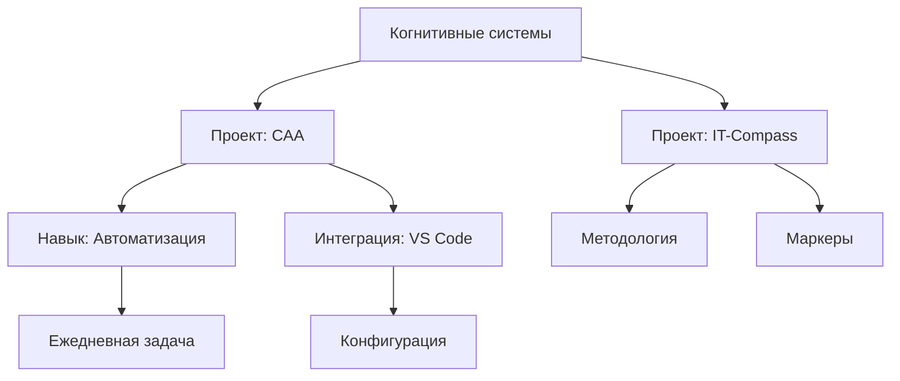

# Простая структура Obsidian для когнитивного архитектора

## 📁 Базовая структура папок

```
obsidian-vault/
├── 📁 00-Inbox/           # Входящие заметки
├── 📁 01-Daily/          # Ежедневные заметки
├── 📁 02-Projects/       # Проекты
├── 📁 03-Areas/         # Области ответственности
├── 📁 04-Resources/     # Ресурсы
├── 📁 05-Archive/       # Архив
├── 📁 06-Templates/     # Шаблоны
└── 📁 07-Attachments/   # Файлы
```

## 🎯 Для когнитивного архитектора

### Проекты (02-Projects/)
```
02-Projects/
├── portfolio-system-architect/
│   ├── README.md
│   ├── Architecture.md
│   ├── Decisions/
│   └── Tasks/
├── cognitive-automation-agent/
│   ├── Overview.md
│   ├── Skills/
│   └── Integration/
└── it-compass-framework/
    ├── Methodology.md
    ├── Markers/
    └── Cases/
```

### Области (03-Areas/)
```
03-Areas/
├── Cognitive Systems/
├── Software Architecture/
├── DevOps & CI-CD/
├── AI & ML/
├── Career Development/
└── Personal Productivity/
```

### Ресурсы (04-Resources/)
```
04-Resources/
├── Cheatsheets/
├── Tools/
├── Books/
├── Courses/
└── People/
```

## 🔗 Визуализация связей

### Типы связей
1. **[[Project]]** → связан с → **[[Area]]**
2. **[[Note]]** → ссылается на → **[[Resource]]**
3. **[[Daily]]** → упоминает → **[[Project]]**
4. **[[Decision]]** → влияет на → **[[Task]]**

### Пример графа связей


## 📝 Шаблоны

### Шаблон проекта
```markdown
# {{Project Name}}

## Описание
- **Цель**:
- **Статус**:
- **Приоритет**:

## Ссылки
- [[Related Area]]
- [[Related Project]]

## Задачи
- [ ] Task 1
- [ ] Task 2

## Решения
- [[Decision 1]]
- [[Decision 2]]

## Ресурсы
- [[Resource 1]]
- [[Resource 2]]
```

### Шаблон ежедневной заметки
```markdown
# {{date:YYYY-MM-DD}}

## 🎯 Фокус дня

## 📝 Заметки

## ✅ Задачи
- [ ]

## 🔗 Ссылки
- [[Project]]
- [[Area]]

## 💭 Мысли
```

## ⚡ Быстрый старт

### 1. Установка
1. Скачать [Obsidian](https://obsidian.md)
2. Создать новое хранилище в удобном месте
3. Скопировать эту структуру

### 2. Настройка
1. Включить **Daily notes** в настройках
2. Включить **Templates** в настройках
3. Указать путь к папке Templates (06-Templates/)

### 3. Использование
1. Каждый день создавать новую заметку в 01-Daily/
2. Для проектов использовать шаблон проекта
3. Связывать заметки двойными квадратными скобками [[ ]]

## 🛠️ Плагины для когнитивного архитектора

### Обязательные
1. **Dataview** - запросы к заметкам
2. **Templater** - продвинутые шаблоны
3. **Excalidraw** - диаграммы
4. **Calendar** - календарь заметок

### Рекомендуемые
1. **Kanban** - доски задач
2. **Mind Map** - ментальные карты
3. **Outliner** структурированные списки
4. **Advanced Tables** - таблицы

## 🔄 Интеграция с другими инструментами

### VS Code
- Использовать **Foam** расширение для VS Code
- Или работать напрямую с markdown файлами

### Git
```bash
# Инициализировать репозиторий в хранилище
cd obsidian-vault
git init
git add .
git commit -m "Initial Obsidian vault"
```

### SourceCraft
- Экспортировать документацию проектов в Obsidian
- Использовать как личную базу знаний

## 💡 Советы

1. **Начинайте с малого** - не пытайтесь создать идеальную структуру сразу
2. **Используйте теги** - #project, #area, #resource
3. **Связывайте всё** - сила Obsidian в связях
4. **Регулярно пересматривайте** - архивируйте старое
5. **Экспериментируйте** - найдите свой workflow

## 🚀 Расширенное использование

### Dataview запросы
````markdown
```dataview
TABLE status, priority
FROM "02-Projects"
WHERE status != "completed"
SORT priority DESC
```
````

### Excalidraw диаграммы
```excalidraw
{
  "type": "excalidraw",
  "version": 2,
  "source": "https://excalidraw.com",
  "elements": [
    {
      "type": "rectangle",
      "version": 1,
      "text": "Когнитивные системы"
    }
  ]
}
```

## 📚 Дополнительные ресурсы

- [Obsidian Help](https://help.obsidian.md)
- [Obsidian Forum](https://forum.obsidian.md)
- [YouTube каналы](https://www.youtube.com/c/ObsidianMD)
