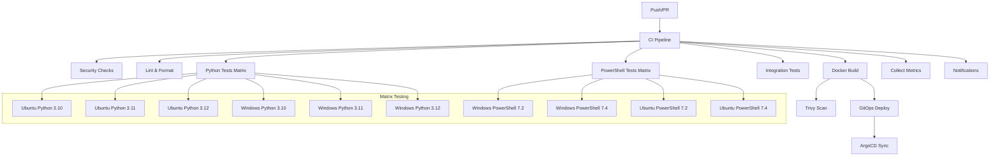

# GitHub Workflows Documentation

Этот документ описывает все GitHub Actions workflows в проекте Portfolio System Architect.

## Обзор

Проект использует комплексную систему CI/CD с 10+ workflows, которые обеспечивают:
- **Непрерывную интеграцию (CI)**: тестирование, линтинг, проверка безопасности
- **Непрерывную доставку (CD)**: деплой в различные среды
- **Мониторинг и наблюдение**: сбор метрик, алертинг
- **GitOps**: синхронизация с Kubernetes через ArgoCD
- **Автоматизацию**: синхронизация репозиториев, проверка дубликатов

## Архитектура CI/CD



## Основные Workflows

### 1. CI/CD Pipeline (ci.yml)
**Файл**: `.github/workflows/ci.yml`

Основной консолидированный pipeline, который запускается при push в main/develop и по расписанию.

**Jobs**:
- `security-check`: Проверка безопасности (detect-secrets, safety, pip-audit, Trivy, SBOM)
- `lint`: Линтинг и форматирование (black, isort, flake8, mypy)
- `python-tests`: Матричное тестирование Python (2 ОС × 3 версии Python)
- `powershell-tests`: Матричное тестирование PowerShell (2 ОС × 2 версии PowerShell)
- `integration-tests`: Интеграционные тесты с Docker Compose
- `docker-build`: Сборка Docker образов с кэшированием Buildx
- `deploy-gitops`: Деплой через GitOps (ArgoCD)
- `notify`: Уведомления о статусе сборки
- `collect-metrics`: Сбор метрик CI/CD

### 2. Azure Deploy (azure-deploy.yml)
**Файл**: `.github/workflows/azure-deploy.yml`

Деплой приложения в Azure App Service/Container Apps.

**Особенности**:
- Использует Azure CLI и Bicep
- Поддерживает staging/production среды
- Интеграция с Azure Key Vault для секретов

### 3. Code Quality (code-quality.yml)
**Файл**: `.github/workflows/code-quality.yml`

Специализированные проверки качества кода.

**Проверки**:
- SonarQube анализ
- Cyclomatic complexity
- Code duplication detection
- Technical debt estimation

### 4. Deploy Pages (deploy-pages.yml)
**Файл**: `.github/workflows/deploy-pages.yml`

Деплой документации на GitHub Pages.

**Особенности**:
- Автоматическая сборка MkDocs
- Деплой в ветку `gh-pages`
- Кэширование зависимостей Python

### 5. Deploy (deploy.yml)
**Файл**: `.github/workflows/deploy.yml`

Общий деплой workflow для различных сред.

### 6. Duplicate Check (duplicate-check.yml)
**Файл**: `.github/workflows/duplicate-check.yml`

Поиск дубликатов кода и файлов в репозитории.

### 7. Monitor Mirror Discrepancies (monitor-mirror-discrepancies.yml)
**Файл**: `.github/workflows/monitor-mirror-discrepancies.yml`

Мониторинг расхождений между основным репозиторием и зеркалами.

### 8. Sync to GitHub (sync-to-github.yml)
**Файл**: `.github/workflows/sync-to-github.yml`

Синхронизация с удаленными репозиториями GitHub.

### 9. Test Cloud Reason (test-cloud-reason.yml)
**Файл**: `.github/workflows/test-cloud-reason.yml`

Тестирование cloud-reason компонента.

### 10. Update (update.yml)
**Файл**: `.github/workflows/update.yml`

Автоматическое обновление зависимостей и конфигураций.

### 11. GitOps ArgoCD (gitops-argocd.yml)
**Файл**: `.github/workflows/gitops-argocd.yml`

GitOps синхронизация с ArgoCD для Kubernetes деплоя.

## Composite Actions

Для устранения дублирования кода созданы reusable composite actions:

### 1. setup-git
**Путь**: `.github/actions/setup-git/action.yml`

Настройка Git с поддержкой long paths.

### 2. setup-python
**Путь**: `.github/actions/setup-python/action.yml`

Установка Python с кэшированием pip.

### 3. install-dependencies
**Путь**: `.github/actions/install-dependencies/action.yml`

Установка зависимостей проекта.

### 4. run-tests
**Путь**: `.github/actions/run-tests/action.yml`

Запуск тестов с покрытием.

### 5. metrics-collector
**Путь**: `.github/actions/metrics-collector/action.yml`

Сбор метрик CI/CD для observability.

### 6. notify
**Путь**: `.github/actions/notify/action.yml`

Многоканальные уведомления (Telegram, Slack, Email).

## Матричное тестирование

### Python Tests
- **ОС**: Ubuntu-latest, Windows-latest
- **Версии Python**: 3.10, 3.11, 3.12
- **Типы тестов**:
  - Unit tests (`tests/unit/`): Быстрые изолированные тесты
  - Integration tests (`tests/integration/`): Тесты взаимодействия компонентов
  - E2E tests (`tests/e2e/`): Сквозные тесты (только на Ubuntu Python 3.11)

### PowerShell Tests
- **ОС**: Windows-latest, Ubuntu-latest
- **Версии PowerShell**: 7.2, 7.4
- **Типы тестов**:
  - Unit tests (`tests/unit/`): Pester тесты модулей
  - Integration tests (`tests/integration/`): Интеграционные сценарии

## Безопасность

### Security Scanning
1. **Trivy**: Сканирование файловой системы и Docker образов на уязвимости
2. **detect-secrets**: Обнаружение секретов в коде
3. **safety**: Проверка уязвимостей Python зависимостей
4. **pip-audit**: Аудит зависимостей pip
5. **SBOM**: Генерация Software Bill of Materials

### Secret Management
- Используется `.secrets.baseline` для baseline сканирования
- Секреты хранятся в GitHub Secrets
- Trivy secret scanning с конфигурацией в `trivy-secret.yaml`

## Наблюдаемость (Observability)

### Сбор метрик CI/CD
Метрики собираются в job `collect-metrics`:
- Время выполнения каждого job
- Статус успешности/провала
- Количество тестов и покрытие
- Размер артефактов

### Уведомления
- **Telegram**: Уведомления о статусе сборки
- **Slack**: Интеграция с каналами команды
- **Email**: Отправка на email при критических ошибках
- **GitHub Status**: Обновление статусов PR

## GitOps

### ArgoCD Integration
- Автоматическая синхронизация манифестов Kubernetes
- Поддержка multi-environment (dev, staging, prod)
- Health checks и автоматический rollback

### Kubernetes Manifests
Манифесты расположены в `deployment/k8s/`:
- `base/`: Базовые конфигурации сервисов
- `overlays/`: Оверлеи для разных сред
- `gitops/`: Конфигурации ArgoCD Application

## Оптимизации производительности

### Кэширование
1. **pip cache**: Кэширование Python пакетов
2. **Docker Buildx cache**: Кэширование слоев Docker образов
3. **composite actions cache**: Кэширование установленных зависимостей

### Параллелизм
- Матричное выполнение тестов
- Параллельные jobs в CI pipeline
- Использование `pytest-xdist` для параллельного выполнения тестов

## Мониторинг и алертинг

### Health Checks
- Проверка доступности сервисов после деплоя
- Мониторинг метрик через Prometheus
- Дашборды Grafana для визуализации

### Alert Rules
Конфигурация алертов в `monitoring/alert-rules.yaml`:
- High error rates
- Service downtime
- Resource utilization

## Онбординг для новых разработчиков

### Быстрый старт
1. Клонировать репозиторий
2. Установить зависимости: `pip install -e .[dev]`
3. Запустить тесты: `pytest tests/unit/`
4. Проверить линтинг: `black . && isort . && flake8`

### Локальный запуск CI
```bash
# Установить act (https://github.com/nektos/act)
act -j security-check
act -j python-tests
```

### Отладка workflows
- Использовать `act` для локального выполнения
- Проверять логи в GitHub Actions UI
- Использовать `debug: true` в шагах для подробного вывода

## Устранение неполадок

### Частые проблемы
1. **Permission denied при git config --system**
   - **Решение**: Использовать `--global` вместо `--system`

2. **Ошибки кэширования Docker**
   - **Решение**: Очистить кэш Buildx `docker buildx prune -a`

3. **Сбои тестов на Windows**
   - **Решение**: Проверить совместимость путей и line endings

4. **Ошибки Trivy scanning**
   - **Решение**: Обновить `.trivyignore` для исключения false positives

### Логи и отладка
- Артефакты тестов сохраняются для каждого запуска
- Подробные логи доступны в GitHub Actions UI
- Использовать `if: failure()` для шагов отладки

## Контакты и поддержка

- **Документация проекта**: [docs/](docs/)
- **Архитектурные решения**: [docs/architecture/decisions/](docs/architecture/decisions/)
- **Issues**: GitHub Issues
- **Discussions**: GitHub Discussions

## Лицензия

Проект распространяется под лицензией MIT. Подробнее см. [LICENSE](../LICENSE).
