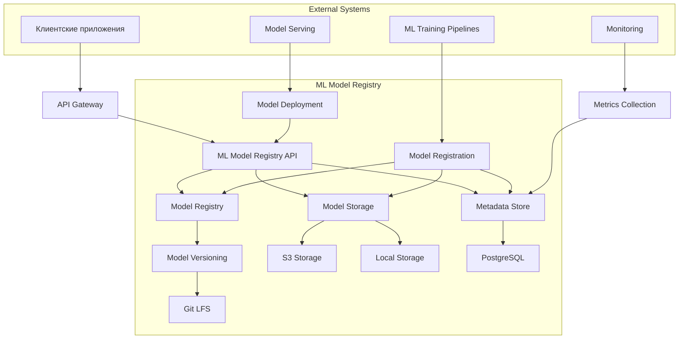

# Архитектурная диаграмма системы версионирования ML-моделей

## Общая архитектура

## Компоненты системы

### 1. API Layer
- **ML Model Registry API**: Основной интерфейс для взаимодействия с системой
- **API Gateway**: Управление доступом и маршрутизация запросов

### 2. Core Services
- **Model Registry**: Центральный компонент управления моделями
- **Model Storage**: Хранилище бинарных файлов моделей
- **Metadata Store**: Хранилище метаданных моделей
- **Model Versioning**: Система контроля версий моделей

### 3. Storage
- **S3 Storage**: Облачное хранилище для бинарных файлов моделей
- **Local Storage**: Локальное хранилище для бинарных файлов моделей
- **PostgreSQL**: Реляционная база данных для хранения метаданных
- **Git LFS**: Система хранения больших файлов Git для контроля версий

### 4. External Systems
- **ML Training Pipelines**: Конвейеры обучения моделей
- **Model Serving**: Системы развертывания и serving'а моделей
- **Monitoring**: Системы мониторинга и сбора метрик

## Потоки данных

1. **Регистрация модели**:
   - ML Training Pipeline → Model Registration → Model Registry → Model Storage → Metadata Store

2. **Получение модели**:
   - Client Application → API Gateway → ML Model Registry API → Model Registry → Model Storage + Metadata Store

3. **Версионирование**:
   - Model Registry → Model Versioning → Git LFS

4. **Мониторинг**:
   - Model Serving → Monitoring → Metrics Collection → Metadata Store