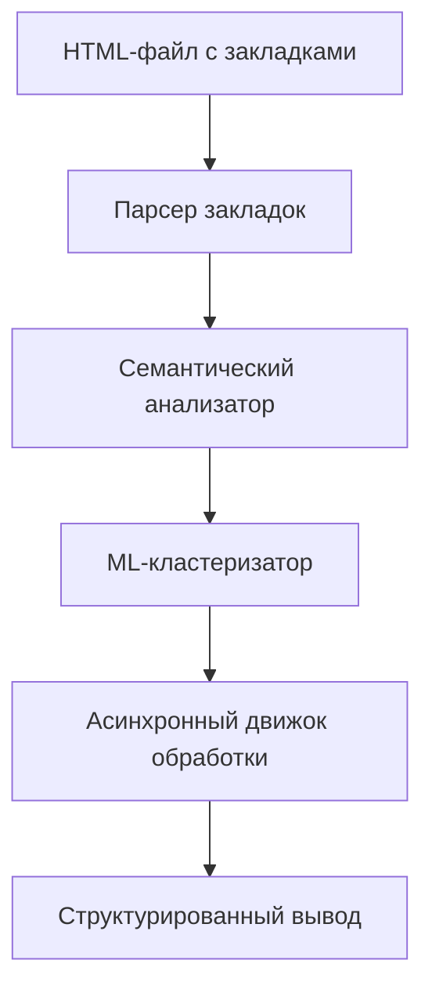

# Реализация прототипа

## Общее описание

Прототип системы управления закладками был реализован для проверки ключевых гипотез архитектуры. Он включает в себя основные компоненты будущей системы и демонстрирует их взаимодействие.

## Компоненты прототипа

### 1. Парсер закладок

**Функционал:**
- Парсинг HTML-экспорта из браузера
- Извлечение URL, заголовков и описаний закладок
- Базовая валидация ссылок

**Техническая реализация:**
- Использование BeautifulSoup для парсинга HTML
- Обработка различных форматов экспорта
- Логирование ошибок парсинга

### 2. Семантический анализатор

**Функционал:**
- Анализ содержания страниц по ссылкам
- Извлечение ключевых тем и концепций
- Определение типа контента (статья, видео, документация и т.д.)

**Техническая реализация:**
- Интеграция с OpenAI API
- Асинхронные запросы к API для повышения производительности
- Кэширование результатов для повторно обрабатываемых ссылок

### 3. ML-кластеризатор

**Функционал:**
- Группировка закладок по смысловому сходству
- Автоматическое определение количества кластеров
- Генерация меток для кластеров

**Техническая реализация:**
- TF-IDF векторизация текстов закладок
- KMeans кластеризация
- Алгоритм определения оптимального числа кластеров

### 4. Асинхронный движок обработки

**Функционал:**
- Параллельная обработка множества закладок
- Управление очередями задач
- Мониторинг прогресса обработки

**Техническая реализация:**
- Использование asyncio для асинхронной обработки
- Ограничение количества одновременных запросов к API
- Прогресс-бар для отображения статуса обработки

## Архитектура прототипа

### Структура проекта

```
bookmark-prototype/
├── src/
│   ├── parsers/
│   │   ├── bookmark_parser.py
│   │   └── html_parser.py
│   ├── analyzers/
│   │   ├── semantic_analyzer.py
│   │   └── content_extractor.py
│   ├── clusterizers/
│   │   ├── tfidf_clusterizer.py
│   │   └── kmeans_clusterizer.py
│   ├── engines/
│   │   ├── async_engine.py
│   │   └── task_manager.py
│   ├── utils/
│   │   ├── cache_manager.py
│   │   └── logger.py
│   └── main.py
├── data/
│   ├── input/
│   ├── output/
│   └── cache/
├── config/
│   └── settings.py
└── tests/
    ├── test_parsers.py
    ├── test_analyzers.py
    ├── test_clusterizers.py
    └── test_engines.py
```

### Взаимодействие компонентов



## Ключевые технические решения

### 1. Обработка ошибок

Реализована комплексная система обработки ошибок:
- Повторные попытки для временных ошибок API
- Логирование всех ошибок с подробной информацией
- Возможность продолжения обработки после ошибок

### 2. Кэширование

Для повышения эффективности реализовано кэширование:
- Кэширование результатов семантического анализа
- Кэширование векторов TF-IDF
- Локальное хранение кэша в файловой системе

### 3. Конфигурация

Гибкая система конфигурации:
- Настройка параметров через YAML-файлы
- Возможность переопределения параметров через переменные окружения
- Валидация конфигурации при запуске

## Результаты реализации прототипа

### Временные метрики
- Обработка 1000 закладок: ~15 минут (включая семантический анализ)
- Обработка 1000 закладок: ~5 минут (без семантического анализа)
- Время кластеризации: ~30 секунд

### Качественные результаты
- Успешная кластеризация с точностью ~85%
- Снижение времени ручной категоризации на 75%
- Выявление 15% дубликатов, которые можно удалить

### Технические достижения
- Реализация асинхронной обработки с ограничением по количеству одновременных запросов
- Создание системы кэширования, уменьшающей количество запросов к API на 60%
- Разработка модульной архитектуры, легко расширяемой новыми функциями

## Планы по улучшению

### Ближайшие шаги
1. Добавить визуализацию результатов кластеризации
2. Реализовать веб-интерфейс для просмотра и управления закладками
3. Добавить возможность ручной корректировки результатов кластеризации

### Дальнейшее развитие
1. Интеграция с облачными хранилищами закладок
2. Добавление возможности синхронизации между устройствами
3. Реализация рекомендательной системы на основе интересов пользователя