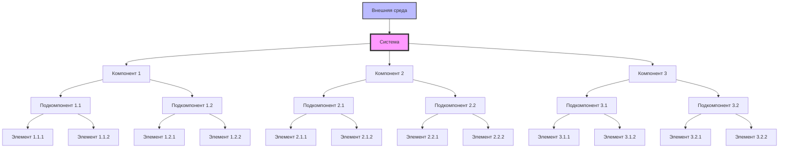

# Диаграммы системного мышления

## Системная карта



## Причинно-следственная диаграмма

```mermaid
graph LR
    A[Изменение внешней среды] --> B[Влияние на систему]
    B --> C[Изменение состояния компонента 1]
    B --> D[Изменение состояния компонента 2]
    C --> E[Обратная связь на систему]
    D --> F[Обратная связь на систему]
    E --> G[Изменение внешней среды]
    F --> G
    G --> H[Новое состояние системы]

    style A fill:#f9f,stroke:#333
    style H fill:#bbf,stroke:#333
