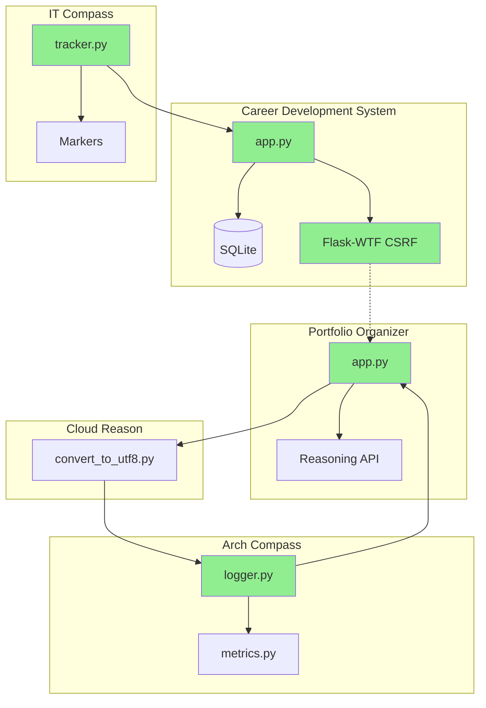

# Components Interaction Diagram

## Mermaid Diagram

## Description

This diagram shows interconnections:
- **Career Development** ← Skills from **IT Compass**
- **Portfolio Organizer** ← Analysis from **Reasoning API** + **Arch Compass** monitoring
- **Cloud Reason** ← UTF-8 conversion support
- **Security** CSRF protection across Flask apps

