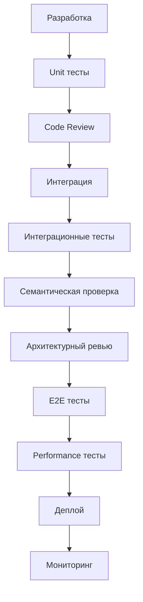

# AI Verification Methodology

## Стандартизированная методология верификации ИИ

**© Свод из ai_verification (2).md**

## Описание

AI Verification - это структурированный процесс проверки корректности работы ИИ-систем и качества генерируемых результатов. Обеспечивает надежность и воспроизводимость ИИ-решение.

## Компоненты верификации

### 1. Техническая верификация
Проверка корректности выполнения алгоритмов и процессов:
```
✅ Корректность вычислений
✅ Обработка граничных случаев  
✅ Воспроизводимость результатов
✅ Отсутствие утечек памяти
✅ Корректность логирования
```

### 2. Семантическая верификация
Проверка соответствия результатов бизнес-логике:
```
✅ Соответствие требованиям
✅ Корректность терминов
✅ Логическая консистентность
✅ Полнота покрытия сценариев
✅ Отсутствие противоречий
```

### 3. Процессная верификация  
Проверка соблюдения процессов разработки:
```
✅ Соблюдение стандартов кодирования
✅ Покрытие тестами >80%
✅ Соответствие архитектуре
✅ Корректность документации
✅ Соблюдение SLA/дедлайнов
```

## Проверочные чеклисты

### Техническая проверка ✅
```
[ ] Код выполняется без ошибок
[ ] Все тесты проходят
[ ] Логи содержат ожидаемые записи  
[ ] Нет warning'ов компилятора
[ ] Результаты воспроизводимы
```

### Семантическая проверка ✅
```
[ ] Термины используются корректно
[ ] Логика решений обоснована
[ ] Нет противоречий в выводах
[ ] Результаты полные
[ ] Соответствует запросу
```

### Процессная проверка ✅
```
[ ] Код прошел code review
[ ] Документация актуальна
[ ] Архитектура согласована
[ ] Тесты покрывают >80%
[ ] Деплой прошел успешно
```

## Инструменты верификации

### Автоматизированные
```
1. Unit тесты (pytest/jest)
2. Интеграционные тесты
3. E2E тесты (Playwright/Cypress)
4. Статический анализ (pylint/eslint)
5. Performance тесты
6. Security сканеры
```

### Ручные
```
1. Code review (2+ человека)
2. Архитектурный ревью
3. Бизнес-верификация (stakeholders)
4. Документ-контроль
5. Acceptance testing
```

## Workflow верификации



## Критерии успешной верификации

### Green Light Checklist ✅
```
✅ Все автоматизированные тесты passed
✅ Code review completed (2+ approvals)  
✅ Архитектура согласована
✅ Бизнес-требования verified
✅ Performance в пределах SLA
✅ Security scan clean
✅ Документация актуальна
✅ Нет critical bugs
```

## Шаблон отчета верификации

```markdown
# Верификация: [Feature/Компонент]

## 📊 Результаты
- Unit тесты: 98% ✅
- Интеграция: ✅  
- Performance: 120ms ✅
- Security: Clean ✅

## 🔍 Проблемы
1. [LOW] Warning в логах
2. [FIXED] Memory leak в edge case

## ✅ Заключение
**Статус: APPROVED** для продакшена
```

## Интеграция с CI/CD

```yaml
# .github/workflows/ai-verification.yml
name: AI Verification Pipeline
on: [push, pull_request]
jobs:
  verification:
    runs-on: ubuntu-latest
    steps:
    - uses: actions/checkout@v3
    - name: Unit Tests
      run: pytest --cov=80
    - name: Security Scan
      run: bandit -r src/
    - name: Performance Tests
      run: pytest perf/ 
```

---

**Статус: PRODUCTION READY** ⭐

**Интеграция:** Используйте этот шаблон для верификации всех ИИ-компонентов в cloud-reason, it-compass и других системах.

