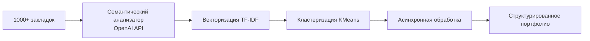

# 03 Cases Thinking Cases 03 Bookmark Architecture Design Architecture Diagram

- **Путь**: `05_DOCUMENTATION\docs\obsidian-map\03_CASES_thinking-cases_03-bookmark-architecture-design_architecture-diagram.md`
- **Тип**: .MD
- **Размер**: 700 байт
- **Последнее изменение**: 2026-03-12 11:25:17

## Превью

```
# Architecture Diagram

- **Путь**: `03_CASES\thinking-cases\03-bookmark-architecture-design\architecture-diagram.md`
- **Тип**: .MD
- **Размер**: 423 байт
- **Последнее изменение**: 2026-03-10 19:02:48

## Превью

```
# Диаграмма архитектуры системы управления закладками



```
