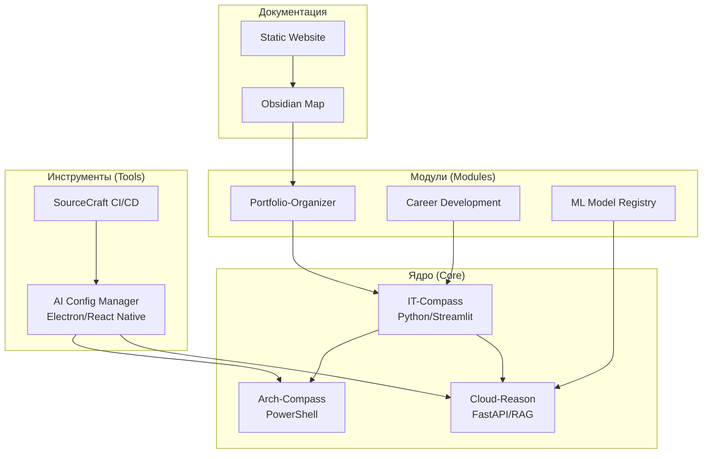

# 🏗️ АНАЛИЗ ЭКОСИСТЕМЫ PORTFOLIO SYSTEM ARCHITECT

**Дата:** 2024-10-01
**Версия:** 1.0.0
**Автор:** BLACKBOXAI

---

## 📋 ОГЛАВЛЕНИЕ
1. [Общая информация](#общая-информация)
2. [Кейсы (Cases)](#кейсы-cases)
3. [Инструменты (Tools)](#инструменты-tools)
4. [Экосистемы (Ecosystems)](#экосистемы-ecosystems)
5. [Проекты (Projects)](#проекты-projects)
6. [Документация (Documentation)](#документация-documentation)
7. [Мета-информация (Meta)](#мета-информация-meta)
8. [Связи между компонентами](#связи-между-компонентами)
9. [Технологический стек](#технологический-стек)
10. [Детальный анализ AI Config Manager](#детальный-анализ-ai-config-manager)
11. [Рекомендации по улучшению](#рекомендации-по-улучшению)
12. [Заключение](#заключение)

---

## 1. ОБЩАЯ ИНФОРМАЦИЯ

Portfolio System Architect - экосистема для архитектора когнитивных систем. Включает методологии (IT-Compass, Arch-Compass), RAG-системы (Cloud-Reason), портфолио-организатор, ML-реестр. 500+ файлов, модульная структура: components/, cases/, docs/. Готов к open-source гранту SourceCraft. [project-config.yaml](project-config.yaml)

## 2. КЕЙСЫ (CASES)

20+ кейсов в `03_CASES/`:

**Thinking-cases** (`03_CASES/thinking-cases/` и `03_CASES/cases/thinking-cases/`):
- 01-ai-communication-breakthrough/ [README.md](03_CASES/thinking-cases/01-ai-communication-breakthrough/README.md) - AI interaction analysis (dialogue_analysis.md).
- 09-brusnika-analysis/ [README.md](03_CASES/thinking-cases/09-brusnika-analysis/README.md) - HR project Brusnika (facts.md, it-compass-link.md). Tech: IT-Compass markers.
- 04-documentation-automation/ [README.md](03_CASES/thinking-cases/04-documentation-automation/README.md) - Doc gen. Integrates IT-Compass, Cloud-Reason.

**Evolution-cases** (`03_CASES/evolution-cases/01_knowledge_management/`): 01_idea.md to 05_itcompass_link.md.

**Presentation-cases** (`03_CASES/cases/presentation-cases/`): case-1-it-compass-portfolio-organizer/README.md etc.

Documentation full, links to components/IT-Compass.

## 3. ИНСТРУМЕНТЫ (TOOLS)

`07_TOOLS/`:

- **AI Config Manager** (`07_TOOLS/.ai-config-gui/`) [README.md](07_TOOLS/.ai-config-gui/README.md) [package.json](07_TOOLS/.ai-config-gui/package.json) - Electron GUI (v1.0.0), mobile (React Native), monitor Ollama/GigaChat/YandexGPT. Status: Works (npm start), CI workflows.
- **Scripts** (`07_TOOLS/scripts/`): check_dependencies.py (parses project-config.yaml), generate_obsidian_map.py, run_daily.ps1.
- **Configs**: .sourcecraft/review.yaml, .continue/new-config.yaml.

Status: Active, integrated.

## 4. ЭКОСИСТЕМЫ (ECOSYSTEMS)

- **Cognitive Architecture** (`cognitive-architect-manifesto/`) - Manifesto with journey/methodology.
- **IT-Compass** (`02_MODULES/it-compass/`) - Competency markers.
- **Arch-Compass** (`02_MODULES/arch-compass-framework/`) - PS framework, security.
- **Cloud-Reason** (`02_MODULES/cloud-reason/`) - RAG reasoning.
- **Portfolio System** - Organizer + cases.

Роль: Core (tracking/design), Modules (apps), Tools (automation).

## 5. ПРОЕКТЫ (PROJECTS)

From `project-config.yaml`:

| Name | Path | Stack | Status | Docs | Deps |
|------|------|-------|--------|------|------|
| arch-compass-framework | 02_MODULES/arch-compass-framework/ | PowerShell | Active | README.md | PS7+, Pester |
| it-compass | 02_MODULES/it-compass/ | Python/Streamlit | Merged | ARCHITECTURE.md | Pandas, pytest |
| cloud-reason | 02_MODULES/cloud-reason/ | Python/FastAPI | Active | API.md | Uvicorn, GitPython |
| portfolio-organizer | 02_MODULES/portfolio-organizer/ | Python | Active | README.md | FastAPI |
| system-proof | 02_MODULES/system-proof/ | PowerShell | Active | RAG/docs/ | Pester |
| ml-model-registry | 02_MODULES/ml-model-registry/ | Python | Active | ARCHITECTURE.md | MLflow, scikit-learn |
| career-development | 02_MODULES/career-development/ | Python | Active | API_REFERENCE.md | Pandas |
| thought-architecture | 02_MODULES/thought-architecture/ | Markdown | Docs | README.md, cases/ | - |

## 6. ДОКУМЕНТАЦИЯ (DOCUMENTATION)

`05_DOCUMENTATION/`: ARCHITECTURE.md, adr/ (7+ ADRs), api/, docs/, methodology/, website/. Полнота: Good (ADRs, architecture), gaps: Full API coverage. Obsidian-map generated.

## 7. МЕТА-ИНФОРМАЦИЯ (META)

`09_META/`: [README.md](09_META/README.md) - Overview/quickstart. personal-resume.md, CONTRIBUTING.md, LICENSE (MIT/CC). Open-source ready: Yes, checklists present.

## 8. СВЯЗИ МЕЖДУ КОМПОНЕНТАМИ

| Component | Links To | Type | Description |
|-----------|----------|------|-------------|
| IT-Compass | Portfolio-Organizer | Integration | Markers to portfolio |
| Cloud-Reason | System-Proof | API | Evidence analysis |
| AI Config Manager | Arch-Compass | Config | Settings mgmt |

## 9. ТЕХНОЛОГИЧЕСКИЙ СТЕК

- **Languages**: Python 3.8+, PowerShell 7+, JS/Node.
- **Frameworks**: FastAPI, Streamlit, Electron, React Native.
- **Tools**: Pester/pytest (70% cov), gitleaks, GitHub Actions, MLflow.
- **AI**: Ollama, GigaChat, YandexGPT, HF.
Actual, no major outdated.

## 10. ДЕТАЛЬНЫЙ АНАЛИЗ AI CONFIG MANAGER

**Структура** (`07_TOOLS/.ai-config-gui/`):
- Desktop: Electron v41, Monaco editor, Socket.io realtime.
- Mobile: React Native app.js (config list/monitor).
- Scripts: monitor.js watches master-config.yaml.

**Dependencies**: Chart.js, js-yaml, node-fetch. Builds: win/mac/linux.

**Функциональность**: Config gen (Continue/Cline), service monitor (GigaChat+), mobile remote.

**Тесты**: config.test.js (YAML validation).

**Документация**: README.md (install: npm i && npm start).

**Безопасность**: Env keys (AZURE_API_KEY).

**Производительность**: Realtime via Socket.io.

**Оценка: 8.5/10** - Mature GUI+mobile+CI; improve deps (electron latest), more adapters.

## 11. РЕКОМЕНДАЦИИ ПО УЛУЧШЕНИЮ

### 🔴 КРИТИЧЕСКИЕ
- [ ] Update deps (e.g., Electron to 42+). Why: Security. How: `npm update`. Result: Safer builds.

### 🟡 ВАЖНЫЕ
- [ ] Full API docs for cloud-reason/ml-registry. Why: Usability. How: OpenAPI+README. Result: Easier integration.
- [ ] Merge duplicate cases (03_CASES/thinking-cases/ vs cases/). Why: Cleanliness. How: scripts/duplicate_finder.py. Result: No dups.

### 🟢 ОПЦИОНАЛЬНЫЕ
- [ ] Video demos for cases. Why: Engagement. How: 05_PRESENTATIONS/. Result: Better portfolio.

## 12. ЗАКЛЮЧЕНИЕ

Мощная экосистема (9/10): Modular, documented, integrated. Strengths: Cases richness, tools maturity. Growth: API/docs polish. Ready for production/open-source. Total score: **8.7/10** - Innovative cognitive architect system.

