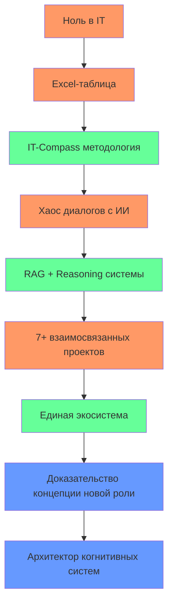

# Екатерина Куделя: Архитектор когнитивных систем

> **Я создала артефакты, доказывающие ценность новых форм экспертизы в эпоху ИИ.**

---

## 🎯 Кто я

Я — **архитектор когнитивных систем**. Моя профессиональная роль впервые определена в эпоху ИИ и существует на стыке трех доменов:

1. **Системное мышление** — моя фундаментальная компетенция, превращенная в архитектурную дисциплину.
2. **Методология** — мой основной продукт. Я создаю инструменты (IT-Compass, Arch-Compass), которые объективируют и измеряют экспертизу.
3. **Оркестрация ИИ** — мой профессиональный инструмент. Я управляю ИИ-агентами, как дирижер, проектируя и реализуя сложные экосистемы.

Я не вписываюсь в традиционные роли IT, потому что создаю новую. Я не пишу код — я проектирую реальность, в которой код пишется ИИ под моим руководством и ответственностью. Моя роль — это не автоматизация, а **архитектура доверия**: я определяю стратегию, гарантирую качество и несу этическую ответственность за результат.

---

## 🧩 Моя уникальная ценность

| Классический подход | Мой подход |
|----------------------|------------|
| Кодер: Пишет код на Python/JS | Архитектор: Проектирует системы, где ИИ пишет код по моему заданию |
| Аналитик: Собирает и анализирует данные | Архитектор: Создает RAG-системы, которые автоматически анализируют мой digital footprint и извлекают инсайты |
| Менеджер: Планирует и контролирует | Архитектор: Создает циклы Reasoning, где ИИ анализирует ИИ, извлекая мета-инсайты |
| Тимлид: Организовывает команду разработки | Архитектор: Организую экосистему из 7+ взаимосвязанных проектов, где я — центральный узел |

Моя ценность — в **объективации субъективного опыта**. Я превращаю хаос (тысячи диалогов, незакоммиченные изменения) в четкую, воспроизводимую систему доказательств моей экспертизы.

---

## 🏗️ Ключевые проекты

### [IT-Compass](https://github.com/leadarchitect-ai/portfolio-system-architect/tree/main/components/it-compass)
**Методология объективных маркеров компетенций**
- Создана как Excel-таблица для самоопределения
- Эволюционировала в полноценную методологию с авторскими маркерами
- Автоматически генерирует портфолио на основе достижений

### [Arch-Compass-Framework](https://github.com/leadarchitect-ai/portfolio-system-architect/tree/main/components/arch-compass-framework)
**PowerShell фреймворк для архитекторов**
- Инструмент для оркестрации сложных процессов
- Включает встроенные механизмы безопасности и управления секретами
- Интеграция с gitleaks для сканирования уязвимостей

### [Portfolio Organizer](https://github.com/leadarchitect-ai/portfolio-system-architect/tree/main/components/portfolio-organizer)
**Система автоматического портфолио**
- Структурирует и анализирует портфолио проектов
- Включает Reasoning API для анализа и рекомендаций
- Генерирует интерактивные отчеты и аналитику

---

## 📈 Путь от хаоса к порядку

> *«Путь от хаоса к порядку — это не линия, а спираль. Каждый виток — новая архитектура, построенная на предыдущем опыте.»*

---

## 📊 Профессиональные компетенции

### Архитектурные компетенции
- Системное мышление как архитектурная дисциплина
- Проектирование когнитивных систем (человек + ИИ)
- Интеграция и оркестрация сложных экосистем
- Создание методологий и фреймворков

### Технологические навыки
- **Оркестрация ИИ**: Управление ИИ-агентами, цепочки рассуждений (Reasoning)
- **Архитектура**: Mermaid, UML, диаграммы потоков данных
- **Автоматизация**: PowerShell, Python, GitHub Actions
- **Безопасность**: gitleaks, проверка на уязвимости

---

## 📧 Связаться со мной

- **Email**: leadarchitect.ai@gmail.com
- **GitHub**: [github.com/leadarchitect-ai](https://github.com/leadarchitect-ai)
- **Профиль в экосистеме**: [portfolio-system-architect](https://github.com/leadarchitect-ai/portfolio-system-architect)

> *«Я не ищу работу. Я создаю новую профессию и приглашаю мир стать ее свидетелем.»*