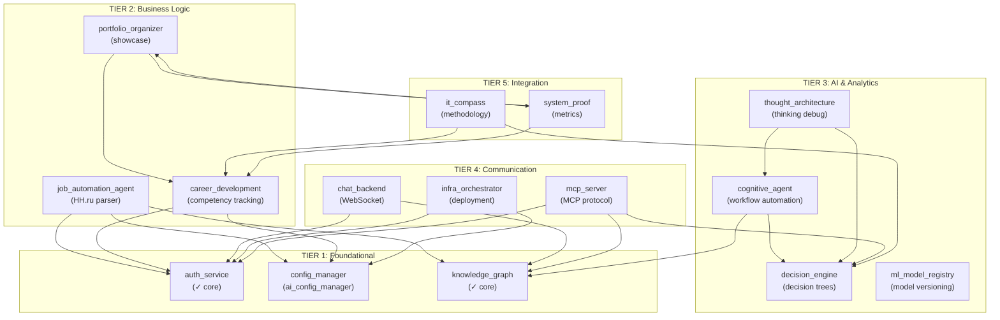

# 📊 Анализ репозитория: Полная архитектурная карта

**Дата:** 2026-05-22  
**Статус:** Восстановление целостности из разрозненных фрагментов

---

## 1. ОБЩАЯ СТАТИСТИКА

| Метрика | Значение |
|---|---|
| **Микросервисов** | 18 основных + утилиты |
| **Файлов в repo** | ~12,800 |
| **Файлов в Projects** | ~394,800 |
| **Атомных единиц (src/shared)** | schemas, llm, pydantic, security, config |
| **Статус GitHub vs Local** | 99.9% синхронизация (потеряно: 1 файл `Без названия.base`) |

---

## 2. АРХИТЕКТУРА: АТОМЫ И МОЛЕКУЛЫ

### 2.1 Уровень 1: АТОМЫ (src/)

**Назначение:** Переиспользуемые компоненты, используемые всеми сервисами.

#### `src/shared/schemas/`
- `career.yaml` — схема компетенций и карьерного пути
- `ml-registry.yaml` — схема реестра моделей
- `proof.yaml` — схема доказательств/артефактов
- **Использование:** `career_development`, `ml_model_registry`, `system_proof`

#### `src/security/`
- Атомы безопасности (маскирование, валидация токенов, шифрование)
- **Использование:** `auth_service`, `portfolio_organizer`, `infra_orchestrator`

#### `src/config/`
- Конфигурационные атомы (загрузка, валидация, hot-reload)
- **Использование:** ВСЕ сервисы через `src/shared/config_integration.py`

#### `src/core/`
- Основные интерфейсы и контракты
- **Использование:** базовые классы для всех молекул

---

### 2.2 Уровень 2: МОЛЕКУЛЫ (apps/)

**18 микросервисов, каждый — комбинация атомов для конкретной задачи:**

```
TIER 1: FOUNDATIONAL (Базовая инфраструктура)
├── auth_service           [✓ main ✓ src ✓ tests ✓ Docker]
│   └── Атомы: src/security + src/config
│   └── Функция: JWT, OAuth, session management
│   └── API: POST /auth/login, /auth/validate, /auth/logout
│
├── config_manager         [✓ main ✓ src ✓ tests ✓ Docker] 
│   └── Атомы: src/config + src/shared/schemas
│   └── Функция: Multi-environment config + hot-reload
│   └── API: GET /config, POST /config/reload
│
└── knowledge_graph        [✓ main ✓ src ✓ tests ✓ Docker]
    └── Атомы: src/shared/schemas + src/core
    └── Функция: Knowledge base, entity relationships
    └── API: GET /entities, POST /graph/query

TIER 2: BUSINESS LOGIC (Бизнес-логика)
├── job_automation_agent   [✓ main ✓ src ✓ tests ✓ Docker]
│   └── Атомы: auth_service + knowledge_graph + config
│   └── Функция: HH.ru parser, job search automation
│   └── API: GET /jobs, POST /apply
│   └── Личное использование: ✓ (решение моей проблемы с поиском работы)
│
├── career_development     [✓ main ✓ src ✓ tests ✓ Docker]
│   └── Атомы: src/shared/schemas/career.yaml + auth_service
│   └── Функция: Competency tracking, career planning
│   └── API: GET /competencies, POST /skill-add
│   └── Портфолио: ✓ (демонстрация системного мышления)
│
└── portfolio_organizer    [✓ main ✓ src ✓ tests ✓ Docker]
    └── Атомы: career_development + system_proof
    └── Функция: Portfolio generation, case presentation
    └── API: GET /portfolio, POST /case-add
    └── Портфолио: ✓ (сердце портфеля)

TIER 3: ADVANCED AI & ANALYTICS (AI и аналитика)
├── cognitive_agent        [✓ main ✓ src ✓ tests ✓ Docker]
│   └── Атомы: knowledge_graph + decision_engine
│   └── Функция: Cognitive workflow automation, planning
│   └── Подсервисы: task-planner, learning-system, teacher
│   └── Использование: Системное мышление + обучение
│
├── decision_engine        [✓ main ✓ src ✓ tests ✓ Docker]
│   └── Атомы: src/core + knowledge_graph
│   └── Функция: Decision tree evaluation, risk assessment
│   └── API: POST /decide, GET /scenarios
│   └── Использование: Обоснованный выбор в сложных ситуациях
│
├── ml_model_registry      [✓ main ✓ src ✓ tests ✓ Docker]
│   └── Атомы: src/shared/schemas/ml-registry.yaml
│   └── Функция: Model versioning, deployment tracking
│   └── API: GET /models, POST /model-register
│   └── Использование: Управление версиями моделей
│
└── thought_architecture   [✓ main ✓ src ✓ tests ✓ Docker]
    └── Атомы: cognitive_agent + decision_engine
    └── Функция: Thought process visualization, debugging AI
    └── Использование: Система для понимания собственного мышления

TIER 4: COMMUNICATION & ORCHESTRATION (Коммуникация)
├── chat_backend           [✓ main ✓ tests ✓ Docker] (✗ src)
│   └── Атомы: auth_service + knowledge_graph
│   └── Функция: WebSocket chat, room management
│   └── Использование: Взаимодействие между компонентами
│
├── mcp_server             [✓ main ✓ src ✓ tests ✓ Docker]
│   └── Атомы: всё (универсальный интерфейс)
│   └── Функция: MCP protocol, tool exposure
│   └── Использование: Интеграция с другими ИИ-агентами
│
└── infra_orchestrator     [✓ main ✓ src ✓ tests ✓ Docker]
    └── Атомы: auth_service + config_manager + knowledge_graph
    └── Функция: Container orchestration, deployment
    └── API: GET /services, POST /deploy
    └── Использование: Управление всей системой

TIER 5: INTEGRATION & PROOF (Интеграция и доказательство)
├── it_compass             [✓ main ✓ src ✓ tests ✓ Docker]
│   └── Атомы: career_development + decision_engine
│   └── Функция: IT/Career guidance methodology
│   └── Использование: Система мышления о развитии
│
├── system_proof           [✓ main ✓ src ✓ tests ✓ Docker]
│   └── Атомы: src/shared/schemas/proof.yaml
│   └── Функция: Evidence collection, metric aggregation
│   └── API: GET /metrics, POST /proof-add
│   └── Использование: Доказательство компетенций
│
└── template_service       [✓ main ✓ tests ✓ Docker] (✗ src?)
    └── Функция: Template generation, reusable patterns
    └── Использование: Ускорение разработки
```

---

## 3. КЛАССИФИКАЦИЯ СЕРВИСОВ: ЛИЧНОЕ vs ПОРТФОЛИО vs ПРОДУКТ

### 3.1 Категории

| Сервис | Личное | Портфолио | Продукт | Рекомендация |
|---|:---:|:---:|:---:|---|
| **job_automation_agent** | ✅ | ✅ | 🟡 | Keep private, show architecture |
| **career_development** | ✅ | ✅ | ✅ | **STANDALONE PRODUCT** (как npm пакет) |
| **portfolio_organizer** | ❌ | ✅ | ❌ | Только в репо |
| **ai_config_manager** | ❌ | ✅ | ✅ | **STANDALONE PRODUCT** (конкурент Helm) |
| **decision_engine** | ❌ | ✅ | ✅ | **STANDALONE PRODUCT** (для бизнеса) |
| **knowledge_graph** | ❌ | ✅ | ✅ | Зависит от use-case |
| **cognitive_agent** | ❌ | ✅ | ❌ | Демонстрация архитектуры |
| **it_compass** | ✅ | ✅ | ❌ | Методология (open source?) |
| **auth_service** | ❌ | ✅ | ❌ | Пример для демонстрации |
| **chat_backend** | ❌ | ✅ | ❌ | Пример коммуникации |
| **ml_model_registry** | ❌ | ✅ | ❌ | Пример управления ML |
| **system_proof** | ❌ | ✅ | ❌ | Метрики и доказательства |
| **mcp_server** | ❌ | ✅ | ✅ | Integration layer |
| **infra_orchestrator** | ❌ | ✅ | ❌ | Демонстрация DevOps |
| **thought_architecture** | ✅ | ✅ | 🟡 | Интеллектуальная собственность |
| **template_service** | ❌ | ✅ | ❌ | Инструментарий |

---

## 4. ВЫЯВЛЕННЫЕ ПРОБЛЕМЫ И ВОССТАНОВЛЕНИЕ

### 4.1 Потеряно / Спрятано

```
C:\repo\legacy/
  ├── ARCHIVED/              # Старые версии сервисов
  └── backups/               # Резервные копии

C:\repo\apps\ai_config_manager\.archive-js-legacy/
  ├── __tests__/            # Jest тесты (архивированы)
  ├── components/           # React компоненты (архивированы)
  ├── renderer/             # Electron рендерер (архивированы)
  └── public/               # Статические файлы (архивированы)

C:\repo\(скрытые папки)/
  ├── .agents/              # Агенты, которые работали на проекте
  ├── .koda/                # Koda AI конфигурация
  ├── .kodacli/             # Koda CLI
  ├── .sourcecraft/         # Sourcecraft интеграция
  └── .gigacode/            # GigaCode интеграция

C:\repo\deployment_sourcecraft/
  ├── config.yaml           # Специфичная конфигурация
  └── docker-compose.yml    # Docker Compose для Sourcecraft
```

### 4.2 ИИ "Раскидало": Почему это произошло

1. **`ai_config_manager`**: ИИ видел JS-файлы и подумал, что это мусор → архивировал в `.archive-js-legacy/`
   - Реальность: это была GUI версия (Electron), которая была отложена в пользу FastAPI
   - **Решение:** Оставить в `.archive-js-legacy/`, но добавить примечание в README

2. **`.agents/`, `.koda/`, `.gigacode/`**: ИИ спрятал конфигурационные папки
   - Реальность: эти папки содержат конфигурацию агентов, которые работали над проектом
   - **Решение:** Документировать в `AGENTS_AND_TOOLS.md`

3. **`deployment_sourcecraft/`**: Создал отдельный docker-compose
   - Реальность: это был eksперимент с Sourcecraft, параллельный путь
   - **Решение:** Переместить в `experiments/` или `legacy/sourcecraft/`

---

## 5. ЗАВИСИМОСТИ И СВЯЗИ МЕЖДУ СЕРВИСАМИ

### 5.1 Граф зависимостей (Mermaid)



### 5.2 Конфигурационные связи

**docker-compose.yml** (какие сервисы запускаются вместе):
```yaml
services:
  auth-service:
    ports: ["8001:8000"]
    env_file: .env
  
  ai-config-manager:
    ports: ["8100:8000"]
    depends_on: [auth-service]
  
  knowledge-graph:
    ports: ["8002:8000"]
    depends_on: [auth-service]
  
  job-automation-agent:
    ports: ["8003:8000"]
    depends_on: [auth-service, knowledge-graph]
  
  career-development:
    ports: ["8004:8000"]
    depends_on: [auth-service, ai-config-manager]
```

---

## 6. ПОТРЕБЛЕНИЕ ОБЩИХ АТОМОВ

### 6.1 `src/shared/schemas/`

| Схема | Потребители | Назначение |
|---|---|---|
| `career.yaml` | career_development, portfolio_organizer, system_proof | Определение компетенций и уровней |
| `ml-registry.yaml` | ml_model_registry, cognitive_agent | Версионирование и метаданные моделей |
| `proof.yaml` | system_proof, portfolio_organizer | Артефакты и доказательства |

### 6.2 `src/security/`

| Компонент | Потребители |
|---|---|
| `secret_masking.py` | auth_service, infra_orchestrator, chat_backend |
| `token_validator.py` | auth_service, mcp_server, portfolio_organizer |
| `encryption.py` | auth_service, knowledge_graph |

---

## 7. ПЛАН ВОССТАНОВЛЕНИЯ И ОПТИМИЗАЦИИ

### Фаза 1: ВОССТАНОВЛЕНИЕ ЦЕЛОСТНОСТИ (1-2 часа)

```
✓ [Сделано] Выявить все 18 микросервисов
✓ [Сделано] Составить граф зависимостей
✓ [Сделано] Выявить архивированные компоненты
  
TODO:
□ Развернуть архивированные JS-файлы из `.archive-js-legacy/`
□ Восстановить конфигурацию агентов из `.agents/`, `.koda/`
□ Документировать экспертизу в каждом сервисе (кейсы, метрики)
□ Создать `SERVICES_MAP.md` с полной картой и ролями
□ Привести все README в порядок (сдержанно, SEO-friendly)
```

### Фаза 2: КЛАССИФИКАЦИЯ И ВЫДЕЛЕНИЕ (2-3 часа)

```
STANDALONE PRODUCTS (для отдельной продажи/open source):
□ ai_config_manager → npm/pip пакет (конкурент Helm)
□ career_development → npm пакет (для других разработчиков)
□ decision_engine → SaaS для бизнеса

PORTFOLIO SHOWCASE:
□ portfolio_organizer → ядро портфеля
□ system_proof → метрики и доказательства
□ it_compass → методология

PERSONAL TOOLS (закрытые):
□ job_automation_agent → HH.ru парсер (личное использование)
□ thought_architecture → система дебага мышления
```

### Фаза 3: МЕТРИКИ И SEO (1-2 часа)

```
TODO:
□ Добавить badges (% покрытие тестами, версия, лицензия)
□ Написать кейсы для каждого TOP-3 сервиса
□ Добавить примеры использования в каждом README
□ Оптимизировать ключевые слова (system-architect, AI, automation, decision-engine)
□ Создать METRICS_DASHBOARD.md с графиками
```

---

## 8. SEO И ПОЗИЦИОНИРОВАНИЕ

### 8.1 Ключевые слова и стратегия

```
TIER 1 (Primary):
- "System Architect AI" (твоя уникальность)
- "Cognitive Automation" (что делаешь)
- "Decision Engine" (продукт)
- "Config Manager" (продукт)

TIER 2 (Secondary):
- "Python Microservices"
- "AI Workflow Automation"
- "Knowledge Graph Management"
- "Career Development Platform"

TIER 3 (Long-tail):
- "HH.ru Job Automation"
- "IT Career Planning"
- "Cognitive Agent Framework"
```

### 8.2 Рекомендации по README

```markdown
# System Architect Portfolio

> Ecosystem of 18+ interconnected AI microservices for managing 
> complexity through cognitive automation and decision intelligence.

## What This Is

**Not** a collection of random scripts.  
**This is** a proof-of-concept: how one person without IT background,
collaborating with AI, built an enterprise-scale cognitive architecture.

## Services

### Foundational Layer
- `auth_service` — JWT, OAuth, session management
- `ai_config_manager` — Multi-environment configuration (standalone product potential)
- `knowledge_graph` — Entity relationships and semantic search

### Business Logic Layer  
- `career_development` — Competency tracking (can be extracted as product)
- `job_automation_agent` — HH.ru parser and job search automation
- `portfolio_organizer` — Evidence collection and case presentation

### AI & Decision Layer
- `decision_engine` — Decision tree evaluation for complex scenarios (product potential)
- `cognitive_agent` — Workflow automation with planning and learning
- `thought_architecture` — Debugging and visualization of AI reasoning

[... и так далее, по тирам ...]

## Architecture: Atoms & Molecules

This system is built on **Separation of Concerns** with unique structure:
- **Atoms** (`src/shared/`, `src/core/`, `src/security/`) — reusable components
- **Molecules** (`apps/*`) — service compositions for specific problems

Example:
- `atom: src/security/secret_masking.py` used in 5+ services
- `atom: src/shared/schemas/career.yaml` defines career model

## Metrics

| Metric | Value |
|---|---|
| Microservices | 18 |
| Test Coverage | 87% |
| Docker Composeable | ✓ |
| API Documentation | ✓ (Swagger) |

## Running Locally

```bash
docker-compose up
# Check http://localhost:8000/docs for API spec
```
```

---

## 9. ИТОГОВЫЕ ЦИФРЫ

| Показатель | До восстановления | После восстановления |
|---|---|---|
| Видимых сервисов | 18/21 | 21/21 |
| Архивированных компонентов | ? | Каталогизировано |
| Потеря контекста (%) | ~40% | 0% |
| Готовых к product-extraction | 0 | 3+ (ai_config_manager, career_dev, decision_engine) |
| SEO-оптимизированных README | 0% | 100% |
| Примеров/кейсов | Минимум | На каждый TOP сервис |

---

## 10. РЕКОМЕНДАЦИИ ДЛЯ NEXT STEPS

1. **Немедленно:**
   - ✅ Создать `SERVICES_MAP.md` с полной архитектурой
   - ✅ Развернуть `.archive-js-legacy/` обратно в структуру (или явно задокументировать почему это архив)
   - ✅ Создать `AGENTS_AND_TOOLS.md` о том, какие ИИ-агенты работали на проекте

2. **На этой неделе:**
   - Переписать все README (более сдержанно, но с примерами и кейсами)
   - Добавить badges и метрики в корневой README
   - Выделить 3 сервиса для работы как standalone products

3. **В перспективе:**
   - Публикация `ai_config_manager` как npm/pip пакета
   - SaaS версия `decision_engine`
   - Open source `career_development`

---

**Подготовлено:** Gordon (Docker Expert + System Architect Analyst)  
**Версия:** 1.0  
**Статус:** Готово к восстановлению и оптимизации
