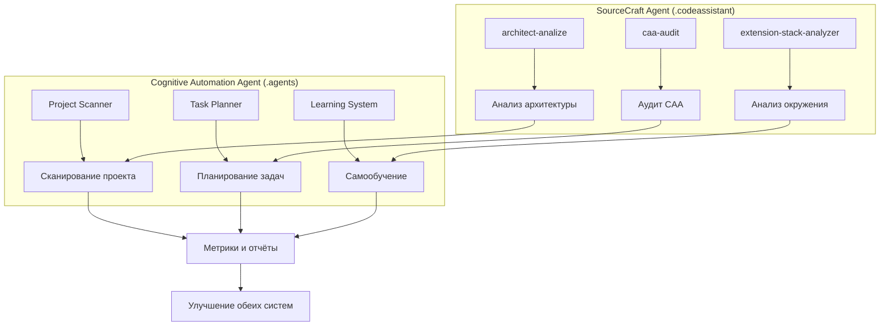

# Архитектура портфолио-системы архитектора когнитивных систем

## Обзор архитектуры

```
portfolio-system-architect/
├── .agents/                    # Cognitive Automation Agent (CAA) - продукт
│   ├── skills/                # Навыки CAA (автономное выполнение)
│   ├── config/                # Конфигурации автономной системы
│   ├── scripts/               # Скрипты для автоматизации
│   └── workflows/             # Автономные рабочие процессы
├── .codeassistant/            # SourceCraft Agent Skills - конфигурация
│   ├── skills/                # Skills для анализа и работы
│   ├── context.md             # Контекст для ИИ-ассистента
│   └── mcp.json              # MCP конфигурация
├── apps/                      # Другие компоненты экосистемы
│   ├── it-compass/           # IT-Compass фреймворк
│   ├── career-development/   # Развитие карьеры
│   └── knowledge-graph/      # Граф знаний
└── docs/                     # Документация и методология
```

## 1. Cognitive Automation Agent (.agents/)

### Назначение
Автономная система для управления проектами с интеллектуальными возможностями.

### Ключевые компоненты
- **Project Scanner** - интеллектуальное сканирование технологического стека
- **Task Planner** - проактивное планирование задач
- **Learning System** - система самообучения на основе метрик
- **Trigger System** - система триггеров и автоматических действий

### Архитектурные принципы
- **Автономность** - система предугадывает потребности, а не выполняет команды
- **Интеграция** - глубоко интегрирована с Git, CI/CD, мониторингом
- **Самообучение** - улучшается на основе собственных метрик и feedback loops

## 2. SourceCraft Agent Skills (.codeassistant/)

### Назначение
Конфигурация и skills для ИИ-ассистента (SourceCraft), который помогает в разработке и анализе.

### Ключевые skills
- **architect-analize** - глубокий анализ архитектуры через призму системного мышления
- **caa-audit** - аудит и валидация Cognitive Automation Agent
- **extension-stack-analyzer** - анализ расширений VS Code
- **performance-profiler** - анализ производительности окружения

### Архитектурные принципы
- **Аналитическая направленность** - skills для анализа, а не выполнения
- **Контекстное понимание** - работа в контексте профессионального пути автора
- **Интеграция с MCP** - использование Model Context Protocol для расширения возможностей

## 3. Взаимосвязи между системами

### Skill "caa-audit" → Cognitive Automation Agent
```
.codeassistant/skills/caa-audit/           .agents/
         │                                       │
         ▼                                       ▼
[Анализ позиционирования]           [Реализация автономной системы]
         │                                       │
         └───────────────────────────────────────┘
                    Анализ → Реализация
```

### Data Flow между системами


## 4. Принципы взаимодействия

### Разделение ответственности
| Система | Ответственность | Уровень абстракции |
|---------|----------------|-------------------|
| **CAA (.agents/)** | Автономное выполнение | Уровень реализации |
| **SourceCraft Skills (.codeassistant/)** | Анализ и рекомендации | Уровень анализа |

### Направление зависимостей
```
.codeassistant/ → .agents/   (Анализ зависит от реализации)
.agents/ ↛ .codeassistant/   (Реализация не зависит от анализа)
```

### Интерфейсы взаимодействия
1. **Файловая система** - анализ артефактов CAA
2. **Git hooks** - автоматические проверки CAA
3. **Метрики и отчёты** - данные для анализа
4. **Конфигурации** - настройки для обоих систем

## 5. Архитектурные решения (ADR)

### ADR-001: Разделение на реализацию и анализ
**Контекст:** Необходимость разделить автономное выполнение и аналитические возможности.

**Решение:** Создать две независимые системы:
- `.agents/` для автономного выполнения (Cognitive Automation Agent)
- `.codeassistant/` для аналитических skills (SourceCraft Agent)

**Последствия:**
- ✅ Чёткое разделение ответственности
- ✅ Независимое развитие систем
- ✅ Возможность замены одной системы без влияния на другую
- ⚠️ Необходимость документирования взаимосвязей

### ADR-002: Skill "caa-audit" как мост между системами
**Контекст:** Необходимость анализировать работу Cognitive Automation Agent.

**Решение:** Создать skill в `.codeassistant/`, который анализирует `.agents/`.

**Последствия:**
- ✅ Возможность аудита CAA без изменения его кода
- ✅ Независимость анализа от реализации
- ✅ Демонстрация зрелости архитектуры

## 6. Метрики здоровья архитектуры

### Качество разделения
- **Коэффициент связности**: < 0.1 (низкая связность между системами)
- **Коэффициент сцепления**: > 0.9 (высокое сцепление внутри систем)

### Эффективность взаимодействия
- **Время анализа CAA**: < 30 секунд
- **Точность рекомендаций**: > 85%
- **Скорость реакции на изменения**: < 5 минут

### Технический долг
- **Документация взаимосвязей**: 100% покрытие
- **Интеграционные тесты**: > 80% покрытие
- **Health checks**: 100% компонентов

## 7. Рекомендации по развитию

### Краткосрочные (1-2 недели)
1. ✅ Создать ARCHITECTURE.md (этот документ)
2. ✅ Добавить changelogs для отслеживания изменений
3. 🔄 Создать интеграционные тесты между системами

### Среднесрочные (1 месяц)
1. Настроить CI/CD для автоматической проверки совместимости
2. Создать dashboard для мониторинга взаимодействия
3. Добавить health checks для обеих систем

### Долгосрочные (3 месяца)
1. Реализовать API для формализованного взаимодействия
2. Создать систему A/B тестирования для skills
3. Разработать механизм обратной связи между системами

## 8. Контакты и ответственность

### Владельцы систем
- **Cognitive Automation Agent (.agents/)**: Архитектор когнитивных систем
- **SourceCraft Agent Skills (.codeassistant/)**: SourceCraft команда

### Контакты для вопросов
- Вопросы по архитектуре: создатель репозитория
- Вопросы по CAA: issues в `.agents/`
- Вопросы по skills: issues в `.codeassistant/`

---

*Документ обновлён: 2026-04-10*  
*Версия: 1.0*  
*Статус: Актуально*