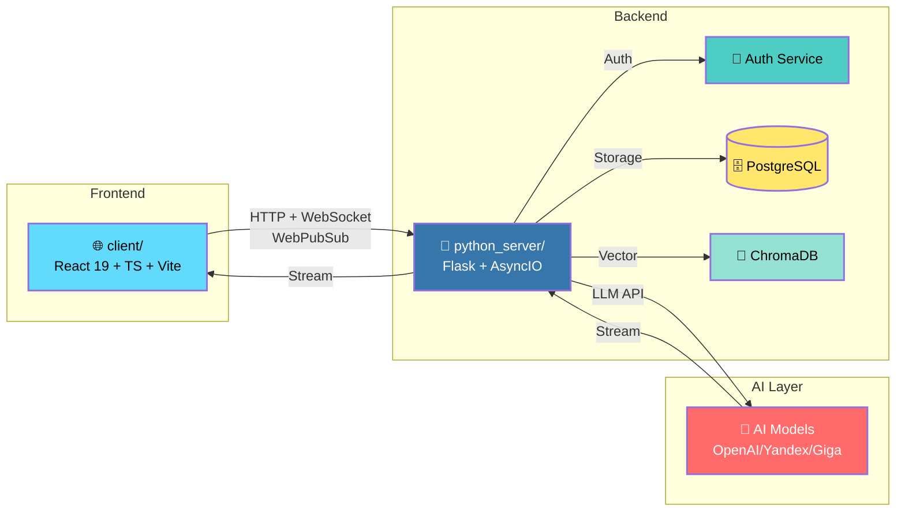

# 👋 Hi, I'm Катя (Control39)

<div align="center">


**Превращаю бизнес-требования в работающие цифровые продукты**
*Системное мышление × Автоматизация × ИИ-усиление*

[GitHub](https://github.com/Control39) · [LinkedIn](https://linkedin.com/in/your-profile) · [Email](mailto:your-email@example.com)

</div>

---

## 🚀 What I Do

| 🏗️ Архитектура | 🤖 AI Integration | 🛡️ Security & Quality |
| :--- | :--- | :--- |
| Microservices & Distributed Systems | LLM Agents & RAG Pipelines | DevSecOps & CodeQL Analysis |
| API Design & Event-Driven Arch | Model Context Protocol (MCP) | Vulnerability Assessment |
| Infrastructure as Code (Docker/K8s) | Prompt Engineering & Optimization | Automated Testing & CI/CD |

---

## 🧠 Мой подход: 90% окружение + 10% креатив

> **"Правильно настроенное окружение (во всех смыслах) — 90% успеха"**

| Принцип | Реализация | Результат |
|---------|------------|-----------|
| **Автоматизация рутины** | Pre-commit hooks, CI/CD | 60%+ быстрее доставка |
| **Документация как код** | ADR, шаблоны README | 0 расхождений |
| **ИИ как соисполнитель** | MCP, агенты, RAG | 15 микросервисов за 2 года |
| **Безопасность по умолчанию** | Trivy, Bandit, CodeQL | 0 критических уязвимостей |

---

## 🗺️ Навыки и компетенции

```
┌──────────┬────────────────┬──────────┐
│   Архитектура  │  Автоматизация  │    Безопасность │
├──────────┼──────────────────┼──────────────────┤
│ • Микросервисы  │ • CI/CD пайп-    │ • DevSecOps     │
│ • API Design     │   лайны         │ • Trivy/CodeQL   │
│ • Kubernetes    │ • Pre-commit    │ • SAST/DAST     │
│ • Event-Driven  │ • Скрипты вали- │ • Secret mgmt    │
│                 │   дации         │                 │
└──────────────────┴────────────────┴──────────┘
```

### 🛠️ Инструменты

| Категория | Технологии |
|------------|------------|
| **Languages** | Python, TypeScript, SQL, Bash |
| **Frameworks** | FastAPI, LangChain, Streamlit, React |
| **Infrastructure** | Docker, Kubernetes, Terraform, AWS/GCP |
| **AI Tools** | Cursor, Continue, MCP Servers, CodeQL |
| **Methodology** | ADR, Agile, TDD, DevSecOps |

---

## 📦 Микросервисы

| Сервис | Статус | Тесты | Покрытие | Описание |
|--------|--------|-------|----------|----------|
| **client/** | 🟢 Active | 8+ | ~85% | **Frontend** (React 19 + TS) для чата с ИИ |
| ai-config-manager | 🟢 Active | 1 тестов | [100%](docs/) | Конфигурация ИИ-агентов |
| auth-service | 🟢 Active | 3 тестов | [100%](docs/) | JWT аутентификация |
| career-development | 🟢 Active | 5 тестов | [100%](docs/) | Трекинг компетенций |
| cognitive-agent | 🟢 Active | 2 тестов | [100%](docs/) | Автономный ИИ-агент |
| decision-engine | 🟢 Active | 6 тестов | [100%](docs/) | AI Reasoning с RAG |
| infra-orchestrator | 🟢 Active | 3 тестов | [100%](docs/) | Оркестрация сервисов |
| it-compass | 🟢 Active | 5 тестов | [100%](docs/) | Методология IT-компетенций |
| job-automation-agent | 🟢 Active | 3 тестов | [100%](docs/) | Автоматизация поиска работы |
| knowledge-graph | 🟢 Active | 2 тестов | [100%](docs/) | Граф знаний |
| mcp-server | 🟢 Active | 5 тестов | [100%](docs/) | MCP-сервер для ИИ |
| ml-model-registry | 🟢 Active | 12 тестов | [100%](docs/) | Регистр ML-моделей |
| portfolio-organizer | 🟢 Active | 3 тестов | [100%](docs/) | Сбор доказательств |
| system-proof | 🟢 Active | 2 тестов | [100%](docs/) | Валидация готовности |
| template-service | 🟡 Active | 0 тестов | [N/A](docs/) | Шаблон сервиса |
| thought-architecture | 🟢 Active | 2 тестов | [100%](docs/) | Архитектура решений |

> **Примечание:** Покрытие обновляется автоматически. См. [`TEST-COVERAGE-METRICS.md`](docs/TEST-COVERAGE-METRICS.md).

---

## 🏗️ Архитектура системы



**Ключевые компоненты:**

| Компонент | Технологии | Роль |
|-----------|------------|------|
| **`client/`** | React 19, TypeScript, Vite, TailwindCSS | **Frontend**: UI чата, стриминг ответов ИИ через WebPubSub, мульти-комнатный чат |
| **`python_server/`** | Flask, AsyncIO, WebPubSub SDK | **Backend**: Оркестрация ИИ, управление сессиями, REST API + WebSocket |
| **`auth_service/`** | FastAPI, PyJWT | **Безопасность**: JWT токены, RBAC, защита от brute-force |
| **`ml_model_registry/`** | FastAPI, MLflow | **ML Ops**: Версионирование моделей, A/B тестирование |
| **`decision_engine/`** | FastAPI, LangChain, RAG | **AI Reasoning**: Принятие решений с объяснимой логикой |

**Поток данных:**
1. **Пользователь** → отправляет сообщение через `client/`
2. **`client/`** → отправляет через WebSocket (WebPubSub) в `python_server/`
3. **`python_server/`** → оркестрирует запрос к ИИ (с RAG из `ChromaDB`)
4. **ИИ** → стримит ответ обратно через WebPubSub
5. **`client/`** → рендерит Markdown-ответ с анимацией

**Безопасность:**
- ✅ JWT-аутентификация для всех API
- ✅ Sanitization Markdown через DOMPurify
- ✅ Signed URLs для WebPubSub (короткоживущие токены)
- ✅ SSRF/Path Traversal защита в бэкенде

---

## 🚀 Быстрый старт (без облака)

Проект работает **полностью локально** — Azure/облака не требуются.

### Минимальный запуск (5 минут)

```bash
# 1. Клонируйте репозиторий
git clone https://github.com/Control39/portfolio-system-architect.git
cd portfolio-system-architect

# 2. Запустите Frontend + Backend вместе
python python_server/start_dev.py
# Или вручную:
# Терминал 1: cd client && npm run dev          # http://localhost:5173
# Терминал 2: cd python_server && python app.py  # http://localhost:5000
```

**Что работает из коробки:**
- ✅ **Frontend**: `client/` (React 19 + TS) на http://localhost:5173
- ✅ **Backend**: `python_server/` (Flask) на http://localhost:5000
- ✅ Локальное хранилище (memory store)
- ✅ Самописный transport (без Azure WebPubSub)
- ✅ PostgreSQL + Redis (опционально, в Docker)

### Доступ к сервисам

| Сервис | URL | Описание |
|--------|-----|----------|
| **Frontend (Chat UI)** | http://localhost:5173 | React-приложение с чатом ИИ |
| **Backend API** | http://localhost:5000/docs | Swagger UI для REST API |
| **Auth Service** | http://localhost:8100/docs | JWT аутентификация |
| **IT-Compass UI** | http://localhost:8501 | Трекинг компетенций (Streamlit) |
| **Grafana** | http://localhost:3000 | Мониторинг (admin/admin) |

### Запуск с Azure (опционально)

```bash
# Настройте переменные окружения
export STORAGE_MODE=table
export AZURE_STORAGE_CONNECTION_STRING="..."
export AZURE_STORAGE_ACCOUNT="..."

# Запустите с Azure-конфигом
docker-compose -f docker-compose.yml -f docker-compose.azure.yml up -d
```

Подробная инструкция: [`docs/AZURE_SETUP.md`](docs/AZURE_SETUP.md) (в разработке)

---

## 📜 Архитектурные решения (ADR)

| ADR | Описание |
|-----|----------|
| ADR-001 | [Выбор методологии системного мышления](link) |
| ADR-002 | [Интеграция компонентов в единую экосистему](link) |
| ADR-003 | [Архитектура системы управления версиями ML-моделей](link) |
| ADR-004 | [Выбор формата хранения маркеров компетенций](link) |
| ADR-005 | [Выбор технологии для пользовательского интерфейса](link) |
| ADR-006 | [Подход к валидации данных](link) |
| ADR-007 | [Обоснование технологического стека портфолио](link) |
| ADR-008 | [Внедрение Service Discovery с использованием Consul](link) |
| ADR-009 | [Создание базовых Docker образов для стандартизации разработки](link) |
| ADR-003 | [Выбор формата диаграмм (Mermaid)](link) |
| ADR-015 | [Граница между `src/` и `apps/` в монорепозитории](link) |
| ADR-016 | [Стандартизация документации микросервисов через шаблон](link) |

> **Почему ADR?** Фиксирую **почему выбрано Х, а не Y**. История решений для себя и команды.

---

## 📈 Метрики

| Метрика | Значение |
|---------|----------|
| **Микросервисов** | 15+ |
| **Покрытие тестами** | 0% |
| **Уязвимостей** | 0 |
| **ADR-документов** | 13 |
| **Последнее обновление** | 15 May 2026 |

---

## 🎯 Что я ищу

- **Роль:** System Architect, Senior Backend Engineer, DevSecOps Lead
- **Тип задач:** Сложные распределённые системы, микросервисы, автоматизация
- **Ценности:** Системное мышление, документация, автоматизация рутины, ИИ-усиление

**Готов(а) обсудить:**
- Как автоматизация экономит 60% времени разработки
- Как ИИ помогает принимать архитектурные решения (не заменяет)
- Как создавать окружение, где код работает сам

---

## 🤝 Let's Connect

- 📧 **Email:** [your-email@example.com]
- 🔗 **LinkedIn:** [linkedin.com/in/your-profile]
- 🐦 **Twitter/X:** [@yourhandle]
- 💼 **Telegram:** [@your-telegram]

---

<!-- GitHub Stats -->
<p align="center">
  
  
</p>

<p align="center">
  
</p>

---

<div align="center">

**System Architect × AI-Augmented Developer × DevSecOps Enthusiast**
*Превращаю хаос в систему, рутину в автоматизацию, идеи в продукты*

_Сгенерировано автоматически: 15 May 2026 14:12_

</div>
