# Portfolio System Architect

Платформа для автоматизации управления портфелем проектов на базе микросервисной архитектуры. 21 контейнеризированный сервис с AI-автоматизацией и production-grade инфраструктурой.

<div align="center">


</div>

---

## 📋 Описание системы

Это **композиционная архитектура** на принципе «Атомов и Молекул»:

- **Атомы** (`src/`) — переиспользуемые компоненты (security, shared, core, telemetry, vector_store)
- **Молекулы** (`apps/`) — независимые сервисы, собранные из атомов
- **Агенты** (`agents/`) — автономные AI-агенты, использующие атомы

**Ключевые возможности:**
- 🔒 0 критических уязвимостей (Trivy + Bandit + CodeQL)
- 🧪 ~75% среднее покрытие тестами (779+ тестов, 98% проходят)
- 🔄 Полный CI/CD + pre-commit hooks
- 📊 Production monitoring (Prometheus + Grafana)
- 🚀 Kubernetes-ready деплой (52 манифеста, GitOps)
- 🧠 Cognitive Agent — автономный AI-оркестратор экосистемы

---

## 🏗️ Архитектура

```mermaid
graph TB
subgraph "АТОМЫ (src/)"
A1[src/security - Маскирование секретов]
A2[src/shared/schemas - career.yaml, proof.yaml]
A3[src/config - Hot-reload конфигурация]
A4[src/core - Базовые интерфейсы]
A5[src/common - Telemetry, health-check]
A6[src/ai - GigaChat, Ollama bridge]
A7[src/vector_store - ChromaDB RAG]
end
subgraph "МОЛЕКУЛЫ (apps/)"
M1[auth_service]
M2[career_development]
M3[decision_engine]
M4[portfolio_organizer]
M5[context_builder]
M6[it_compass]
M7[knowledge_graph]
M8[chat_backend]
M9[infra_orchestrator]
M10[ml_model_registry]
M11[system_proof]
M12[thought_architecture]
M13[assistant_orchestrator]
M14[template_service]
M15[mcp_server]
M16[job_automation_agent]
M17[embedding_agent]
M18[competency_gap_engine]
M19[ai_provider_manager]
M20[ai_config_manager]
end
subgraph "АГЕНТЫ (agents/)"
AG1[cognitive_agent - AI-оркестратор]
end
A1 --> M1 & M2 & M3 & M4 & M5 & M6 & M7 & AG1
A2 --> M2 & M4 & M6
A3 --> M1 & M2 & M3 & M4 & M5 & M6 & M7 & AG1
A4 --> M3 & AG1
A5 --> M1 & M2 & M3 & M4 & M5 & M6 & M7 & AG1
A6 --> M3 & AG1
A7 --> M7 & AG1
M18 & M19 & M20 -.->|зависимости| M1 & M2 & M3 & M4 & M5 & M6 & M7
```



---

## 🚀 Быстрый старт

```bash
# 1. Клонировать репозиторий
git clone https://github.com/Control39/portfolio-system-architect.git
cd portfolio-system-architect

# 2. Создать виртуальное окружение
python -m venv .venv
.venv\Scripts\activate  # Windows
# source .venv/bin/activate  # Linux/Mac

# 3. Установить зависимости
pip install -r requirements-dev.txt

# 4. Запустить тесты
pytest apps/*/tests/ -v --cov=apps --cov-report=term-missing

# 5. Запустить диагностику
python agents/cognitive_agent/orchestrator_v2.py
```

### Запуск Cognitive Agent

```bash
# Запуск AI-агента
cd agents/cognitive_agent
python -m uvicorn src.main:app --reload --port 8008

# Или через Docker
docker-compose up -d cognitive-agent
```

### Docker (опционально)

```bash
docker-compose up -d

# Доступ к сервисам:
# Auth Service: http://localhost:8100/docs
# IT-Compass UI: http://localhost:8501
# Grafana: http://localhost:3000 (admin/admin)
```

---

## 📊 Сервисы

### 🟢 Production-сервисы (`apps/`)

| Сервис                 | Статус  | Coverage | Назначение                     |
| ---------------------- | ------- | -------- | ------------------------------ |
| auth_service           | ✅ Ready | ~95%     | JWT-аутентификация             |
| portfolio_organizer    | ✅ Ready | 92%      | Сбор и валидация доказательств |
| decision_engine        | ✅ Ready | ~85%     | AI reasoning с RAG             |
| career_development     | ✅ Ready | 80%      | Трекинг компетенций            |
| it_compass             | ✅ Ready | ~85%     | Методология IT-компетенций     |
| context_builder        | ✅ Ready | ~85%     | Сборка контекста для LLM       |
| ai_config_manager      | ✅ Ready | ~90%     | Централизованная конфигурация  |
| ml_model_registry      | ✅ Ready | ~90%     | Регистр ML-моделей             |
| chat_backend           | ✅ Ready | ~78%     | WebSocket-чат                  |
| job_automation_agent   | ✅ Ready | ~80%     | Автоматизация поиска работы    |
| assistant_orchestrator | ✅ Ready | ~80%     | Оркестрация ассистентов        |
| knowledge_graph        | ✅ Ready | ~75%     | Граф знаний                    |
| infra_orchestrator     | ✅ Ready | ~75%     | Оркестрация сервисов           |
| thought_architecture   | ✅ Ready | ~75%     | ADR, архитектура решений       |
| system_proof           | ✅ Ready | ~75%     | Аудит готовности системы       |
| template_service       | ✅ Ready | ~60%     | Генератор шаблонов             |
| mcp_server             | ✅ Ready | 47%      | MCP-сервер для агентов         |

### 🟡 В разработке / Библиотеки (модули без standalone entry point)

| Сервис                | Статус    | Coverage | Назначение                          |
| --------------------- | --------- | -------- | ----------------------------------- |
| embedding_agent       | 🟡 Planned | ~75%     | Векторные эмбеддинги (ChromaDB RAG) |
| ai_provider_manager   | 🟡 Planned | ~75%     | Управление провайдерами AI          |
| competency_gap_engine | 🟡 Planned | ~70%     | Анализ разрывов компетенций         |

### 🧠 Автономный агент (`agents/`)

| Агент               | Статус    | Coverage       | Назначение                       |
| ------------------- | --------- | -------------- | -------------------------------- |
| **cognitive_agent** | **🟡 MVP** | **66% (core)** | **🧠 Центральный AI-оркестратор** |

**Среднее покрытие по экосистеме: ~75%**

### 🔑 Ключевая роль Cognitive Agent

**Cognitive Agent** (`agents/cognitive_agent/`) — центральный оркестратор экосистемы, который:
- 🔍 **Сканирует** все сервисы и понимает их структуру
- 📋 **Планирует** задачи через ИИ (GigaChat + LangChain)
- 🔗 **Интегрирует** IT-Compass, Job Automation, Decision Engine
- 📚 **Собирает метрики** и учится на результатах
- 🎯 **Выполняет** навыки (skills) через скрипты

**Статус:** FastAPI сервер работает, ИИ-планирование в разработке.
**Документация:** [agents/cognitive_agent/README.md](agents/cognitive_agent/README.md)

---

## 🔄 CI/CD

[](https://github.com/Control39/portfolio-system-architect/actions/workflows/ci.yml)
[](https://github.com/Control39/portfolio-system-architect/actions/workflows/codeql.yml)
[](https://github.com/Control39/portfolio-system-architect/actions/workflows/security-scan.yml)
[](https://github.com/Control39/portfolio-system-architect/actions/workflows/trivy-scan.yml)

**Автоматизированные проверки:**
- ✅ Pre-commit hooks (ruff, mypy, bandit, detect-secrets)
- ✅ Security scanning (Trivy, CodeQL, Bandit)
- ✅ Test coverage (pytest-cov → Codecov)
- ✅ Dependency updates (Dependabot)
- ✅ Architecture validation (custom checks)

---

## 📚 Документация

### Архитектура
- [ARCHITECTURE.md](docs/ARCHITECTURE.md) — общая архитектура системы
- [ADR](docs/architecture/decisions/) — архитектурные решения (19 ADR)
  - ADR-001: Методология системного мышления
  - ADR-014: Архитектурная граница «Атомы vs Молекулы»
  - ADR-019: Local vs Cloud LLM
  - ADR-024: Enhanced config manager

### Автономный агент
- [Cognitive Agent](agents/cognitive_agent/README.md) — AI-оркестратор экосистемы
- [Автономный агент](agents/cognitive_agent/IMPLEMENTATION_REPORT.md) — отчёт о реализации

### Для разных аудиторий
| Аудитория                  | Документ                                           | Что внутри                   |
| -------------------------- | -------------------------------------------------- | ---------------------------- |
| 🎯 HR / Нанимающий менеджер | [HIRING_BRIEF.md](docs/HIRING_BRIEF.md)            | Бизнес-ценность, компетенции |
| 💻 Техлид / Архитектор      | [ADR](docs/architecture/decisions/)                | Паттерны, стандарты          |
| 🛠️ DevOps / SRE             | [deployment/](deployment/)                         | K8s манифесты, CI/CD         |
| 🌱 Начинающие               | [apps/it_compass/](apps/it_compass/)               | Методология самооценки       |
| 🧠 AI-разработчик           | [agents/cognitive_agent/](agents/cognitive_agent/) | Автономный AI-агент          |

### Для ИИ-ассистентов
Перед работой с проектом изучите:
1. [AI_INSTRUCTIONS.md](docs/ai/AI_INSTRUCTIONS.md) — архитектурные правила
2. [AI_PROVIDER_SETUP.md](docs/ai/AI_PROVIDER_SETUP.md) — настройка провайдеров
3. [gigacode/](docs/ai/gigacode/) — гайды по GigaCode

---

## 🧪 Тестирование

```bash
# Запустить все тесты
pytest apps/*/tests/ -v

# Запустить тесты с coverage
pytest apps/*/tests/ --cov=apps --cov-report=term-missing

# Запустить тесты конкретного сервиса
pytest agents/cognitive_agent/tests/ -v

# Запустить только быстрые тесты
pytest -m "not slow"
```

**Статистика тестов:**
- Всего тестов: 779+
- Проходят: ~98%
- Среднее покрытие: ~75%

---

## 🔐 Безопасность

**Автоматизированные проверки:**
- **Trivy** — сканирование уязвимостей в зависимостях и Docker образах
- **CodeQL** — статический анализ кода на уязвимости
- **Bandit** — проверка Python кода на security issues
- **detect-secrets** — предотвращение коммита секретов
- **Gitleaks** — дополнительная проверка на секреты

**Результат:** 0 критических уязвимостей в production-сервисах.

---

## 📈 Мониторинг

Система включает production-ready мониторинг:

- **Prometheus** — сбор метрик
- **Grafana** — визуализация (дашборды для каждого сервиса)
- **Alertmanager** — алерты в Telegram

Дашборды показывают:
- Health check статус сервисов
- Latency и throughput
- Error rates
- Resource utilization (CPU, memory)

---

## 🤝 Вклад в проект

Проект открыт для обсуждения и сотрудничества. Если у вас есть вопросы или предложения:

1. Откройте [Issue](https://github.com/Control39/portfolio-system-architect/issues)
2. Обсудите в [Discussions](https://github.com/Control39/portfolio-system-architect/discussions)
3. Напишите на [leadarchitect@yandex.ru](mailto:leadarchitect@yandex.ru)

---

## 📄 Лицензия

- **Код:** MIT License
- **Методология:** CC BY-ND 4.0 (© Екатерина Куделя)

---

<div align="center">

**Cognitive Architecture × AI-Augmented Development × DevSecOps**

*Последнее обновление: июнь 2026*

</div>
