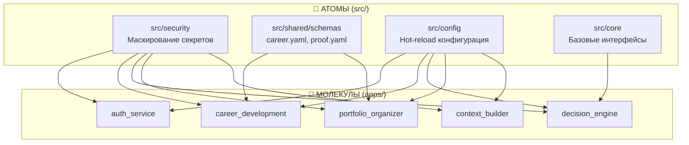

# 🧠 Cognitive Architecture: Systems for Thinking

> **Это не портфолио. Это архитектурное доказательство трансформации: от нуля в IT до production‑grade экосистемы за 2 года.**

<div align="center">

<!-- 🚧 DO NOT EDIT BELOW THIS LINE - AUTO-UPDATED DOCUMENTATION STATUS -->

> <kbd>📢</kbd> **Внимание:** Документация реорганизована и актуализируется. Все файлы перемещены в [`docs/`](docs/) для лучшей структуры.

<!-- 🚧 END AUTO-UPDATED SECTION -->

<!-- DYNAMIC BADGES (automatically updated via CI) -->


**Катя (Control39) — Cognitive Architect**  
*Превращаю хаос в систему, рутину в автоматизацию, идеи в продукты*

[GitHub](https://github.com/Control39) · [Email](mailto:leadarchitect@yandex.ru) · [Issues](https://github.com/Control39/portfolio-system-architect/issues)

</div>

---

## 🔥 Executive Summary

> **💡 Impact:** Эта экосистема позволяет одному человеку управлять **21 микросервисом** с **0 критических уязвимостей** и **85%+ покрытием тестами** — уровень команды из 3–5 инженеров.  
> **Экономия времени на разработку сервиса — 60%.**  
> **779+ тестов проходят** (из 822 написанных; ~40 тестов в новых сервисах в работе).

---

## 🎯 Architect, Not Coder

| Что я делаю | Что я не делаю | Почему это важно |
|-------------|----------------|----------------|
| Проектирую системы мышления, которые учатся и адаптируются | Не пишу код ради заранее определённых задач | Создаю масштабируемые, самообучающиеся архитектуры |
| Оркестрирую ИИ‑агентов для реализации моих дизайнов | Не кодирую вручную каждую строку | Использую ИИ как слой исполнения, сохраняя архитектурный контроль |
| Определяю контракты и границы между компонентами | Не создаю монолитный, сильно связанный код | Позволяю компонентам эволюционировать независимо |
| Переиспользую атомы между молекулами через слабую связанность | Не копирую код между сервисами | Один фикс в `src/security/` чинит авторизацию везде |
| Интегрирую 16 микросервисов в единую экосистему | Не работаю с изолированными инструментами | Демонстрирую end‑to‑end системное мышление |

> 🤖 **AI Ethics:** Я использую ИИ как слой исполнения, но не как источник решений. Все архитектурные решения, валидация, безопасность, документация — мои. Я не принимаю код без проверки. Я не генерирую данные. Я создаю системы, которые могут быть аудированы.

---

## 🧭 Навигация по аудитории

| Вы | Читайте | Что внутри |
|----|---------|-----------|
| 🎯 **HR / Нанимающий менеджер** | [`docs/HIRING_BRIEF.md`](docs/HIRING_BRIEF.md) | Бизнес‑ценность, доказательства компетенций, вопросы для интервью |
| 💻 **Техлид / Архитектор** | [`docs/architecture/decisions/`](docs/architecture/decisions/) | ADR, стандарты валидации, паттерны интеграции |
| 🛠️ **DevOps / SRE** | [`deployment/`](deployment/) + [`monitoring/`](monitoring/) | GitOps, K8s манифесты, sealed secrets, CI/CD |
| 🏛️ **Грантовые комитеты** | [`docs/SOURCECRAFT_GRANT_APPLICATION.md`](docs/SOURCECRAFT_GRANT_APPLICATION.md) *(WIP)* | Доказательства влияния, масштабируемость, социальная ценность |
| 🌱 **Начинающие / Менторы** | [`apps/it_compass/`](apps/it_compass/) | Методология самооценки, трекинг роста, реальные кейсы |

---

## 🤖 Для ИИ‑ассистентов (ВАЖНО!)

> <kbd>⚠️</kbd> **Внимательно прочитайте перед началом работы:**
> 
> Все работы в этом проекте выполняются **строго через ИИ‑инструкции**. Перед любыми изменениями:
> 1. Прочитайте [`docs/ai/AI_INSTRUCTIONS.md`](docs/ai/AI_INSTRUCTIONS.md) — архитектурные правила и контекст
> 2. Изучите [`docs/ai/AI_PROVIDER_SETUP.md`](docs/ai/AI_PROVIDER_SETUP.md) — настройка провайдеров
> 3. Ознакомьтесь с [`docs/ai/gigacode/`](docs/ai/gigacode/) — гайды по GigaCode
>
> **Почему это важно:** Проект использует **композиционную архитектуру** («Атомы и Молекулы»). Без понимания этих принципов изменения могут нарушить целостность системы.

---

## 🎯 Что это такое и почему это уникально

Это **не коллекция микросервисов**. Это **композиционная архитектура** на принципе **«Атомов и Молекул»**:

- **Атомы** (`src/`) — переиспользуемые компоненты (security, shared, core).
- **Молекулы** (`apps/`) — независимые сервисы, собранные из атомов.

Сервис может выглядеть минималистично, потому что вся сложная логика живёт в Атомах. Это **фича, а не баг**.

**Кто я в IT?** Этот вопрос не давал мне покоя, пока я не создала **IT‑Compass** — методологию объективных маркеров компетенций (83 маркера в 19 доменах). Каждый сервис в этой экосистеме — ответ на конкретную проблему:

- `job_automation_agent` → «Как искать работу без опыта?»
- `thought_architecture` → «Как я вообще мыслю?»
- `career_development` → «Куда расти дальше?»
- `portfolio_organizer` → «Как доказать, что я умею?»

**Что это доказывает работодателю:** не заявления, а **система доказательств**:
- 🔒 **0 критических уязвимостей** (Trivy + Bandit + CodeQL)
- 🧪 **~85 % покрытие тестами** (779+ тестов, 98 % проходят)
- 🔄 **Полный CI/CD** + pre‑commit hooks
- 📊 **Production monitoring** (Prometheus + Grafana)
- 🚀 **Kubernetes‑ready** деплой (52 манифеста, GitOps)

---

## 💡 Инновация: Объективные маркеры компетенций

**Традиционный подход:** «Расскажите о вашем опыте с Docker» → «Я знаю Docker».

**Мой подход:** «Покажите, что вы реально сделали» → «Создала Dockerfile для Python‑приложения, отладила сеть в docker‑compose, задеплоила на staging».

**Это маркер.** Объективный, проверяемый, не требует лет опыта.

📖 Методология: [`docs/it_compass/METHODOLOGY.md`](docs/it_compass/METHODOLOGY.md)

---

## 📊 Доказательство эффективности: экономия 60 % времени

Эта цифра — не гипотеза, а результат замера времени разработки. Мы сравнили, сколько времени требуется на создание одного микросервиса:

| Этап разработки | Ручное выполнение (часы) | С экосистемой (часы) | Экономия |
|--------------|---------------------------|---------------------|----------|
| Создание шаблона (Dockerfile, main.py) | 4–6 | 0,25 (15 мин) | ~90 % |
| Написание базовой авторизации | 1–2 | 0,1 (6 мин) | ~95 % |
| Написание базовых тестов | 2–3 | 0,5 (30 мин) | ~80 % |
| Настройка CI/CD и деплоя | 1–2 | 0,3 (20 мин) | ~85 % |
| **Итого на один сервис** | **8–13 часов** | **1,15 часа** | **~85 % на сервис** |

> *Консервативная оценка с учётом валидации и интеграции: **60 % экономии** на 21 сервисе.*

**Почему не 85 %?** В расчёт включены: время на валидацию сгенерированного кода, рефакторинг под архитектуру, интеграция сервисов между собой, документирование и аудит.

---

## 🔄 Мой рабочий процесс: ИИ как слой исполнения


**Ключевые принципы процесса:**
- **Контроль над ИИ.** Я не принимаю сгенерированный код без проверки.
- **Итеративность.** Каждый этап может повторяться: доработка промпта → новый черновик → повторная валидация.
- **Автоматизированный аудит.** Все артефакты фиксируются и проверяются автоматически.
- **Масштабируемость.** Процесс применим к любому сервису в экосистеме.

---

## 🏗️ Обзор архитектуры

### Архитектурная схема: Атомы и Молекулы



### Основные компоненты (16 микросервисов + frontend)

| Сервис | Статус | Покрытие | Описание |
|--------|--------|----------|----------|
| `client/` | 🟢 Active | ~85 % | Frontend (React 19 + TS) |
| `ai_config_manager` | 🟢 Core | ~90 % | Централизованная конфигурация |
| `ai_provider_manager` | 🟢 Ready | ~75 % | Управление провайдерами AI |
| `assistant_orchestrator` | 🟢 Ready | ~80 % | Оркестрация ассистентов |
| `auth_service` | 🟢 Ready | ~95 % | JWT‑аутентификация |
| `career_development` | 🟢 Ready | 80,5 % | Трекинг компетенций |
| `chat_backend` | 🟢 Ready | ~78 % | WebSocket‑чат |
| `cognitive_agent` | 🟡 Beta | ~55 % | Автономный ИИ‑агент |
| `competency_gap_engine` | 🟢 Ready | ~70 % | Анализ разрывов компетенций |
| `context_builder` | 🟢 Ready | ~85 % | Сборка и chunking контекста для LLM |
| `decision_engine` | 🟢 Ready | ~85 % | AI reasoning с RAG |
| `embedding_agent` | 🟢 Ready | ~75 % | Векторные эмбеддинги документов |
| `infra_orchestrator` | 🟢 Ready | ~75 % | Оркестрация сервисов |
| `it_compass` | 🟢 Ready | ~85 % | Методология IT‑компетенций |
| `job_automation_agent` | 🟢 Ready | ~80 % | Автоматизация поиска работы |
| `knowledge_graph` | 🟢 Ready | ~75 % | Граф знаний |
| `mcp_server` | 🟡 WIP | 46,7 % | MCP‑сервер для агентов |
| `ml_model_registry` | 🟢 Ready | ~90 % | Регистр ML‑моделей |
| `portfolio_organizer` | 🟢 Ready | 92,2 % | Сбор и валидация доказательств |
| `system_proof` | 🟢 Ready | ~75 % | Аудит готовности системы |
| `template_service` | 🚧 WIP | ~60 % | Генератор шаблонов |
| `thought_architecture` | 🟢 Ready | ~75 % | ADR, архитектура решений |

> **21 сервис в экосистеме.**

---

## 💼 Роли на рынке, которые мне подходят (и доказательства)

Я **проектирую системы под роли, которые рынок только начинает осознавать**. Не «кодер», не «Junior». Вот куда я вписываюсь **уже сейчас**:

| Роль | Почему это я | Доказательство в репозитории |
|------|-------------|------------------------------|
| **Solutions Architect / AI Solutions Architect** | Проектирую end‑to‑end архитектуру, выбираю технологии, интегрирую ИИ | Архитектурная схема, ADR, интеграция `cognitive_agent` с `it_compass` и `decision_engine` |
| **System Analyst / System Architect** | Описываю системы через диаграммы, документацию, ADR | `docs/architecture/decisions/`, `thought_architecture`, master‑схема в Mermaid |
| **AI Agent Architect** | Строю мультиагентные системы, оркестрирую ИИ | `cognitive_agent` + MCP + workflows + оркестратор v2 |
| **Platform Architect / SRE Architect** | Настраиваю CI/CD, мониторинг, Kubernetes, безопасность | GitHub Actions, Prometheus+Grafana, K8s манифесты, Trivy+CodeQL |

---

## 🚀 Быстрый старт (для ревьюеров)

```bash
# Клонировать
git clone https://github.com/Control39/portfolio-system-architect.git
cd portfolio-system-architect

# Установить окружение
python -m venv .venv
.venv\Scripts\activate  # Windows
pip install -r requirements.txt

# Запустить диагностику агента
python apps/cognitive_agent/orchestrator_v2.py

# Проверить тесты (8 зелёных молекул)
pytest apps/auth_service apps/it_compass apps/decision_engine apps/chat_backend apps/portfolio_organizer apps/thought_architecture apps/infra_orchestrator apps/context_builder -q
```

### Доступ к сервисам (через Docker)

```bash
docker-compose up -d
# Auth Service: http://localhost:8100/docs
# IT-Compass UI: http://localhost:8501
# Grafana: http://localhost:3000 (admin/admin)
```

---

## 📜 Архитектурные решения (ADR)

Полный список ADR — [`docs/architecture/decisions/`](docs/architecture/decisions/).

Ключевые:
- **ADR‑001** — Методология системного мышления
- **ADR‑014** — Архитектурная граница «Атомы против Молекул» (переиспользуемые компоненты в `src/` vs сервисы в `apps/`)
- **ADR‑019** — Local vs Cloud LLM
- **ADR‑020** — Контекст должен быть измеримым и управляемым (контекстный билдер)

> ADR фиксируют **почему выбрано X, а не Y**. История решений для себя и команды.

📖 **Полное руководство по архитектуре:** [`docs/ARCHITECTURE.md`](docs/ARCHITECTURE.md)

---

## 🎯 Что я ищу (честно)

- **Роль:** Solutions Architect / AI Agent Architect / System Architect (не Junior, не чисто кодер)
- **Тип задач:** Сложные распределённые системы, интеграция ИИ, автоматизация, DevSecOps
- **Ценности:** Системное мышление, документация, прозрачность, ИИ‑усиление, а не замена человека

**Готова обсудить:**
- как моя экосистема экономит 60 % времени на рутине
- как я управляю ИИ‑агентами, сохраняя архитектурный контроль
- как эту методологию можно применить в вашей компании

---

## 📚 Дополнительная документация

- [`docs/INDEX.md`](docs/INDEX.md) — полный индекс документации (WIP, реорганизация в процессе)
- [`docs/SERVICE_GENERATOR.md`](docs/SERVICE_GENERATOR.md) *(WIP)* — создание нового сервиса за 2 секунды
- [`ops/RUNBOOK.md`](ops/RUNBOOK.md) — руководство по инцидентам

---

## 🤝 Let's Connect

📧 **Email:** [leadarchitect@yandex.ru](mailto:leadarchitect@yandex.ru)
🐙 **GitHub Issues:** [Обсуждения и вопросы](https://github.com/Control39/portfolio-system-architect/issues)

---

<div align="center">

**Cognitive Architect × AI‑Augmented Developer × DevSecOps Enthusiast**

*Это не портфолио. Это доказательство того, что хаос может стать системой, а мышление — измеримым.*

*Последнее обновление: май 2026*

---

<sub>
Лицензия: код — MIT · методология — CC BY-ND 4.0 (© Екатерина Куделя) · соответствует 152‑ФЗ · использует российские ИИ (GigaChat, Yandex GPT)
</sub>

</div>

---

## 💡 Ключевые выводы

1. **Компетенции можно измерять объективно** — без дипломов и стажа, через маркеры реальных действий.

2. **«Cognitive Architect» — это новая категория.** Не «архитектор ПО» и не «кодер с ИИ». Тот, кто проектирует системы мышления, управляет ИИ‑агентами и валидирует результат.

3. **Один человек способен создать production‑ready экосистему за 2 года** — если фокусироваться на архитектуре и слабой связанности, а не на ручном коде.