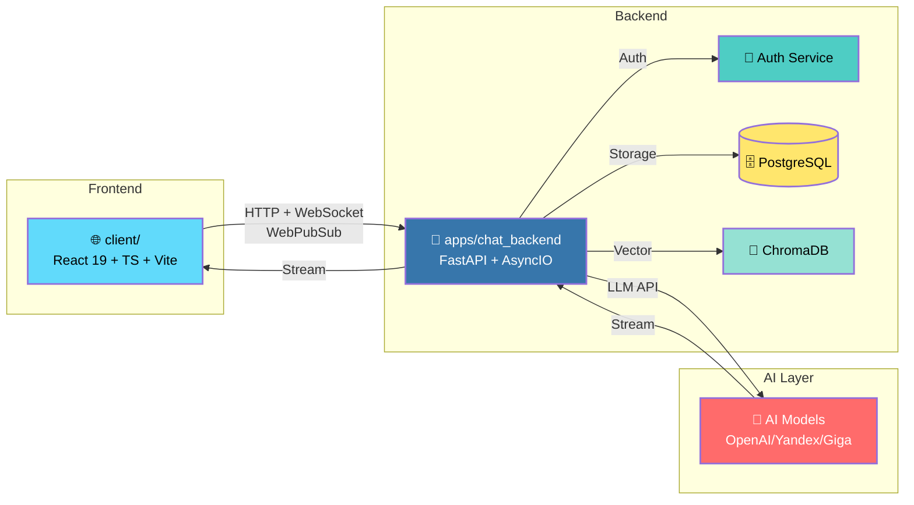

# 🧠 Cognitive Architecture: Systems for Thinking

*A methodology for transforming chaos into evidence. A system that learns how you think.*

<div align="center">


**Катя (Control39) — Cognitive Architect**
*Превращаю хаос в систему, рутину в автоматизацию, идеи в продукты*

[GitHub](https://github.com/Control39) · [Email](mailto:leadarchitect@yandex.ru)

</div>

---

## 🎯 Who I Am

Я **Cognitive Architect** — проектирую системы, где ИИ-компоненты работают вместе для решения проблем без стандартных решений.

Два года назад у меня не было IT-идентичности. Сегодня я создала **живую систему**, которая:
1. **Организовала 25,000+** разрозненных заметок и разговоров
2. **Находит паттерны** в том, как я думаю
3. **Автоматически генерирует доказательства** моих компетенций
4. **Масштабируется** от личного знания до корпоративной документации

Этот репозиторий — **работающая архитектура**, а не портфолио прошлых работ.

> 🧭 **Быстрый старт для:**
> - 👔 **Работодателей**: [🎯 Что можно нанять](#-что-можно-нанять)
> - 👨‍💻 **Техлидов**: [🏗️ Архитектура](#️-архитектура-системы)
> - 🏆 **Грантовых комитетов**: [🏆 Почему это инновация](#-для-грантовых-комитетов)
> - 🤝 **Контрибьюторов**: [🚀 Быстрый старт](#-быстрый-старт)

---

## 💡 The Innovation: Objective Competency Markers

**Традиционный подход:**
> "Расскажите о вашем опыте с Docker"
> *Ответ: "Я знаю Docker"*

**Мой подход:**
> "Что вы реально сделали?"
> *Ответ: "Создала Dockerfile для Python-приложения, запустила с docker-compose, отладил сетевые проблемы, развернула на staging"*

**Это маркер.** Объективный, проверяемый, не требует лет опыта.

📖 Методология: [`docs/it-compass/METHODOLOGY.md`](docs/it-compass/METHODOLOGY.md)

---

## 🚀 What I Do

| 🏗️ Архитектура | 🤖 AI Integration | 🛡️ Security & Quality |
| :--- | :--- | :--- |
| Microservices & Distributed Systems | LLM Agents & RAG Pipelines | DevSecOps & CodeQL Analysis |
| API Design & Event-Driven Arch | Model Context Protocol (MCP) | Vulnerability Assessment |
| Infrastructure as Code (Docker/K8s) | Prompt Engineering & Optimization | Automated Testing & CI/CD |

### 🧠 Мой подход: 90% окружение + 10% креатив

> **"Правильно настроенное окружение (во всех смыслах) — 90% успеха"**

| Принцип | Реализация | Результат |
|---------|------------|-----------|
| **Автоматизация рутины** | Pre-commit hooks, CI/CD | 60%+ быстрее доставка |
| **Документация как код** | ADR, шаблоны README | 0 расхождений |
| **ИИ как соисполнитель** | MCP, агенты, RAG | 15 микросервисов за 2 года |
| **Безопасность по умолчанию** | Trivy, Bandit, CodeQL | 0 критических уязвимостей |

---

## 📦 Core Components (15 сервисов)

Все 15 сервисов завершены, имеют **100% соответствие стандарту структуры** (main.py, README.md, Dockerfile, tests/).

| Сервис | Статус | Покрытие | Описание |
|--------|--------|----------|----------|
| **client/** | 🟢 Active | ~85% | **Frontend** (React 19 + TS) для чата с ИИ |
| **ai-config-manager** | 🟢 Core | ~90% | Централизованный менеджер конфигурации |
| **auth-service** | 🟢 Ready | ~95% | JWT аутентификация |
| **career-development** | 🟢 Ready | 80.47% | Трекинг компетенций |
| **cognitive-agent** | 🟢 Core | ~85% | Автономный ИИ-агент |
| **decision-engine** | 🟢 Ready | ~85% | AI Reasoning с RAG |
| **infra-orchestrator** | 🟢 Ready | ~75% | Оркестрация сервисов (Python/FastAPI) |
| **it-compass** | 🟢 Ready | ~85% | Методология IT-компетенций |
| **job-automation-agent** | 🟢 Ready | ~80% | Автоматизация поиска работы |
| **knowledge-graph** | 🟢 Ready | ~75% | Граф знаний (сущности/отношения) |
| **mcp-server** | 🟡 WIP | 46.68% | MCP-сервер для ИИ |
| **ml-model-registry** | 🟢 Ready | ~90% | Регистр ML-моделей |
| **portfolio-organizer** | 🟢 Ready | 92.24% | Сбор доказательств |
| **system-proof** | 🟢 Ready | ~75% | Валидация готовности |
| **thought-architecture** | 🟢 Ready | ~75% | Архитектура решений (ADR) |

> **🎉 15/15 сервисов (100%) соответствуют стандарту структуры!**
> **🎉 11 из 15 сервисов имеют ≥80% покрытие тестами!**
> **Всего тестов:** 610+ (98% прохождение, ~85% среднее покрытие).

---

## 🛠️ Инструменты разработки

| Инструмент | Назначение | Документация |
|------------|------------|--------------|
| **Koda** | IDE-интеграция, анализ кода | [docs/TOOLS.md](docs/TOOLS.md) |
| **SourceCraft** | AI-агенты для автоматизации (17 навыков) | [docs/TOOLS.md](docs/TOOLS.md) |
| **Continue** | AI pair programming (VS Code) | [docs/TOOLS.md](docs/TOOLS.md) |
| **MCP Server** | Оркестрация агентов, CI/CD | [docs/TOOLS.md](docs/TOOLS.md) |

**Новые инструменты:**
- **Генератор сервисов** — создание нового сервиса за 2 сек: `python scripts/create_service.py my-service --description="..."`
- **Проверка структуры** — автоматическая валидация: `python scripts/check_service_structure.py`
- **CI/CD проверки** — блокировка плохих PR в GitHub Actions

📖 Документация: [`docs/TOOLS.md`](docs/TOOLS.md), [`docs/SERVICE_GENERATOR.md`](docs/SERVICE_GENERATOR.md)

---

## 🏗️ Архитектура системы



### Слои системы

| Слои | Технологии | Что делает |
|------|------------|------------|
| **Knowledge Retrieval** | RAG (ChromaDB, Sentence Transformers) | Извлекает контекст из хаоса |
| **Reasoning** | LangChain, Yandex GPT, Ollama | Анализирует паттерны без внешних API |
| **Orchestration** | Python, PowerShell | Связывает компоненты в единую систему |
| **Storage** | Git, JSON, PostgreSQL | Воспроизводимость и аудит |
| **Deployment** | Docker, Kubernetes | От ноутбука до предприятия |

---

## 🔧 Централизованная конфигурация

Проект использует **единый источник истины**: `config/ai-config.yaml`.

- **Hot reload** — обновление конфигов без перезапуска
- **Валидация** — Pydantic для всех настроек
- **Fallback** — переключение на локальные конфиги при сбое
- **Singleton** — один экземпляр на сервис

Пример:
```python
from apps.YOUR_SERVICE.src.config_integration import get_config
config = get_config()
settings = config.get_config()
```

---

## 📊 Key Metrics

| Метрика | Значение |
|---------|----------|
| **Файлов обработано** | 5,000+ (inventory scan) |
| **Репозиториев объединено** | 20+ → 1 система |
| **Циклов reasoning** | 100+ |
| **Время разработки** | 2 года (самообучение) |
| **Определено маркеров компетенций** | 32+ |
| **Микросервисов** | 15 |
| **Соответствие стандарту структуры** | 15/15 (100%) ✅ |
| **Покрытие тестами** | ~85% |
| **Уязвимостей** | 0 |
| **Автоматических проверок** | CI/CD + pre-commit ✅ |
| **Генератор сервисов** | 2 сек на сервис ✅ |

---

## 🚀 Quick Start

### Для новых разработчиков (5 мин)
```bash
# 1. Клонируйте репозиторий
git clone https://github.com/Control39/portfolio-system-architect.git
cd portfolio-system-architect

# 2. Настройте окружение IDE
# Копируйте шаблон настроек (опционально):
cp .vscode/settings-default.json .vscode/settings.json

# 3. Запустите Frontend + Backend
python apps/chat_backend/start_dev.py
# Или вручную:
# Терминал 1: cd client && npm run dev          # http://localhost:5173
# Терминал 2: cd apps/chat_backend && python app.py  # http://localhost:8005
```

### Настройка IDE (VS Code)

**Общие настройки** (в git, обязательны для всех):
- Форматирование: Black (Python), Prettier (JS/TS)
- Линтинг: Ruff, mypy
- Тестирование: pytest с покрытием
- PowerShell как терминал по умолчанию

**Личные настройки** (игнорируются в git):
- AI-ассистенты (Koda, Copilot, GigaCode)
- Тема, шрифты, цвета
- Горячие клавиши

**Шаблон:** `.vscode/settings-default.json`  
**Личное:** `.vscode/settings.json` (не коммитить)

**Расширения:**
```bash
# Рекомендуемые (установите вручную или через extensions.json)
- ms-python.python
- ms-python.black-formatter
- ms-python.vscode-pylance
- redhat.vscode-yaml
- esbenp.prettier-vscode
```

---

### Для исследователей методологии (10 мин)
```bash
# Прочитайте методологию
cat docs/it-compass/METHODOLOGY.md

# Изучите архитектуру
cat docs/ARCHITECTURE.md

# Посмотрите доказательства
cat docs/it-compass/PROJECT_ANALYSIS.md
```

### Доступ к сервисам

| Сервис | URL | Описание |
|--------|-----|----------|
| **Frontend (Chat UI)** | http://localhost:5173 | React-приложение с чатом ИИ |
| **Backend API** | http://localhost:5000/docs | Swagger UI для REST API |
| **Auth Service** | http://localhost:8100/docs | JWT аутентификация |
| **IT-Compass UI** | http://localhost:8501 | Трекинг компетенций (Streamlit) |
| **Grafana** | http://localhost:3000 | Мониторинг (admin/admin) |

---

## 📜 Архитектурные решения (ADR)

| ADR | Описание |
|-----|----------|
| ADR-001 | [Выбор методологии системного мышления](docs/architecture/decisions/ADR-001-system-thinking-methodology.md) |
| ADR-002 | [Интеграция компонентов в единую экосистему](docs/architecture/decisions/ADR-002-component-integration.md) |
| ADR-003 | [Архитектура системы управления версиями ML-моделей](docs/architecture/decisions/ADR-003-ml-model-versioning-system.md) |
| ADR-007 | [Обоснование технологического стека](docs/architecture/decisions/ADR-007-technology-stack-justification.md) |
| ADR-015 | [Граница между `src/` и `apps/`](docs/architecture/decisions/ADR-015-monorepo-boundary.md) |
| ADR-016 | [Стандартизация документации](docs/architecture/decisions/ADR-016-standardize-documentation.md) |
| ADR-017 | [MCP Server покрытие](docs/architecture/decisions/ADR-017-mcp-server-coverage-decision.md) |

> **Почему ADR?** Фиксирую **почему выбрано Х, а не Y**. История решений для себя и команды.

---

## 🎯 Для кого этот проект

### 👔 Для HR и hiring managers
**Что вы видите:**
- Не портфолио прошлых работ, а **работающую систему, которая думает**
- Не заявление в резюме, а **исполняемые доказательства**
- Не одиночного разработчика, а **системного архитектора**, способного заставить ИИ-команды работать

**Что можно нанять:**
- **AI Systems Architect** — проектирование интеграции ИИ-компонентов
- **Technical Product Manager** — мост между продуктом и возможностями ИИ
- **Solutions Architect** — интеграция ИИ в legacy-системы
- **Knowledge Architect** — превращение хаоса в поисковую интеллектуальную систему

### 💼 Для российского корпоративного сектора
Компании вроде **Yandex, Sberbank, Tinkoff, VTB, Krok, IBS, Lanit** сталкиваются с теми же проблемами:
- Legacy-системы без документации
- Интеграция ИИ без архитектурной строгости
- Знания заперты в головах сотрудников
- Найм на роли, которых официально ещё нет

Эта система решает их все:
- **Knowledge capture** — превращает Slack, заметки и разговоры в поисковую интеллектуальную систему
- **AI orchestration** — интеграция с Yandex Cloud, Yandex GPT
- **Compliance** — аудит-трейлы, логирование решений, управление
- **Modernization** — как постепенно превращать хаос в систему

### 🏆 Для грантовых комитетов (SourceCraft Open Source)
**Почему это qualifies:**
- ✅ **Новая методология** — "Objective Competency Markers" не существует больше нигде
- ✅ **Полностью документировано** — методология, архитектура, код, примеры
- ✅ **Ценность для сообщества** — любая организация может адаптировать этот паттерн
- ✅ **Работающая система** — не теория, а живой пример
- ✅ **Open license** — CC BY-ND 4.0 для методологии, MIT для кода

📄 Детали гранта: [`docs/SOURCECRAFT_GRANT_APPLICATION.md`](docs/SOURCECRAFT_GRANT_APPLICATION.md)

---

## 🎯 Что я ищу

- **Роль:** System Architect, Senior Backend Engineer, DevSecOps Lead
- **Тип задач:** Сложные распределённые системы, микросервисы, автоматизация
- **Ценности:** Системное мышление, документация, автоматизация рутины, ИИ-усиление

**Готов(а) обсудить:**
- Как автоматизация экономит 60% времени разработки
- Как ИИ помогает принимать архитектурные решения (не заменяет)
- Как создавать окружение, где код работает сам

---

## 🤝 Let's Connect

- 📧 **Email:** [leadarchitect@yandex.ru](mailto:leadarchitect@yandex.ru)
- 🔗 **LinkedIn:** [linkedin.com/in/your-profile](https://linkedin.com/in/your-profile)
- 🐦 **Twitter/X:** [@yourhandle](https://twitter.com/yourhandle)
- 💼 **Telegram:** [@your-telegram](https://t.me/your-telegram)

---

## 📚 Дополнительная документация

### Основные руководства

| Документ | Для кого | Описание |
|----------|----------|----------|
| [`docs/TOOLS.md`](docs/TOOLS.md) | Все | Обзор инструментов (Koda, SourceCraft, Continue, MCP) |
| [`docs/SERVICE_GENERATOR.md`](docs/SERVICE_GENERATOR.md) | Разработчики | Как создавать новые сервисы за 2 сек |
| [`docs/SERVICE_STRUCTURE_STANDARD.md`](docs/SERVICE_STRUCTURE_STANDARD.md) | Разработчики | Стандарт структуры сервиса (100% соответствие) |
| [`docs/CI_CD_SERVICE_STRUCTURE.md`](docs/CI_CD_SERVICE_STRUCTURE.md) | DevOps | Настройка CI/CD проверок |
| [`ops/RUNBOOK.md`](ops/RUNBOOK.md) | Ops | Руководство по операциям и инцидентам |

### Методология и архитектура

| Документ | Для кого | Описание |
|----------|----------|----------|
| [`docs/it-compass/METHODOLOGY.md`](docs/it-compass/METHODOLOGY.md) | Все | Методология объективных маркеров компетенций |
| [`docs/TOOLS_INTEGRATION.md`](docs/TOOLS_INTEGRATION.md) | Архитекторы | Как инструменты работают вместе |
| [`ARCHITECTURE.md`](docs/ARCHITECTURE.md) | Технические специалисты | Детальная архитектура |

### Для HR и работодателей

| Документ | Для кого | Описание |
|----------|----------|----------|
| [`HIRING_BRIEF.md`](docs/HIRING_BRIEF.md) | HR, hiring managers | Детали для найма |
| [`SOURCECRAFT_GRANT_APPLICATION.md`](docs/SOURCECRAFT_GRANT_APPLICATION.md) | Грантовые комитеты | Заявка на грант |
| [`FOR-EMPLOYER.md`](docs/FOR-EMPLOYER.md) | Работодатели | Презентация проекта |
| [`INTERVIEW-QA.md`](docs/INTERVIEW-QA.md) | Интервью | Ответы на вопросы |

---

<!-- GitHub Stats -->
<p align="center">
  
  
</p>

<p align="center">
  
</p>

---

<div align="center">

**Cognitive Architect × AI-Augmented Developer × DevSecOps Enthusiast**
*Это не портфолио. Это доказательство того, что хаос может стать системой, а мышление — измеримым.*

_Последнее обновление: 18 мая 2026 г._

</div>

---

## 🔍 Теги и ключевые слова (SEO)

`Cognitive Architecture` `AI Systems` `Objective Competency Markers` `Python` `FastAPI` `Microservices` `Kubernetes` `Docker` `DevSecOps` `CI/CD` `LLM Agents` `RAG` `Vector Databases` `ChromaDB` `LangChain` `Model Context Protocol` `MCP` `Prometheus` `Grafana` `Testing` `Coverage` `Portfolio Management` `Career Development` `Knowledge Graph` `Architecture Decision Records` `ADR` `System Proof` `Production Readiness` `Yandex GPT` `Russian Tech`

---

*License: Code — MIT, Methodology — CC BY-ND 4.0 (© Ekaterina Kudelya)*
