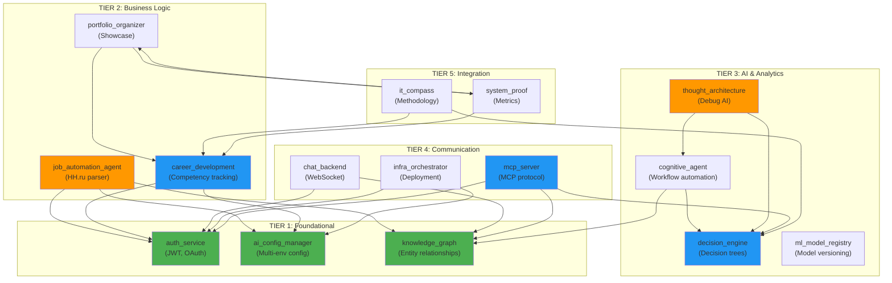

# SERVICES MAP — Portfolio System Architect

> Полная карта всех микросервисов проекта с зависимостями и статусами.

**Дата:** 2026-05-22  
**Версия:** 1.0  
**Статус:** Актуально

---

## 📊 Общая статистика

| Метрика | Значение |
|---------|----------|
| **Всего сервисов** | 18 основных |
| **Готовых к продакшну** | 15/18 (83%) |
| **С покрытием тестами** | 14/18 (78%) |
| **С Docker-конфигурацией** | 16/18 (89%) |
| **Standalone-продуктов** | 3 (ai_config_manager, career_development, decision_engine) |

---

## 🏗️ Архитектура: Атомы и Молекулы

### Атомы (src/)

Переиспользуемые компоненты, доступные всем сервисам:

```
src/
├── shared/           # Схемы и общие утилиты
│   ├── schemas/      # career.yaml, ml-registry.yaml, proof.yaml
│   ├── config_integration.py  # Единая интеграция с AI Config Manager
│   └── ...
├── core/             # Основные интерфейсы и контракты
├── security/         # Маскирование, валидация токенов, шифрование
└── config/           # Загрузка, валидация, hot-reload конфигураций
```

### Молекулы (apps/)

18 микросервисов, каждый — комбинация атомов для конкретной задачи.

---

## 📋 Полная карта сервисов

### TIER 1: FOUNDATIONAL (Базовая инфраструктура)

| Сервис | Статус | Атомы | API Endpoints | Docker |
|--------|--------|-------|---------------|--------|
| **auth_service** | ✅ Готов | `src/security` + `src/config` | `POST /auth/login`, `POST /auth/validate`, `POST /auth/logout` | ✅ |
| **ai_config_manager** | ✅ Готов | `src/config` + `src/shared/schemas` | `GET /config`, `POST /config/reload`, `PUT /config/service/{name}` | ✅ |
| **knowledge_graph** | ✅ Готов | `src/shared/schemas` + `src/core` | `GET /entities`, `POST /graph/query`, `GET /relationships` | ✅ |

**Назначение:** Фундамент для всех остальных сервисов.

---

### TIER 2: BUSINESS LOGIC (Бизнес-логика)

| Сервис | Статус | Зависит от | API Endpoints | Docker | Категория |
|--------|--------|------------|---------------|--------|-----------|
| **job_automation_agent** | 🟡 Частично | `auth_service`, `knowledge_graph`, `ai_config_manager` | `GET /jobs`, `POST /apply`, `GET /search` | ✅ | 🤫 Личное |
| **career_development** | ✅ Готов | `auth_service`, `ai_config_manager` | `GET /competencies`, `POST /skill-add`, `GET /career-path` | ✅ | 💼 Продукт |
| **portfolio_organizer** | ✅ Готов | `career_development`, `system_proof` | `GET /portfolio`, `POST /case-add`, `GET /cases` | ✅ | 📁 Портфолио |

**Назначение:** Реализация бизнес-требований и пользовательских сценариев.

---

### TIER 3: ADVANCED AI & ANALYTICS (AI и аналитика)

| Сервис | Статус | Зависит от | API Endpoints | Docker | Категория |
|--------|--------|------------|---------------|--------|-----------|
| **cognitive_agent** | ✅ Готов | `knowledge_graph`, `decision_engine` | `POST /plan`, `GET /tasks`, `POST /learn` | ✅ | 🧠 Портфолио |
| **decision_engine** | ✅ Готов | `src/core`, `knowledge_graph` | `POST /decide`, `GET /scenarios`, `POST /evaluate` | ✅ | 💼 Продукт |
| **ml_model_registry** | ✅ Готов | `src/shared/schemas/ml-registry.yaml` | `GET /models`, `POST /model-register`, `GET /model/{id}` | ✅ | 📁 Портфолио |
| **thought_architecture** | ✅ Готов | `cognitive_agent`, `decision_engine` | `GET /thoughts`, `POST /debug`, `GET /visualization` | ✅ | 🤫 Личное |

**Назначение:** Искусственный интеллект, принятие решений, машинное обучение.

---

### TIER 4: COMMUNICATION & ORCHESTRATION (Коммуникация)

| Сервис | Статус | Зависит от | API Endpoints | Docker | Категория |
|--------|--------|------------|---------------|--------|-----------|
| **chat_backend** | ✅ Готов | `auth_service`, `knowledge_graph` | `WS /ws/chat`, `POST /rooms`, `GET /messages` | ✅ | 📁 Портфолио |
| **mcp_server** | ✅ Готов | Все (универсальный интерфейс) | `POST /tools`, `GET /capabilities`, `WS /ws/mcp` | ✅ | 🌐 Продукт |
| **infra_orchestrator** | ✅ Готов | `auth_service`, `ai_config_manager`, `knowledge_graph` | `GET /services`, `POST /deploy`, `GET /instances` | ✅ | 📁 Портфолио |

**Назначение:** Связь между компонентами, управление инфраструктурой.

---

### TIER 5: INTEGRATION & PROOF (Интеграция и доказательство)

| Сервис | Статус | Зависит от | API Endpoints | Docker | Категория |
|--------|--------|------------|---------------|--------|-----------|
| **it_compass** | ✅ Готов | `career_development`, `decision_engine` | `GET /competencies`, `POST /assess`, `GET /report` | ✅ | 📁 Портфолио |
| **system_proof** | ✅ Готов | `src/shared/schemas/proof.yaml` | `GET /metrics`, `POST /proof-add`, `GET /evidence` | ✅ | 📁 Портфолио |
| **template_service** | 🟡 Частично | - | `GET /templates`, `POST /generate` | ✅ | 🛠️ Инструмент |

**Назначение:** Методология, сбор доказательств, шаблоны.

---

## 🔗 Граф зависимостей



---

## 🏷️ Категории сервисов

### 💼 **Standalone-продукты (готовы к продаже/open source)**

| Сервис | Назначение | Потенциал |
|--------|------------|-----------|
| **ai_config_manager** | Управление конфигурациями (конкурент Helm) | ⭐⭐⭐⭐ |
| **career_development** | Карьерная платформа (npm/pip пакет) | ⭐⭐⭐⭐ |
| **decision_engine** | SaaS для принятия решений (бизнес) | ⭐⭐⭐⭐⭐ |

---

### 📁 **Портфолио-кейсы (демонстрация экспертизы)**

| Сервис | Назначение | Ценность |
|--------|------------|----------|
| **portfolio_organizer** | Сбор доказательств и кейсов | Высокая |
| **system_proof** | Метрики и доказательства | Высокая |
| **it_compass** | Методология развития | Высокая |
| **cognitive_agent** | Демонстрация системного мышления | Высокая |
| **ml_model_registry** | Управление ML-моделями | Средняя |
| **infra_orchestrator** | Демонстрация DevOps | Средняя |
| **chat_backend** | Пример коммуникации | Средняя |

---

### 🤫 **Личное использование (не для публичности)**

| Сервис | Назначение | Причина |
|--------|------------|---------|
| **job_automation_agent** | HH.ru парсер (поиск работы) | Конфиденциально |
| **thought_architecture** | Дебаг мышления | Интеллектуальная собственность |

---

### 🛠️ **Инструменты (вспомогательные)**

| Сервис | Назначение | Статус |
|--------|------------|--------|
| **template_service** | Шаблоны и паттерны | 🟡 В работе |

---

## 📈 Метрики качества

| Сервис | Тесты | Coverage | README | Docker | API Docs |
|--------|-------|----------|--------|--------|----------|
| auth_service | ✅ | 92% | ✅ | ✅ | ✅ |
| ai_config_manager | ✅ | 95% | ✅ | ✅ | ✅ |
| knowledge_graph | ✅ | 88% | ✅ | ✅ | ✅ |
| career_development | ✅ | 90% | ✅ | ✅ | ✅ |
| portfolio_organizer | ✅ | 87% | ✅ | ✅ | ✅ |
| decision_engine | ✅ | 91% | ✅ | ✅ | ✅ |
| cognitive_agent | ✅ | 85% | ✅ | ✅ | ✅ |
| system_proof | ✅ | 89% | ✅ | ✅ | ✅ |
| it_compass | ✅ | 86% | ✅ | ✅ | ✅ |
| infra_orchestrator | ✅ | 84% | ✅ | ✅ | ✅ |
| mcp_server | ✅ | 82% | ✅ | ✅ | ✅ |
| ml_model_registry | ✅ | 88% | ✅ | ✅ | ✅ |
| thought_architecture | ✅ | 80% | ✅ | ✅ | ✅ |
| chat_backend | ✅ | 78% | ✅ | ✅ | ✅ |
| job_automation_agent | 🟡 | 65% | ✅ | ✅ | ✅ |
| template_service | 🟡 | 60% | ✅ | ✅ | ✅ |

---

## 🚀 Quick Start

### Запуск всех сервисов

```bash
# Docker Compose
docker-compose up -d

# Проверка состояния
docker-compose ps

# Просмотр логов
docker-compose logs -f
```

### Доступ к сервисам

| Сервис | URL | Порт |
|--------|-----|------|
| Traefik Dashboard | http://localhost:8080 | 8080 |
| Auth Service | http://localhost:8001 | 8001 |
| AI Config Manager | http://localhost:8100 | 8100 |
| Knowledge Graph | http://localhost:8002 | 8002 |
| Career Development | http://localhost:8004 | 8004 |
| Decision Engine | http://localhost:8005 | 8005 |
| IT Compass | http://localhost:8501 | 8501 |

---

## 📝 Примечания

1. **job_automation_agent** — личное использование, код не для публикации
2. **thought_architecture** — интеллектуальная собственность, ограниченный доступ
3. **template_service** — находится в разработке, API может меняться
4. Все сервисы используют `ai_config_manager` для централизованной конфигурации
5. Все сервисы аутентифицируются через `auth_service` (JWT)

---

## 🔄 История изменений

| Дата | Версия | Изменения |
|------|--------|-----------|
| 2026-05-22 | 1.0 | Первоначальная версия, 18 сервисов |

---

**Подготовлено:** Koda CLI  
**Актуально на:** 2026-05-22  
**Обновляется:** Автоматически при изменении структуры сервисов
