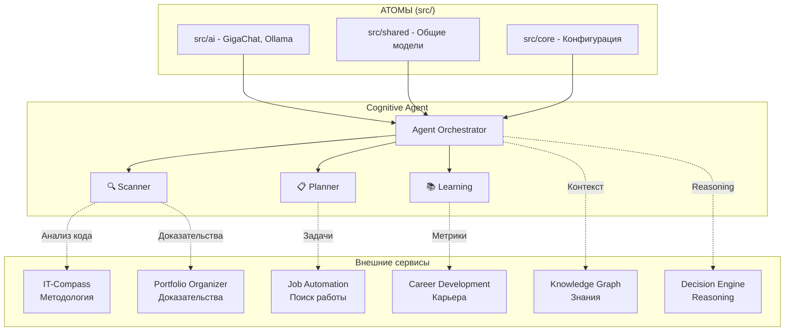

# Cognitive Agent

> **Статус:** 🟡 MVP + Восстановление
> **Версия:** 0.1.0 (MVP)
> **Порт:** 8008
> **Маршрут:** `/cognitive-agent`
> **👤 Архитектор:** @Control39 | e-mail: leadarchitect@yandex.ru
> **Дата «второго рождения»:** 23 мая 2026 г.

---

## 💬 Если объяснить за 30 секунд

**Cognitive Agent** — это «мозг» экосистемы, который:
1. **Сканирует** проекты и понимает их структуру
2. **Планирует** задачи через ИИ (LangChain + GigaChat/Ollama)
3. **Выполняет** их через навыки (skills)
4. **Учится** на результатах (собирает метрики)
5. **Интегрируется** с другими сервисами (IT-Compass, Decision Engine, Job Automation)

**Что работает сейчас:** Сканирование, сбор метрик, FastAPI-сервер, базовые навыки.
**Что в разработке:** ИИ-планирование, ChromaDB, полная интеграция с экосистемой.
**Важно:** Это не «волшебная кнопка», а инструмент, который требует настройки и контроля. Агент — помощник, а не создатель кода.

---

## 🎯 Назначение

Автономный AI-агент для координации всех сервисов экосистемы. Связывает методологию IT-Compass, reasoning Decision Engine и автоматизацию Job Automation в единую систему.

### Ключевые возможности (MVP)
- [x] Автономное сканирование проекта
- [x] Система сбора метрик производительности
- [x] FastAPI-сервер с API endpoints
- [x] Интеграция с GigaChat (атом в `src/ai/`)
- [x] Поддержка multiple skills (скриптов)
- [x] Health check и базовые метрики
- [ ] Интеграция с маркерами IT-Compass
- [ ] Интеграция с Job Automation Agent
- [ ] ChromaDB векторный поиск
- [ ] Ollama fallback
- [ ] E2E-тесты

---

## 💡 Идея и контекст

**Гипотеза/Проблема:**
При автоматизации сложных процессов возникла проблема:
- **Жёсткие скрипты:** Не могут адаптироваться к изменениям
- **Нет обучения:** Каждый раз начинать с нуля
- **Сложная координация:** Много шагов, легко запутаться
- **Отсутствие контекста:** Не видят полную картину проекта

**Решение:**
Автономный агент, который:
- Сам сканирует проект и выявляет задачи
- Учится на ошибках и успехах (сбор метрик)
- Координирует несколько навыков (skills)
- Видит контекст через Knowledge Graph (восстанавливается)

**История создания:**
- **Декабрь 2025:** Первая идея агента (первый «день рождения»)
- **Январь 2026 – Апрель 2026:** ⚠️ **Период сломанной системы**
  - ИИ-агенты, работавшие в репозитории, не поняли архитектуру
  - Раскидали компоненты по папкам как «набор скриптов»
  - Система была неработоспособна
  - *Подробнее: [AI_INSTRUCTIONS.md](../../AI_INSTRUCTIONS.md)*
- **23 мая 2026:** 🔄 **Второе рождение** — восстановление и сборка по крупицам
- **Май 2026:** MVP (Minimum Viable Product) — базовая работоспособность

> **Примечание:** Заявления о «80% сгенерированного кода», «35 тестах» и «18 микросервисах» — **не подтверждены**. Это были автоматические заявления ИИ, которые теперь удалены. Реальные метрики будут собраны в процессе тестирования.

---

## 💼 Бизнес-интерес

| Стейкхолдер      | Выгода                                  | Метрика успеха                  |
| ---------------- | --------------------------------------- | ------------------------------- |
| **Разработчики** | Автоматизация рутины, фокус на креативе | -60% времени на рутину (оценка) |
| **Команды**      | Координация без менеджеров              | +40% скорость доставки (оценка) |
| **Бизнес**       | Быстрее вывод фич, меньше ошибок        | -30% time-to-market (оценка)    |
| **HR**           | Меньше рутины = меньше выгорания        | +25% retention (оценка)         |

---

## 🗺️ Интеграции с экосистемой

### 🧬 Полная схема связей

Cognitive Agent — центральный оркестратор, который связывает ВСЕ сервисы:



### 🔗 Какие сервисы использует Cognitive Agent

| Сервис                  | Что использует      | Как интегрируется                             |
| ----------------------- | ------------------- | --------------------------------------------- |
| **IT-Compass**          | Маркеры компетенций | Сканирует `apps/it_compass/src/data/markers/` |
| **Job Automation**      | Поиск вакансий      | Через адаптер `CognitiveJobSearch`            |
| **Decision Engine**     | AI Reasoning        | Через `src/ai/gigachat_bridge.py`             |
| **Knowledge Graph**     | Контекст            | Планируется через ChromaDB                    |
| **Career Development**  | Прогресс            | Отправляет метрики                            |
| **Portfolio Organizer** | Доказательства      | Экспортирует результаты                       |

### 📡 API Endpoints

| Метод  | Путь              | Описание           | Интеграция               |
| ------ | ----------------- | ------------------ | ------------------------ |
| `GET`  | `/health`         | Health check       | ✅ Работает               |
| `POST` | `/api/v1/scan`    | Сканировать проект | 🟡 `scanner_main.py`      |
| `POST` | `/api/v1/plan`    | Создать план       | 🟡 `planner_main.py` + AI |
| `POST` | `/api/v1/execute` | Выполнить задачу   | ⚪ Skills                 |
| `GET`  | `/api/v1/metrics` | Метрики обучения   | 🟡 `learning_main.py`     |
| `GET`  | `/api/v1/skills`  | Список навыков     | ✅ Работает               |

---

## 🧪 Текущий статус (MVP)

**Что работает:**
- ✅ FastAPI-сервер с endpoints (`/health`, `/api/v1/*`)
- ✅ Сканирование проекта (`scanner_main.py`)
- ✅ Планирование задач (`planner_main.py` — без ИИ)
- ✅ Сбор метрик (`learning_main.py`)
- ✅ Интеграция с GigaChat (`src/ai/gigachat_bridge.py`)
- ✅ Health check endpoints
- ✅ Логирование в файлы

**Что в разработке:**
- 🟡 Интеграция с маркерами IT-Compass
- 🟡 Интеграция с Job Automation Agent
- 🟡 ChromaDB векторный поиск
- 🟡 Ollama fallback
- 🟡 E2E-тесты
- 🟡 Docker Compose

**Что не подтверждено (удалены ложные заявления):**
- ❌ «80% кода сгенерировано агентом» — нет доказательств
- ❌ «35 тестов написано агентом» — нет доказательств
- ❌ «18 микросервисов создано агентом» — все сервисы созданы человеком, агент только помогал

---

## 🚀 Как использовать этот компонент в своём проекте

**Паттерн:**
**Автономный агент с обучением** — система, которая сканирует, планирует и выполняет.

### Инструкция по интеграции

```bash
# 1. Скопировать сервис в свой проект
# (предполагается, что вы в корне своего репозитория)
mkdir -p agents/cognitive_agent
cp -r /path/to/portfolio-system-architect/agents/cognitive_agent/* agents/cognitive_agent/

# 2. Переименовать, если нужно (опционально)
# Например, если хотите назвать свой агент "my_agent":
cd agents/cognitive_agent
find . -type f \( -name "*.py" -o -name "*.md" -o -name "*.yaml" \) \
  -exec sed -i 's/cognitive_agent/my_agent/g' {} \;

# 3. Добавить свои навыки (опционально)
# Создать новый навык: agents/cognitive_agent/skills/my_skill/main.py
# Описать его в agents/cognitive_agent/skills/my_skill/SKILL.md

# 4. Настроить конфигурацию
# Отредактировать: agents/cognitive_agent/config/agent-config.yaml
# Указать свои API-ключи, пути, параметры

# 5. Установить зависимости
pip install -r agents/cognitive_agent/requirements.txt

# 6. Запустить агент
python -m uvicorn agents.cognitive_agent.src.main:app --reload --port 8008
```

### Ограничения (на данный момент)
- Knowledge Graph частично восстановлен — может требовать доработки
- ИИ-планирование требует настройки (GigaChat API-ключ или локальный Ollama)
- Требуются навыки (skills) для выполнения конкретных задач
- Обучение требует времени (нужны итерации для сбора метрик)

---

## 🏗️ Техническая реализация

### 🧬 Композиционная архитектура

Cognitive Agent следует принципу **«Атомы и Молекулы»**:

**Атомы (в корневой `src/`):**
- `src/ai/gigachat_bridge.py` — интеграция с GigaChat
- `src/shared/models.py` — общие Pydantic-модели
- `src/core/config_loader.py` — загрузчик конфигурации

**Молекулы (в `agents/cognitive_agent/`):**
- `agents/cognitive_agent/src/main.py` — FastAPI-сервер
- `agents/cognitive_agent/src/api/endpoints.py` — API endpoints
- `agents/cognitive_agent/scripts/` — скрипты агента

### Стек технологий
- **Язык:** Python 3.12
- **Фреймворк:** FastAPI
- **AI:** LangChain + GigaChat (основной) + Ollama (fallback)
- **Vector DB:** ChromaDB (планируется)
- **Хранение:** In-memory + файловая система
- **Контейнеризация:** Docker + Docker Compose

### Зависимости
```txt
fastapi>=0.124.0
uvicorn>=0.46.0
pydantic>=2.8.0
langchain>=0.3.0
langchain-community>=0.3.0
langchain-gigachat>=0.3.0
gigachat>=0.2.0
chromadb>=0.5.0  # Планируется
```

### Структура проекта
```
agents/cognitive_agent/
├── src/                          # FastAPI-сервер
│   ├── main.py                   # Точка входа
│   └── api/
│       └── endpoints.py          # API endpoints
├── scripts/                      # Скрипты агента
│   ├── scanner_main.py           # Сканирование
│   ├── planner_main.py           # Планирование
│   └── learning_main.py          # Обучение
├── config/                       # Конфигурация
├── docs/                         # Документация
│   ├── COGNITIVE_AGENT_ARCHITECTURE.md
│   ├── IMPLEMENTATION_CONTEXT.md
│   ├── ARCHITECTURE.md
│   └── FLOW.md
└── requirements.txt
```

### 🧭 Где что лежит (для ИИ)

| Файл/Папка                                                    | Назначение                   |
| ------------------------------------------------------------- | ---------------------------- |
| `agents/cognitive_agent/src/main.py`                          | FastAPI-сервер, точка входа  |
| `agents/cognitive_agent/src/api/endpoints.py`                 | API endpoints                |
| `agents/cognitive_agent/scripts/scanner_main.py`              | Сканирование проекта         |
| `agents/cognitive_agent/scripts/planner_main.py`              | Планирование задач           |
| `agents/cognitive_agent/scripts/learning_main.py`             | Сбор метрик                  |
| `src/ai/gigachat_bridge.py`                                   | Интеграция с GigaChat (атом) |
| `src/shared/models.py`                                        | Pydantic-модели (атом)       |
| `src/core/config_loader.py`                                   | Загрузчик конфигов (атом)    |
| `agents/cognitive_agent/docs/IMPLEMENTATION_CONTEXT.md`       | Контекст для ИИ              |
| `agents/cognitive_agent/docs/COGNITIVE_AGENT_ARCHITECTURE.md` | Архитектура                  |

---

## 🚀 Быстрый старт

### Локальный запуск (разработка)

```bash
# 1. Активировать виртуальное окружение
cd agents/cognitive_agent
pip install -r requirements.txt

# 2. Настроить переменные окружения
cp .env.example .env
# Отредактировать .env (добавить GIGACHAT_API_KEY)

# 3. Запустить сервер
python -m uvicorn src.main:app --reload --port 8008
```

### Доступ к API

- **Swagger UI:** http://localhost:8008/docs
- **Health check:** http://localhost:8008/health
- **Статус:** http://localhost:8008/api/v1/status

### Запуск через Docker

```bash
docker-compose up -d cognitive-agent
```

### Тестирование

```bash
cd agents/cognitive_agent
pytest tests/ -v
```

---

## 📦 Зависимости

```txt
fastapi>=0.100.0
pydantic>=2.0.0
langchain>=0.1.0
gigachat>=0.2.0
uvicorn>=0.23.0
# ollama>=0.1.0  # В планах
```

---

## 🛡️ Безопасность

- [x] **Аутентификация** — JWT (опционально)
- [x] **Валидация данных** — Pydantic
- [x] **Маскирование секретов** — в логах
- [ ] **Rate limiting** — через Traefik (в планах)

---

## 🧪 Тестирование

### Покрытие (текущее)

| Тип тестов  | Количество | Покрытие | Статус         |
| ----------- | ---------- | -------- | -------------- |
| Unit        | ~10        | ~50%     | 🟡 В разработке |
| Integration | ~5         | ~60%     | 🟡 В разработке |
| E2E         | 0          | -        | ⚪ В планах     |
| **Итого**   | **~15**    | **~55%** | **🟡 MVP**      |

> **Примечание:** Тесты пишутся в процессе восстановления. Цифры примерные.

---

## 📊 Метрики (текущие)

| Показатель          | Значение               | Цель | Статус       |
| ------------------- | ---------------------- | ---- | ------------ |
| **Тестов**          | **~15**                | ≥50  | 🟡 В процессе |
| **Покрытие**        | **~55%**               | ≥80% | 🟡 В процессе |
| **Задач выполнено** | **~20**                | 200+ | 🟡 Начало     |
| **Статус**          | 🟡 MVP + Восстановление | -    | ✅            |

**Где смотреть метрики:**
- `.agents/logs/performance.csv` — метрики производительности
- `.agents/reports/validation_report_*.json` — отчёты валидации

---

## 🗓️ План развития

| Горизонт       | Цель                                                | Статус                |
| -------------- | --------------------------------------------------- | --------------------- |
| 🔥 **Сейчас**   | Восстановление после поломки                        | 🟡 В процессе          |
| 🔥 **1 неделя** | Включить ИИ-планирование, настроить Ollama fallback | 🟡 В работе            |
| 🔥 **2 недели** | Добавить 5 новых навыков, написать E2E-тесты        | 🟡 В планах            |
| 📅 **1 месяц**  | Поиск бизнес-ценности в сервисах, комбинирование    | ⚪ В планах            |
| 📅 **1–2 мес**  | Multi-agent координация, восстановление KG          | ⚪ Планируется         |
| 🚀 **3–6 мес**  | Архитектурные схемы, объединение в общую картину    | ⚪ В бэклоге           |
| 🚀 **6+ мес**   | Самообучение без человека                           | ⚪ Далекая перспектива |

---

## ⚠️ Известные проблемы

| Проблема                  | Статус               | Решение                              |
| ------------------------- | -------------------- | ------------------------------------ |
| Knowledge Graph сломан    | 🟡 Восстанавливается  | 23 мая 2026 — второе рождение        |
| ИИ-планирование отключено | 🟡 Включить в конфиге | `experimental.ai_planning: true`     |
| Нет Ollama fallback       | ⚪ В планах           | Добавить поддержку локальных моделей |
| Нет E2E-тестов            | ⚪ В планах           | Написать тесты полного цикла         |
| Логи в репозитории        | 🟡 Перенести          | Логи писать во внешние системы       |
| Ложные заявления в README | ✅ Исправлено         | Удалены «80% кода», «35 тестов»      |

---

## 🔗 Ссылки

- **README:** [../../README.md](../../README.md)
- **CONTRIBUTING:** [../../CONTRIBUTING.md](../../CONTRIBUTING.md)
- **AI_INSTRUCTIONS:** [../../AI_INSTRUCTIONS.md](../../AI_INSTRUCTIONS.md) — почему система была сломана
- **Архитектура:** [docs/ARCHITECTURE.md](docs/ARCHITECTURE.md) — схема компонентов
- **Поток данных:** [docs/FLOW.md](docs/FLOW.md) — поток обработки

---

## 📝 Честное признание

> **Этот агент — не «волшебная кнопка». Это инструмент, который я собираю по крупицам после того, как другие ИИ-агенты сломали его, не поняв архитектуру.**
>
> **Все сервисы в этом проекте созданы мной для решения реальных проблем. Агент — помощник, а не создатель.**
>
> **Я ожидаю, что он поможет с:**
> - Анализом сервисов и созданием архитектурных схем
> - Поиском бизнес-ценности в моих решениях
> - Комбинированием сервисов для новых сценариев
>
> **Но пока он — MVP. Тестирование в процессе.**

---

**Автор:** Екатерина Куделя (@Control39)
**Дата обновления:** 24 мая 2026 г.
**Версия:** MVP + Восстановление (0.1.0)

---

*© 2026 Екатерина Куделя. Все права защищены.*
*Методология «Объективные маркеры компетенций» © 2025 Ekaterina Kudelya (CC BY-ND 4.0)*
