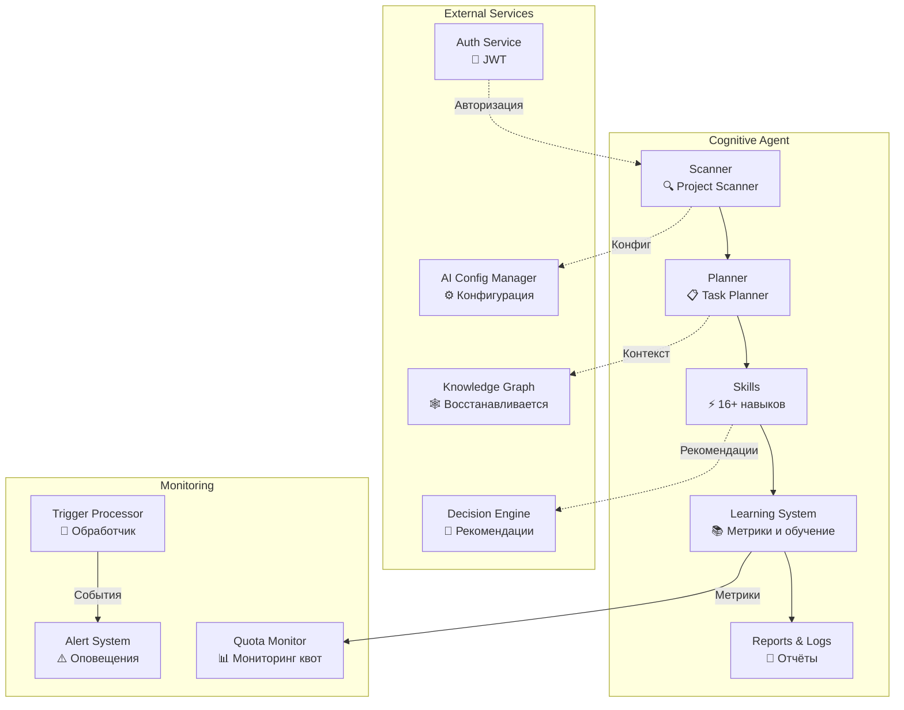
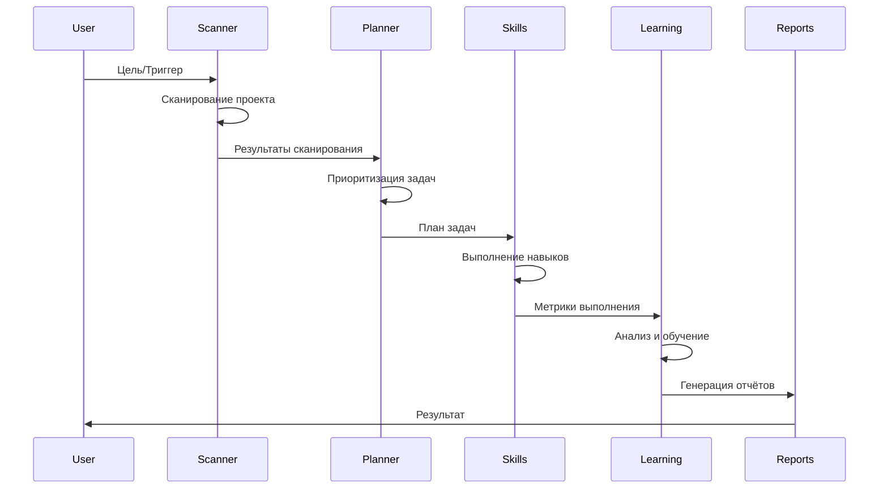
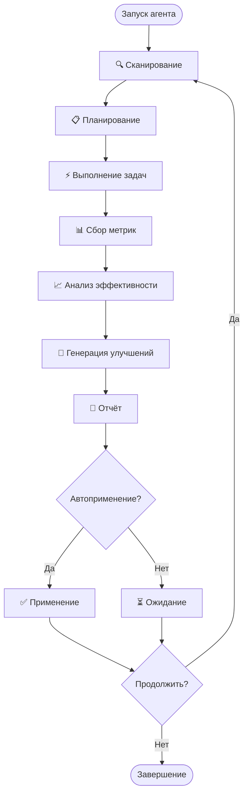

# Архитектура Cognitive Agent

## 🏗️ Компонентная схема



## 📊 Поток данных



## 🔄 Цикл работы



## 📁 Структура файлов

```
agents/cognitive_agent/
├── scripts/
│   ├── scanner_main.py          # 🔍 Сканирование проекта
│   ├── planner_main.py          # 📋 Планировщик задач
│   ├── learning_main.py         # 📚 Система обучения
│   ├── trigger-processor.py     # 🔔 Обработчик триггеров
│   ├── alert-system.py          # ⚠️ Система оповещений
│   ├── quota-monitor.py         # 📊 Мониторинг квот
│   ├── scheduled-monitor.py     # ⏰ Плановый мониторинг
│   └── ... (ещё 10+ скриптов)
│
├── config/
│   ├── scanner.yaml             # Конфиг сканера
│   ├── planner.yaml             # Конфиг планировщика
│   ├── learning.yaml            # Конфиг обучения
│   └── alerts.yaml              # Конфиг оповещений
│
├── data/
│   └── learning/
│       ├── metrics/             # Метрики задач
│       ├── models/              # ML-модели
│       └── reports/             # Отчёты
│
└── logs/                        # Логи (создаётся кодом)
    ├── scanner.log
    ├── planner.log
    └── alerts.log
```

## 🔌 Интеграции

| Компонент             | Тип        | Статус              | Протокол   |
| --------------------- | ---------- | ------------------- | ---------- |
| **Knowledge Graph**   | Внутренний | 🟡 Восстанавливается | API        |
| **Decision Engine**   | Внутренний | 🟡 Stub              | API        |
| **AI Config Manager** | Внутренний | ✅ Работает          | Filesystem |
| **Auth Service**      | Внешний    | ✅ Работает          | JWT        |
| **GigaChat/Ollama**   | Внешний    | ⚪ В планах          | API        |

## 🎯 Статус реализации

| Компонент          | Реализовано | Описание                           |
| ------------------ | ----------- | ---------------------------------- |
| **Scanner**        | ✅ 100%      | Сканирование проекта, анализ стека |
| **Planner**        | ✅ 70%       | Планирование без ИИ (заглушка)     |
| **Learning**       | ✅ 100%      | Сбор метрик, анализ, отчёты        |
| **Skills**         | ✅ 100%      | 16+ навыков автоматизации          |
| **Monitoring**     | ✅ 100%      | 3 монитора + оповещения            |
| **AI Integration** | ❌ 0%        | LangChain/GigaChat не подключены   |
| **API Server**     | ❌ 0%        | FastAPI не реализован              |

---

**Автор:** Екатерина Куделя
**Дата:** 13 июня 2026
**Версия:** 0.1.0 (MVP + Восстановление)
