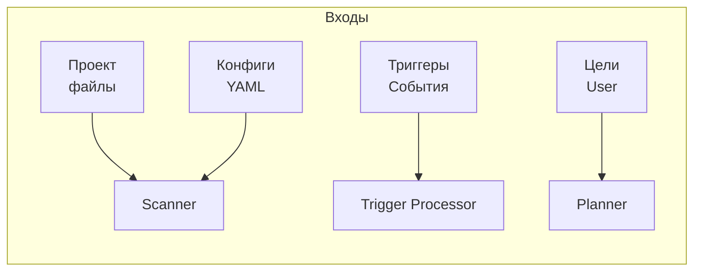
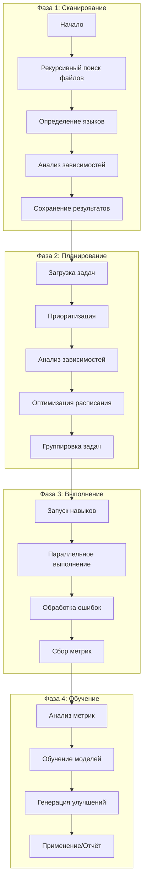
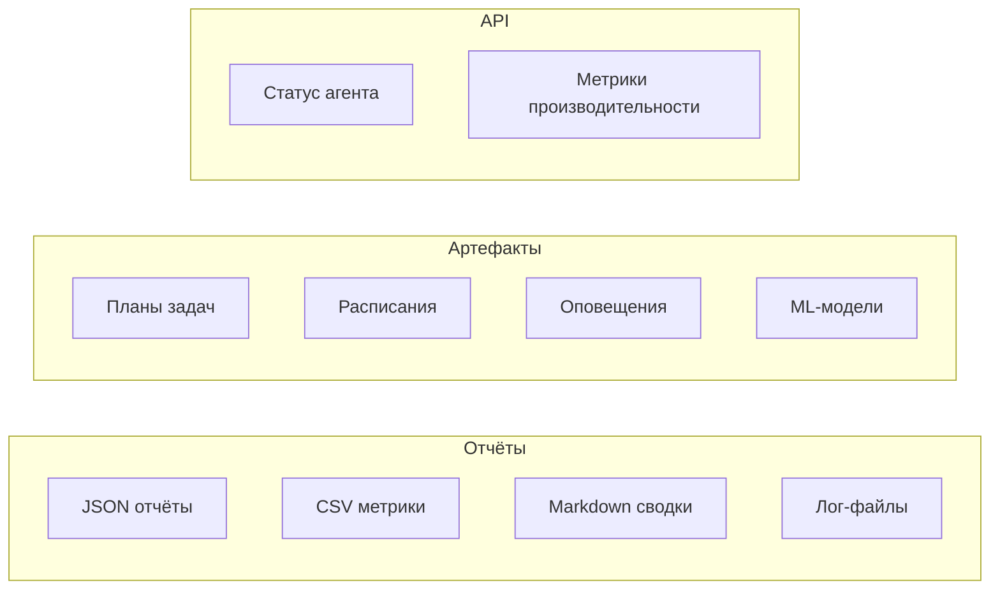
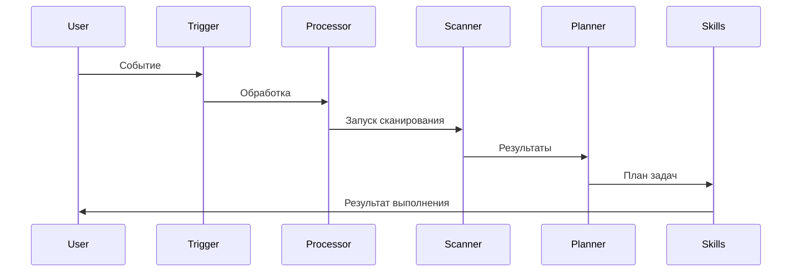

# Поток данных Cognitive Agent

## 📥 Входные данные



## 🔄 Обработка



## 📤 Выходные данные



## 🗂️ Хранение данных

```
.agents/
├── logs/                    # Логи агентов
│   ├── alerts.log          # Оповещения
│   ├── quota-monitor.log   # Квоты
│   └── scheduled-monitor.log  # Плановые
│
├── data/
│   └── trigger_metrics.db  # База событий
│
└── config/
    └── agent-config.yaml   # Конфигурация

agents/cognitive_agent/
├── logs/                   # Логи компонентов
│   ├── scanner.log
│   ├── planner.log
│   └── triggers.log
│
├── data/
│   └── learning/
│       ├── metrics/       # Метрики задач
│       ├── models/        # ML-модели
│       └── reports/       # Отчёты
│
├── reports/
│   ├── scans/            # Отчёты сканирования
│   ├── plans/            # Планы задач
│   └── status/           # Статусы выполнения
│
└── config/               # Конфиги компонентов
```

## 🔄 Циклы работы

### Автоматический запуск (каждые 6 часов)

```mermaid
timeline
    title Цикл работы агента
    section 00:00
        Запуск по расписанию
        Сканирование проекта
    section 00:05
        Планирование задач
        Запуск навыков
    section 00:30
        Сбор метрик
        Генерация отчётов
    section 01:00
        Оповещения (если есть проблемы)
        Завершение цикла
```

### Ручной запуск (по триггеру)



---

**Автор:** Екатерина Куделя
**Дата:** 13 июня 2026
**Версия:** 0.1.0 (MVP + Восстановление)
