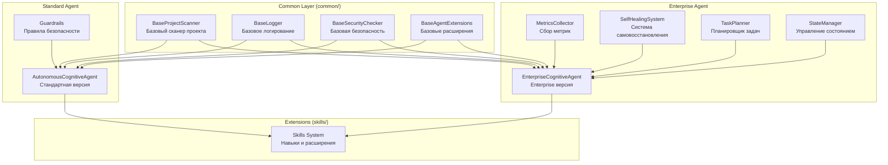

# Внутреннее устройство Cognitive Agent

На основе проведенного анализа кодовой базы агента, я могу предоставить исчерпывающую картину о внутреннем устройстве Cognitive Agent и выявить возможные области для улучшения.

## Архитектурные особенности

Cognitive Agent построен по принципу "атомов и молекул", с базовым классом [BaseCognitiveAgent](file://c:\repo\agents\cognitive_agent\src\base_agent.py#L317-L978), который обеспечивает общую функциональность для стандартной и enterprise-версии. Архитектура включает:

1. **Standard версию** ([autonomous_agent.py](file:///c:/repo/agents/cognitive_agent/autonomous_agent.py)) с базовой функциональностью
2. **Enterprise версию** ([autonomous_agent_enterprise.py](file:///c:/repo/agents/cognitive_agent/autonomous_agent_enterprise.py)) с расширенными возможностями
3. **Общие компоненты** ([common](file:///c:/repo/agents/cognitive_agent/common/__init__.py)) для устранения дублирования кода

Enterprise версия включает:
- Полная поддержка async/await
- Расширенный мониторинг и наблюдаемость
- Система самовосстановления с обнаружением аномалий
- Продвинутый планировщик с зависимостями
- Система управления состоянием
- Комплексная безопасность с RBAC

### Компонентная структура с общими компонентами

## Компоненты агента

### Общие компоненты (common)

После рефакторинга для устранения дублирования кода:

- [BaseProjectScanner](file://c:\repo\agents\cognitive_agent\common\base_scanner.py#L20-L385): Сканирование проекта и определение технологического стека
- [BaseLogger](file://c:\repo\agents\cognitive_agent\common\base_logger.py#L14-L87): Структурированное логирование через structlog
- [BaseSecurityChecker](file://c:\repo\agents\cognitive_agent\common\base_security.py#L13-L145): Базовые проверки безопасности
- [BaseAgentExtensions](file://c:\repo\agents\cognitive_agent\common\base_agent_extensions.py#L16-L228): Общие расширения для агента

### Специфичные компоненты

1. **Project Scanner** - анализ структуры кода и технологического стека
2. **Task Planner** - генерация планов выполнения задач с учетом зависимостей
3. **Skills System** - набор специализированных компонентов для выполнения задач
4. **Security System** - многоуровневые guardrails для обеспечения безопасности
5. **Monitoring & Metrics** - отслеживание производительности и эффективности
6. **Learning & Adaptation** - анализ результатов для улучшения будущих решений

## Интеграции

- **AI Provider Manager** с GigaChat (облако) и Ollama (локально)
- **ChromaDB (RAG)** для семантического поиска
- **IT-Compass** для анализа архитектурных маркеров
- **Job Automation Agent** для интеграции с CI/CD

## Система логирования и безопасности

Агент использует структурированное логирование через `structlog` с совместимостью ELK/Grafana и полное аудит-логирование всех действий. Система безопасности включает многоуровневые guardrails, валидацию входных данных и RBAC.

## Улучшения после рефакторинга

### Устранение дублирования кода

После реализации приоритетной задачи №1:

- Общие компоненты вынесены в модуль [common](file:///c:/repo/agents/cognitive_agent/common/__init__.py)
- [autonomous_agent.py](file:///c:/repo/agents/cognitive_agent/autonomous_agent.py) и [autonomous_agent_enterprise.py](file:///c:/repo/agents/cognitive_agent/autonomous_agent_enterprise.py) используют общие базовые классы
- Изменения в общих компонентах автоматически применяются к обеим версиям
- Упрощено сопровождение и развитие функциональности

### Преимущества нового подхода

1. **Снижение технического долга**: Значительно уменьшено дублирование кода между версиями
2. **Упрощение сопровождения**: Изменения в общих компонентах применяются ко всем версиям
3. **Повышение надежности**: Единая реализация логики снижает вероятность различий между версиями
4. **Ускорение разработки**: Новые функции можно добавлять в одном месте

## Обнаруженные недоработки (до рефакторинга)

До реализации приоритетной задачи №1:

1. **Дублирование кода** между версиями агента - значительная часть функциональности дублировалась между [autonomous_agent.py](file:///c:/repo/agents/cognitive_agent/autonomous_agent.py) и [autonomous_agent_enterprise.py](file:///c:/repo/agents/cognitive_agent/autonomous_agent_enterprise.py)
2. **Сложность конфигурации** - большое количество параметров в [agent-config.yaml](file:///c:/repo/agents/cognitive_agent/config/agent-config.yaml) без единого справочника
3. **Недостаточная документация** - некоторые файлы в [/scripts](file:///c:/repo/agents/cognitive_agent/scripts) имеют минимальную документацию
4. **Неконсистентность логирования** - разные компоненты используют разные подходы к логированию

## Потенциальные проблемы

1. **Уязвимости безопасности** - возможен обход некоторых проверок при специфических условиях
2. **Проблемы с памятью** - возможны утечки при анализе больших кодовых баз
3. **Многопоточные проблемы** - потенциальные проблемы с конкурентным доступом
4. **Неполная обработка исключений** - отсутствие единой стратегии обработки ошибок

## Рекомендации

1. **Рефакторинг** для уменьшения дублирования кода - уже реализовано через модуль [common](file:///c:/repo/agents/cognitive_agent/common/__init__.py)
2. **Улучшение документации** с добавлением подробных комментариев к сложным функциям
3. **Унификация логирования** с использованием единого подхода во всех компонентах
4. **Улучшение безопасности** с дополнительной валидацией путей файлов
5. **Оптимизация производительности** с улучшенным управлением памятью и кэшированием
