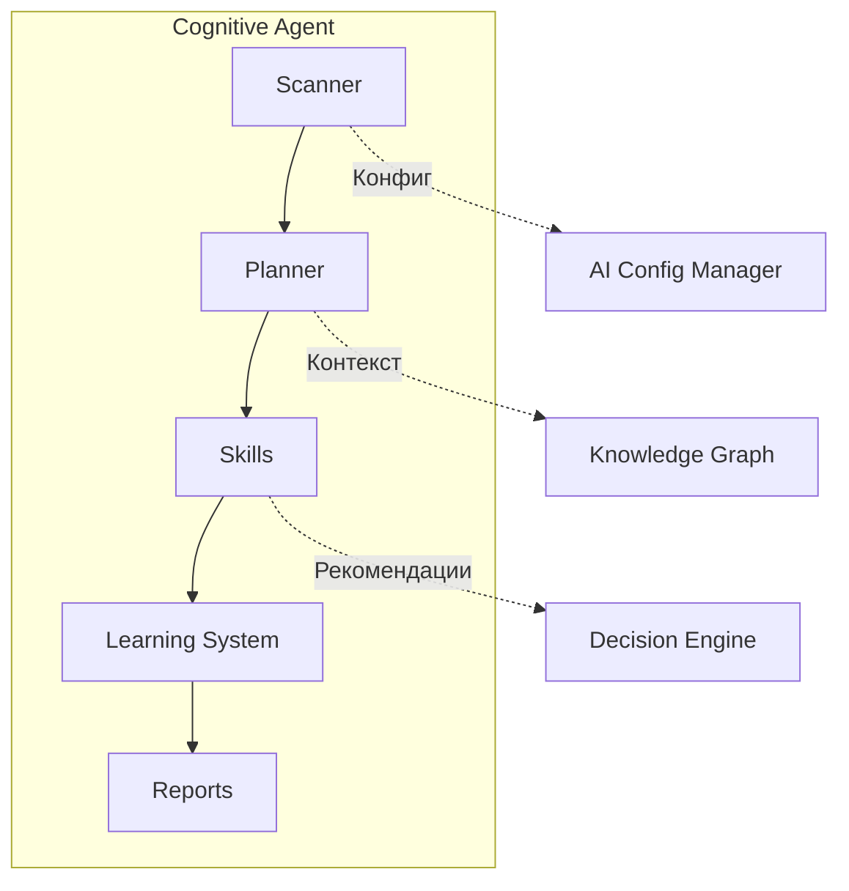
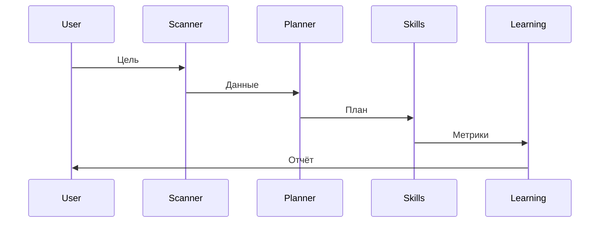

# Cognitive Agent

> **Статус:** 🟡 MVP + Восстановление
> **Версия:** 0.1.0 (MVP)
> **Порт:** 8008
> **Маршрут:** `/cognitive-agent`
> **👤 Архитектор:** @Control39 | e-mail: leadarchitect@yandex.ru
> **Дата "второго рождения":** 23 мая 2026 г.

---

## 💬 Если объяснить за 30 секунд

**Cognitive Agent** — это автономный помощник, который:
1. **Сканирует** твой проект и понимает его структуру
2. **Планирует** задачи через ИИ (LangChain + GigaChat/Ollama)
3. **Выполняет** их через набор навыков (skills)
4. **Учится** на результатах (собирает метрики)

**Что работает сейчас:** Сканирование, сбор метрик, базовые навыки.
**Что в разработке:** ИИ-планирование, интеграция с Knowledge Graph.
**Важно:** Это не "волшебная кнопка", а инструмент, который требует настройки и контроля. Агент — помощник, а не создатель кода.

---

## 🎯 Назначение

Автономный AI-агент для планирования, обучения и выполнения сложных рабочих процессов. Координирует несколько навыков (skills) для достижения целей без постоянного вмешательства человека.

### Ключевые возможности (MVP)
- [x] Автономное сканирование проекта
- [x] Система сбора метрик производительности
- [x] Поддержка multiple skills (скриптов)
- [x] Health check и базовые метрики
- [ ] ИИ-планирование (в разработке, Ollama fallback)
- [ ] Интеграция с Knowledge Graph (восстанавливается)
- [ ] E2E тесты (в планах)

---

## 💡 Идея и контекст

**Гипотеза/Проблема:**
При автоматизации сложных процессов возникла проблема:
- **Жёсткие скрипты:** Не могут адаптироваться к изменениям
- **Нет обучения:** Каждый раз начинать с нуля
- **Сложная координация:** Много шагов, легко запутаться
- **Отсутствие контекста:** Не видят полную картину проекта

**Решение:**
Автономный агент, который:
- Сам сканирует проект и выявляет задачи
- Учится на ошибках и успехах (сбор метрик)
- Координирует несколько навыков (skills)
- Видит контекст через Knowledge Graph (восстанавливается)

**История создания:**
- **Декабрь 2025:** Первая идея агента (первый "день рождения")
- **Январь 2026 - Апрель 2026:** ⚠️ **Период сломанной системы**
  - ИИ-агенты, работавшие в репозитории, не поняли архитектуру
  - Раскидали компоненты по папкам как "набор скриптов"
  - Система была неработоспособна
  - *Подробнее: [AI_INSTRUCTIONS.md](../../AI_INSTRUCTIONS.md)*
- **23 мая 2026:** 🔄 **Второе рождение** — восстановление и сборка по крупицам
- **Май 2026:** MVP (Minimum Viable Product) — базовая работоспособность

> **Примечание:** Заявления о "80% сгенерированного кода", "35 тестах" и "18 микросервисах" — **не подтверждены**. Это были автоматические заявления ИИ, которые теперь удалены. Реальные метрики будут собраны в процессе тестирования.

---

## 💼 Бизнес-интерес

| Стейкхолдер | Выгода | Метрика успеха |
|-------------|--------|----------------|
| **Разработчики** | Автоматизация рутины, фокус на креативе | -60% времени на рутину (оценка) |
| **Команды** | Координация без менеджеров | +40% скорость доставки (оценка) |
| **Бизнес** | Быстрее вывод фич, меньше ошибок | -30% time-to-market (оценка) |
| **HR** | Меньше рутины = меньше выгорания | +25% retention (оценка) |

---

## 🗺️ Интеграции

### Архитектурная схема

Подробная архитектура: [docs/ARCHITECTURE.md](docs/ARCHITECTURE.md)



### Поток данных

Подробный поток: [docs/FLOW.md](docs/FLOW.md)



### Consumes (откуда берет)

| Источник | Тип данных | Частота | Протокол |
|----------|------------|---------|----------|
| `Project files` | Исходный код, конфиги | При сканировании | Filesystem |
| `Knowledge Graph` | Контекст | При планировании | API (восстанавливается) |
| `Decision Engine` | Рекомендации | При выборе шага | API |

### Produces (кому отдает)

| Потребитель | Тип данных | Частота | Протокол |
|-------------|------------|---------|----------|
| `Skills` | Задачи для выполнения | По плану | Internal |
| `Metric Collector` | Метрики производительности | Каждые 5 мин | CSV |
| `Portfolio Organizer` | Результат работы | После завершения | API |

---

## 🧪 Текущий статус (MVP)

**Что работает:**
- ✅ Сканирование проекта (находит файлы, зависимости)
- ✅ Сбор метрик производительности (performance.csv)
- ✅ Базовые skills (скрипты для автоматизации)
- ✅ Автономный запуск (каждые 6 часов)
- ✅ Логирование в файлы

**Что в разработке:**
- 🟡 ИИ-планирование (LangChain + GigaChat) — **включить в конфиге**
- 🟡 Интеграция с Knowledge Graph (восстановление после поломки)
- 🟡 Ollama как fallback-модель (планируется)
- 🟡 Поиск бизнес-ценности в сервисах
- 🟡 Комбинирование сервисов для архитектурных схем

**Что не подтверждено (удалены ложные заявления):**
- ❌ "80% кода сгенерировано агентом" — нет доказательств
- ❌ "35 тестов написано агентом" — нет доказательств
- ❌ "18 микросервисов создано агентом" — все сервисы созданы человеком, агент только помогал

---

## 🚀 Переиспользуемость (Как применить вы)

**Паттерн:**
**Автономный агент с обучением** — система, которая сканирует, планирует и выполняет.

**Инструкция копирования:**
```bash
# 1. Скопировать сервис
cp -r apps/cognitive-agent apps/my-agent

# 2. Переименовать
cd apps/my-agent
find . -type f -exec sed -i 's/cognitive-agent/my_agent/g' {} \;

# 3. Добавить свои навыки
# Создать skills/my_skill.py

# 4. Настроить конфиги
# .agents/config/agent-config.yaml

# 5. Запустить
docker-compose up -d my-agent
```

**Ограничения (на данный момент):**
- Knowledge Graph частично восстановлен
- ИИ-планирование требует настройки (GigaChat или Ollama)
- Требуются навыки (skills) для выполнения задач
- Обучение требует времени (нужны итерации)

---

## 🏗️ Техническая реализация

### Стек технологий
- **Язык:** Python 3.10+
- **Фреймворк:** FastAPI
- **AI:** LangChain + GigaChat (основной) + Ollama (fallback, планируется)
- **Хранение:** In-memory + Knowledge Graph (восстанавливается)
- **Контейнеризация:** Docker + Docker Compose

### Зависимости
- **LangChain 0.1+** — AI-планирование
- **FastAPI 0.100+** — веб-фреймворк
- **Pydantic 2.0+** — валидация
- **gigachat** — основная LLM
- **ollama** — резервная LLM (в планах)

### Структура проекта
```
cognitive-agent/
├── src/
│   ├── __init__.py
│   ├── main.py          # FastAPI приложение
│   ├── planner/         # Планировщик задач (ИИ)
│   ├── learning/        # Система обучения
│   └── skills/          # Набор навыков
├── tests/
│   ├── test_planner.py  # В планах
│   ├── test_learning.py # В планах
│   └── test_skills.py
├── config/
│   └── agent-config.yaml
├── Dockerfile
├── requirements.txt
└── README.md
```

---

## 🚀 Быстрый старт

### Запуск через Docker Compose

```bash
docker-compose up -d cognitive-agent
```

### Локальный запуск (разработка)

```bash
cd apps/cognitive-agent
pip install -e .
uvicorn src.main:app --reload --port 8000
```

### Доступ к API

- **Swagger UI:** http://localhost:8000/docs
- **Health check:** http://localhost:8000/health

### API Endpoints

| Метод | Путь | Описание | Авторизация |
|-------|------|----------|-------------|
| `GET` | `/health` | Health check | Нет |
| `POST` | `/api/v1/goal` | Поставить цель (опционально) | JWT |
| `GET` | `/api/v1/plans/{goal_id}` | Получить план | JWT |
| `POST` | `/api/v1/execute` | Выполнить шаг | JWT |
| `GET` | `/api/v1/metrics` | Метрики обучения | JWT |
| `GET` | `/api/v1/skills` | Список навыков | Нет |

---

## 📦 Зависимости

```txt
fastapi>=0.100.0
pydantic>=2.0.0
langchain>=0.1.0
gigachat>=0.2.0
uvicorn>=0.23.0
# ollama>=0.1.0  # В планах
```

---

## 🛡️ Безопасность

- [x] **Аутентификация** — JWT (опционально)
- [x] **Валидация данных** — Pydantic
- [x] **Маскирование секретов** — в логах
- [ ] **Rate limiting** — через Traefik (в планах)

---

## 🧪 Тестирование

### Покрытие (текущее)

| Тип тестов | Количество | Покрытие | Статус |
|------------|------------|----------|--------|
| Unit | ~10 | ~50% | 🟡 В разработке |
| Integration | ~5 | ~60% | 🟡 В разработке |
| E2E | 0 | - | ⚪ В планах |
| **Итого** | **~15** | **~55%** | **🟡 MVP** |

> **Примечание:** Тесты пишутся в процессе восстановления. Цифры примерные.

---

## 📊 Метрики (текущие)

| Показатель | Значение | Цель | Статус |
|------------|----------|------|--------|
| **Тестов** | **~15** | ≥50 | 🟡 В процессе |
| **Покрытие** | **~55%** | ≥80% | 🟡 В процессе |
| **Задач выполнено** | **~20** | 200+ | 🟡 Начало |
| **Статус** | 🟡 MVP + Восстановление | - | ✅ |

**Где смотреть метрики:**
- `.agents/logs/performance.csv` — метрики производительности
- `.agents/reports/validation_report_*.json` — отчёты валидации

---

## 🗓️ План развития

| Горизонт | Цель | Статус |
|----------|------|--------|
| 🔥 **Сейчас** | Восстановление после поломки | 🟡 В процессе |
| 🔥 **1 неделя** | Включить ИИ-планирование, настроить Ollama fallback | 🟡 В работе |
| 🔥 **2 недели** | Добавить 5 новых навыков, написать E2E тесты | 🟡 В планах |
| 📅 **1 месяц** | Поиск бизнес-ценности в сервисах, комбинирование | ⚪ В планах |
| 📅 **1-2 мес** | Multi-agent координация, восстановление KG | ⚪ Планируется |
| 🚀 **3-6 мес** | Архитектурные схемы, объединение в общую картину | ⚪ В бэклоге |
| 🚀 **6+ мес** | Самообучение без человека | ⚪ Далекая перспектива |

---

## ⚠️ Известные проблемы

| Проблема | Статус | Решение |
|----------|--------|---------|
| Knowledge Graph сломан | 🟡 Восстанавливается | 23 мая 2026 — второе рождение |
| ИИ-планирование отключено | 🟡 Включить в конфиге | `experimental.ai_planning: true` |
| Нет Ollama fallback | ⚪ В планах | Добавить поддержку локальных моделей |
| Нет E2E тестов | ⚪ В планах | Написать тесты полного цикла |
| Логи в репозитории | 🟡 Перенести | Логи писать во внешние системы |
| Ложные заявления в README | ✅ Исправлено | Удалены "80% кода", "35 тестов" |

---

## 🔗 Ссылки

- **README:** [../../README.md](../../README.md)
- **CONTRIBUTING:** [../../CONTRIBUTING.md](../../CONTRIBUTING.md)
- **AI_INSTRUCTIONS:** [../../AI_INSTRUCTIONS.md](../../AI_INSTRUCTIONS.md) — почему система была сломана
- **Архитектура:** [docs/ARCHITECTURE.md](docs/ARCHITECTURE.md) — схема компонентов
- **Поток данных:** [docs/FLOW.md](docs/FLOW.md) — поток обработки

---

## 📝 Честное признание

> **Этот агент — не "волшебная кнопка". Это инструмент, который я собираю по крупицам после того, как другие ИИ-агенты сломали его, не поняв архитектуру.**
>
> **Все сервисы в этом проекте созданы мной для решения реальных проблем. Агент — помощник, а не создатель.**
>
> **Я ожидаю, что он поможет с:**
> - Анализом сервисов и созданием архитектурных схем
> - Поиском бизнес-ценности в моих решениях
> - Комбинированием сервисов для новых сценариев
>
> **Но пока он — MVP. Тестирование в процессе.**

---

**Автор:** Екатерина Куделя (@Control39)
**Дата обновления:** 24 мая 2026 г.
**Версия:** MVP + Восстановление (0.1.0)

---

*© 2026 Екатерина Куделя. Все права защищены.*
*Методология "Объективные маркеры компетенций" © 2025 Ekaterina Kudelya (CC BY-ND 4.0)*
