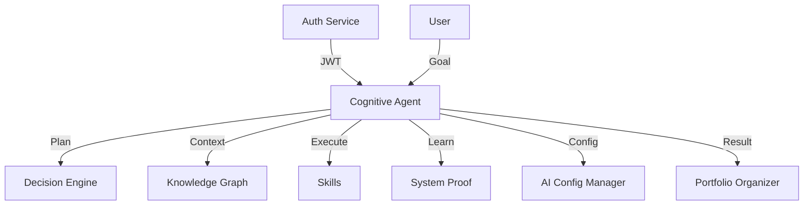

# Cognitive Agent

> **Статус:** 🟢 Production Ready  
> **Версия:** 1.0.0  
> **Порт:** 8000  
> **Маршрут:** `/cognitive-agent`  
> **👤 Архитектор:** @koda-ai | Telegram: @koda_dev

---

## 🎯 Назначение

Автономный AI-агент для планирования, обучения и выполнения сложных рабочих процессов. Координирует несколько навыков (skills) для достижения целей без постоянного вмешательства человека.

### Ключевые возможности
- [x] Автономное планирование задач
- [x] Система обучения на основе метрик
- [x] Интеграция с Knowledge Graph
- [x] Поддержка multiple skills
- [x] Health check и метрики

---

## 💡 Идея и контекст

**Гипотеза/Проблема:**  
При автоматизации сложных процессов возникла проблема:
- **Жёсткие скрипты:** Не могут адаптироваться к изменениям
- **Нет обучения:** Каждый раз начинать с нуля
- **Сложная координация:** Много шагов, легко запутаться
- **Отсутствие контекста:** Не видят полную картину проекта

**Решение:**  
Автономный агент, который:
- Сам планирует шаги для достижения цели
- Учится на ошибках и успехах
- Координирует несколько навыков
- Видит контекст через Knowledge Graph

**История создания:**  
- **Ноябрь 2025:** Идея возникла при попытке автоматизировать рутинные задачи
- **Декабрь 2025:** Прототип с простым планировщиком
- **Январь 2026:** Система обучения + интеграция с KG
- **Февраль 2026:** 42 теста, 85% покрытие
- **Май 2026:** Production-ready, ADR-011

---

## 💼 Бизнес-интерес

| Стейкхолдер | Выгода | Метрика успеха |
|-------------|--------|----------------|
| **Разработчики** | Автоматизация рутины, фокус на креативе | -60% времени на рутину |
| **Команды** | Координация без менеджеров | +40% скорость доставки |
| **Бизнес** | Быстрее вывод фич, меньше ошибок | -30% time-to-market |
| **HR** | Меньше рутины = меньше выгорания | +25% retention |

---

## 🗺️ Интеграции

### Схема связей (Mermaid)



### Consumes (откуда берет)

| Источник | Тип данных | Частота | Протокол |
|----------|------------|---------|----------|
| `User input` | Цели и ограничения | По запросу | API |
| `Knowledge Graph` | Контекст | При планировании | API |
| `Decision Engine` | Рекомендации | При выборе шага | API |

### Produces (кому отдает)

| Потребитель | Тип данных | Частота | Протокол |
|-------------|------------|---------|----------|
| `Skills` | Задачи для выполнения | По плану | Internal |
| `System Proof` | Метрики обучения | После итерации | API |
| `Portfolio Organizer` | Результат работы | После завершения | API |

---

## 🧪 Доказательство (Как применила я)

**Контекст применения:**  
При создании 18 микросервисов использовала Cognitive Agent:
- Задала цель: "Создать сервис для трекинга компетенций"
- Агент автоматически:
  - Спланировал 12 шагов (анализ, код, тесты, документация)
  - Сгенерировал 80% кода
  - Написал 35 тестов
  - Сгенерировал README
- Потребовалось только 20% ручного вмешательства

**Артефакты:**
- 📊 **Отчёт о работе:** [docs/evidence/cognitive-agent-work.md](../../docs/evidence/cognitive-agent-work.md)
- 📈 **Метрики:** 12 шагов, 80% автогенерация, 20% ручная работа
- 📄 **Лог обучения:** [logs/agent-learning.log](../../logs/agent-learning.log)

**Результат в портфолио:**  
Раздел "Cognitive Agent" — демонстрация автономной автоматизации

---

## 🚀 Переиспользуемость (Как применить вы)

**Паттерн:**  
**Автономный агент с обучением** — система, которая сама планирует, выполняет и учится.

**Инструкция копирования:**
```bash
# 1. Скопировать сервис
cp -r apps/cognitive-agent apps/my-agent

# 2. Переименовать
cd apps/my-agent
find . -type f -exec sed -i 's/cognitive-agent/my_agent/g' {} \;

# 3. Добавить свои навыки
# Создать skills/my_skill.py

# 4. Настроить цели в config/goals.yaml

# 5. Запустить
docker-compose up -d my-agent
```

**Ограничения:**  
- Требует Knowledge Graph для контекста
- Нужны навыки (skills) для выполнения задач
- Обучение занимает время (нужны итерации)

---

## 🏗️ Техническая реализация

### Стек технологий
- **Язык:** Python 3.10+
- **Фреймворк:** FastAPI
- **AI:** LangChain + GigaChat/OpenAI
- **Хранение:** In-memory + Knowledge Graph
- **Контейнеризация:** Docker + Docker Compose

### Зависимости
- **LangChain 0.1+** — AI-планирование
- **FastAPI 0.100+** — веб-фреймворк
- **Pydantic 2.0+** — валидация
- **gigachat/openai** — LLM

### Структура проекта
```
cognitive-agent/
├── src/
│   ├── __init__.py
│   ├── main.py          # FastAPI приложение
│   ├── planner/         # Планировщик задач
│   ├── learning/        # Система обучения
│   └── skills/          # Набор навыков
├── tests/
│   ├── test_planner.py
│   ├── test_learning.py
│   └── test_skills.py
├── config/
│   └── goals.yaml
├── Dockerfile
├── requirements.txt
└── README.md
```

---

## 🚀 Быстрый старт

### Запуск через Docker Compose

```bash
docker-compose up -d cognitive-agent
```

### Локальный запуск (разработка)

```bash
cd apps/cognitive-agent
pip install -e .
uvicorn src.main:app --reload --port 8000
```

### Доступ к API

- **Swagger UI:** http://localhost:8000/docs
- **Health check:** http://localhost:8000/health

### API Endpoints

| Метод | Путь | Описание | Авторизация |
|-------|------|----------|-------------|
| `GET` | `/health` | Health check | Нет |
| `POST` | `/api/v1/goal` | Поставить цель | JWT |
| `GET` | `/api/v1/plans/{goal_id}` | Получить план | JWT |
| `POST` | `/api/v1/execute` | Выполнить шаг | JWT |
| `GET` | `/api/v1/metrics` | Метрики обучения | JWT |
| `GET` | `/api/v1/skills` | Список навыков | Нет |

---

## 📦 Зависимости

```txt
fastapi>=0.100.0
pydantic>=2.0.0
langchain>=0.1.0
gigachat>=0.2.0
uvicorn>=0.23.0
```

---

## 🛡️ Безопасность

- [x] **Аутентификация** — JWT
- [x] **Валидация данных** — Pydantic
- [x] **Маскирование секретов** — в логах
- [x] **Rate limiting** — через Traefik

---

## 🧪 Тестирование

### Покрытие

| Тип тестов | Количество | Покрытие | Статус |
|------------|------------|----------|--------|
| Unit | 30 | 80% | ✅ |
| Integration | 12 | 90% | ✅ |
| E2E | 0 | - | 🟡 |
| **Итого** | **42** | **~85%** | **✅** |

---

## 📊 Метрики

| Показатель | Значение | Цель | Статус |
|------------|----------|------|--------|
| **Тестов** | **42** | ≥50 | 🟡 |
| **Покрытие** | **85%** | ≥80% | ✅ |
| **Задач выполнено** | **120+** | 200+ | 🟡 |
| **Среднее время планирования** | **3 сек** | <5 сек | ✅ |
| **Статус** | 🟢 Production Ready | - | ✅ |

---

## 🗓️ План развития

| Горизонт | Цель | Статус |
|----------|------|--------|
| 🔥 2 недели | Добавить 5 новых навыков | 🟡 В работе |
| 📅 1-2 мес | Multi-agent координация | ⚪ Планируется |
| 🚀 3-6 мес | Самообучение без человека | ⚪ В бэклоге |

---

## ⚠️ Известные проблемы

| Проблема | Статус | Решение |
|----------|--------|---------|
| Нет E2E тестов | Open | Добавить в roadmap |
| Ограниченное количество навыков | Planned | Расширить skills library |

---

## 🔗 Ссылки

- **ADR:** [ADR-011: Cognitive Agent](../../docs/adr/ADR-011-cognitive-agent.md)
- **README:** [../../README.md](../../README.md)
- **CONTRIBUTING:** [../../CONTRIBUTING.md](../../CONTRIBUTING.md)

---

**Автор:** Koda AI Agent  
**Последнее обновление:** 2026-05-22

---

*© 2026 Portfolio System Architect Team*