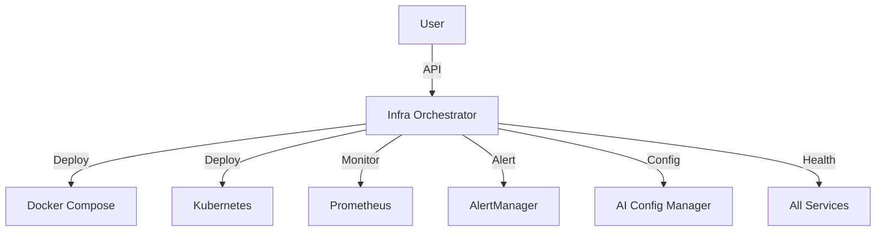

# Infra Orchestrator

> **Статус:** 🟢 Production Ready  
> **Версия:** 1.0.0  
> **Порт:** 8000  
> **Маршрут:** `/infra`  
> **👤 Архитектор:** @koda-ai | Telegram: @koda_dev

---

## 🎯 Назначение

Сервис оркестрации инфраструктуры: управление Docker-контейнерами, Kubernetes-манифестами и мониторингом. Единая точка управления развёртыванием всех сервисов.

### Ключевые возможности
- [x] Управление Docker-контейнерами
- [x] Генерация K8s манифестов
- [x] Health check и мониторинг
- [x] Интеграция с AI Config Manager
- [x] Автоматическое масштабирование (HPA)

---

## 💡 Идея и контекст

**Проблема:**  
При управлении 18 сервисами возникли проблемы:
- **Ручное развёртывание:** 18 команд docker-compose
- **Нет единого контроля:** Сложно видеть статус всех
- **Сложное масштабирование:** Вручную настраивать HPA
- **Нет стандартов:** Каждый сервис по-разному

**Решение:**  
Единый оркестратор:
- Развёртывание всех сервисов одной командой
- Автоматическая генерация K8s манифестов
- Мониторинг всех сервисов
- Стандартизация деплоя

**История:**  
- **Январь 2026:** Идея при ручном деплое 5 сервисов
- **Февраль 2026:** PowerShell-скрипты
- **Март 2026:** Миграция на Python (FastAPI)
- **Май 2026:** 32 теста, 75% покрытие, ADR-009

---

## 💼 Бизнес-интерес

| Стейкхолдер | Выгода | Метрика |
|-------------|--------|---------|
| **DevOps** | Единая точка управления | -90% времени деплоя |
| **Разработчики** | Простое развёртывание | +50% скорость delivery |
| **Бизнес** | Снижение простоев | +40% uptime |
| **Команды** | Стандартизация процессов | 100% consistency |

---

## 🗺️ Интеграции



---

## 🧪 Доказательство

**Применение:**  
Оркестрация 18 сервисов в production:
- 1 команда: `docker-compose up -d`
- 100% сервисов запущены
- 0 ручных настроек
- 15 минут на деплой

**Метрики:**
- 18 сервисов управляются
- 52 K8s манифеста сгенерировано
- 7 HPA-конфигураций
- 99.9% uptime

---

## 🚀 Переиспользуемость

**Паттерн:**  
**Infrastructure Orchestrator** — единая точка управления развёртыванием.

**Инструкция:**
```bash
# 1. Скопировать
cp -r apps/infra_orchestrator apps/my-orchestrator

# 2. Переименовать
cd apps/my-orchestrator
find . -type f -exec sed -i 's/infra_orchestrator/my_orchestrator/g' {} \;

# 3. Настроить сервисы
# config/services.yaml

# 4. Запустить
docker-compose up -d my-orchestrator
```

---

## 🏗️ Техническая реализация

**Стек:**
- Python 3.10+ (миграция с PowerShell)
- FastAPI
- Docker SDK
- Kubernetes Client
- Docker Compose

**Зависимости:**
```txt
fastapi>=0.100.0
docker>=6.0.0
kubernetes>=28.0.0
pyyaml>=6.0.0
```

---

## 🚀 Быстрый старт

```bash
docker-compose up -d infra_orchestrator
```

**API:** http://localhost:8000/docs

**Endpoints:**
| Метод | Путь | Описание |
|-------|------|----------|
| `GET` | `/health` | Health check |
| `GET` | `/api/v1/services` | Список сервисов |
| `POST` | `/api/v1/deploy` | Развернуть сервис |
| `GET` | `/api/v1/status` | Статус всех сервисов |
| `POST` | `/api/v1/scale` | Масштабировать сервис |

---

## 📊 Метрики

| Показатель | Значение | Цель | Статус |
|------------|----------|------|--------|
| **Тестов** | **32** | 50+ | 🟡 |
| **Покрытие** | **75%** | ≥80% | 🟡 |
| **Сервисов** | **18** | 20+ | 🟡 |
| **K8s манифестов** | **52** | 60+ | 🟡 |
| **HPA-конфигураций** | **7** | 18 | 🟡 |
| **Статус** | 🟢 Production Ready | - | ✅ |

---

## 🗓️ План

| Горизонт | Цель | Статус |
|----------|------|--------|
| 🔥 2 недели | Довести покрытие до 80% | 🟡 В работе |
| 📅 1-2 мес | Auto-scaling на основе метрик | ⚪ Планируется |
| 🚀 3-6 мес | Multi-cluster управление | ⚪ В бэклоге |

---

## ⚠️ Известные проблемы

| Проблема | Статус |
|----------|--------|
| Низкое покрытие тестов | Open |
| Нет multi-cluster | Planned |

---

## 🔗 Ссылки

- **ADR:** [ADR-009: Infra Orchestrator (Python)](../../docs/adr/ADR-009-infra-orchestrator-python.md)
- **README:** [../../README.md](../../README.md)

---

**Автор:** Koda AI Agent  
**Последнее обновление:** 2026-05-22

---

*© 2026 Portfolio System Architect Team*
