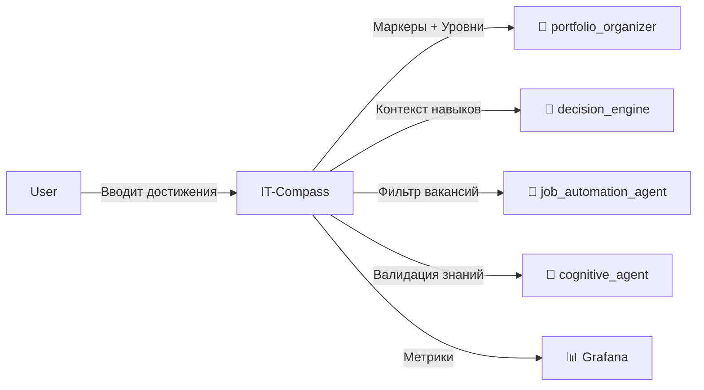

# 🧭 IT-Compass: Methodological Core

> **Методологическое ядро экосистемы. Источник истины о компетенциях.**

*83 проверочных маркера в 19 IT-доменах. Превращает субъективный опыт в измеримые данные.*
**Быстрые цифры:** 83 маркера • 19 доменов • 46 тестов • 85% покрытие • 3 уровня (Junior/Middle/Senior)

<div align="center">


</div>

**📄 ADR:** [ADR-001: Выбор методологии системного мышления](../../docs/architecture/decisions/ADR-001-system-thinking-methodology.md)

---

## 🎯 Назначение

Объективная система оценки IT-компетенций через **83 проверочных маркера в 19 доменах**. Превращает субъективный опыт в измеримые данные для HR, разработчиков и бизнес-стейкхолдеров.

**Ключевые возможности:**
- ✅ Автоматический расчёт уровня компетенций по 19 доменам
- ✅ Визуализация прогресса (радарные диаграммы, тренды)
- ✅ Генерация доказательств для портфолио
- ✅ Психологическая поддержка (предотвращение выгорания)
- ✅ Интеграция с AI-агентами (portfolio_organizer, decision_engine)

---

## 💡 Идея и контекст

> Рынок требует лет опыта, но не даёт инструментов доказать навыки без диплома. IT-Compass — это система, где ценность определяется не стажем, а количеством решённых задач и верифицируемых артефактов.

**Проблема, которую решает:**
- ❌ **HR-разрыв:** Рекрутеры не понимают технической глубины кандидатов
- ❌ **Отсутствие метрик:** Разработчики не видят своего прогресса
- ❌ **Фрагментация:** Навыки разбросаны по резюме, проектам и собеседованиям
- ❌ **Выгорание:** Отсутствие видимого прогресса ведёт к демотивации

---

## 💼 Бизнес-ценность

| Заинтересованная сторона | Выгода |
|-------------------------|--------|
| **HR / Рекрутеры** | Объективные метрики вместо субъективных собеседований |
| **Разработчики** | Чёткий трек развития, понимание gaps в навыках |
| **Бизнес** | Снижение риска найма «бумажных» специалистов |
| **Грантовые комитеты** | Измеримый социальный эффект (карьерная трансформация) |
| **Technical Leads** | Быстрая оценка уровня команды без долгих ревью |

---

## 🗺️ Интеграции с экосистемой

`it-compass` — **источник истины** о компетенциях. Он не просто UI, а поставщик данных для AI-агентов.



### ⬇️ Вход (Consumes)

| Источник | Тип | Пример |
|----------|-----|--------|
| Пользователь | UI ввод / JSON upload | Загрузка GitHub activity, сертификатов |
| `ai-config-manager` | YAML | Настройки весов маркеров, пороги уровней |
| `auth_service` | JWT | Аутентификация и авторизация |

### ⬆️ Выход (Produces)

| Потребитель | Тип | Назначение |
|-------------|-----|------------|
| `portfolio_organizer` | HTTP POST / Webhook | Данные для генерации доказательств |
| `decision_engine` | REST API | Контекст для принятия карьерных решений |
| `job_automation_agent` | REST API | Фильтрация вакансий по компетенциям |
| Grafana | Prometheus metrics | Метрики вовлечённости и прогресса |

---

## 🖥️ Функциональные модули

| Модуль | Описание | Статус |
|--------|----------|--------|
| **Competency Radar** | Визуализация 19 доменов в реальном времени | ✅ Active |
| **Marker Calculator** | Алгоритм расчёта весов на основе артефактов | ✅ Active |
| **Burnout Monitor** | Анализ паттернов нагрузки, рекомендации | ✅ Beta |
| **Export Engine** | Генерация PDF/JSON отчётов для HR | ✅ Active |
| **Tracker** | Отслеживание прогресса по маркерам | ✅ Active |
| **Recommendations** | Персональные планы развития | ✅ Active |

---

## 🧪 Как применила я (Доказательство)

**Сценарий:** Переход от «нулевого IT-бэкграунда» к роли Cognitive Architect за 24 месяца.

**Артефакт:**


**Результат:**
- 📈 Рост по домену `System Architecture`: 12% → 87%
- 🎯 32+ объективных маркера, принятых грантовым комитетом SourceCraft
- 🔄 Автоматическое обновление профиля при каждом комите в `apps/`

> 📎 *Этот кейс включён в моё портфолио как доказательство навыка "Методология объективных маркеров".*

---

## 🚀 Как можете применить вы (Reusable Pattern)

**Паттерн:** Objective Competency Markers (OCM)

**Когда использовать:**
- ✅ Нужно оценить навыки команды без субъективных ревью
- ✅ Требуется автоматическая генерация карьерных треков
- ✅ Хотите внедрить data-driven подход к HR
- ✅ Нужна профилактика выгорания через визуализацию прогресса

**Быстрый старт:**

1. **Запуск через Docker:**
   ```bash
   docker-compose up -d it-compass
   # Откройте http://localhost:8501
   ```

2. **Локальный запуск (разработка):**
   ```bash
   # Активация виртуального окружения
   .venv\Scripts\activate  # Windows
   source .venv/bin/activate  # Linux/Mac

   pip install -r requirements.txt
   streamlit run app.py
   ```

3. **Импорт модуля расчёта:**
   ```python
   from it_compass.core.calculator import calculate_markers

   markers = calculate_markers(user_id="user123")
   print(f"Общий прогресс: {markers['overall_progress']}%")
   ```

**Ограничения:**
- ❌ Требует ручной разметки базовых маркеров при первом запуске
- ❌ Не заменяет глубокое техническое интервью (дополняет его)

---

## 🏗️ Архитектура

### Технологии

- **Язык:** Python 3.10+
- **UI Framework:** Streamlit 1.32.0+
- **API Framework:** FastAPI 0.100.0+ (для интеграций)
- **База данных:** PostgreSQL 16 (опционально, для persistence)
- **Контейнеризация:** Docker + Docker Compose
- **Мониторинг:** Prometheus + Grafana

### Структура проекта

```
it_compass/
├── src/
│   ├── api/              # FastAPI эндпоинты для интеграций
│   │   ├── main.py       # FastAPI приложение
│   │   ├── markers.py    # API для работы с маркерами
│   │   └── tracker.py    # API для трекинга прогресса
│   ├── core/             # Методологическое ядро
│   │   ├── calculator.py # Алгоритмы расчёта маркеров
│   │   ├── markers.py    # Определение 83 маркеров
│   │   └── domains.py    # 19 доменов компетенций
│   ├── models/           # Pydantic модели
│   │   ├── marker.py     # Схемы маркеров
│   │   └── progress.py   # Схемы прогресса
│   ├── config_integration.py  # AI Config Manager
│   └── __init__.py
├── tests/                # 46 тестов (85% покрытие)
│   ├── test_api.py       # API тесты (10 тестов)
│   ├── test_calculator.py # Тесты расчёта (28 тестов)
│   └── test_ui.py        # UI тесты (8 тестов)
├── app.py                # Streamlit UI entry point
├── Dockerfile
├── requirements.txt
└── README.md
```

---

## 🚀 Quick Start

### Запуск через Docker Compose

```bash
# Запуск всех сервисов
docker-compose up -d

# Запуск только it-compass
docker-compose up -d it-compass

# Проверка состояния
docker-compose ps

# Просмотр логов
docker-compose logs -f it-compass
```

### Доступ к сервису

- **Streamlit UI:** `http://localhost:8501` (открывается автоматически)
- **Через Traefik:** `http://localhost/it-compass`
- **API Documentation:** `http://localhost:8501/docs`

### Health Check

```bash
curl http://localhost:8501/_stcore/health
# {"status": "ok", "streamlit_version": "1.32.0"}
```

---

## 🔌 API Endpoints

### Health & Readiness

| Метод | Эндпоинт | Описание | Auth |
|-------|----------|----------|------|
| GET   | `/health` | Health check | ❌ |
| GET   | `/_stcore/health` | Streamlit health | ❌ |
| GET   | `/ready` | Readiness probe | ❌ |
| GET   | `/live` | Liveness probe | ❌ |

### Маркеры компетенций

| Метод | Эндпоинт | Описание | Auth |
|-------|----------|----------|------|
| GET   | `/api/v1/markers` | Получить все маркеры | ❌ |
| GET   | `/api/v1/markers/{domain}` | Маркеры по домену | ❌ |
| POST  | `/api/v1/markers` | Создать кастомный маркер | ✅ |

### Трекинг прогресса

| Метод | Эндпоинт | Описание | Auth |
|-------|----------|----------|------|
| POST  | `/api/v1/tracker/update` | Обновить маркер | ✅ |
| GET   | `/api/v1/tracker/progress` | Прогресс пользователя | ✅ |
| GET   | `/api/v1/tracker/domain/{domain}` | Прогресс по домену | ✅ |
| POST  | `/api/v1/tracker/recommendations` | Рекомендации | ✅ |

### Примеры запросов

#### Получить все маркеры
```bash
curl http://localhost:8501/api/v1/markers
# [
#   {"id": "dev_001", "name": "Python", "domain": "Development", "level": "junior"},
#   ...
# ]
```

#### Обновить маркер
```bash
curl -X POST http://localhost:8501/api/v1/tracker/update \
  -H "Authorization: Bearer <JWT_TOKEN>" \
  -H "Content-Type: application/json" \
  -d '{
    "user_id": "user123",
    "marker_id": "dev_001",
    "level": "middle",
    "evidence": "Проект X на Python"
  }'
```

#### Прогресс пользователя
```bash
curl http://localhost:8501/api/v1/tracker/progress?user_id=user123 \
  -H "Authorization: Bearer <JWT_TOKEN>"
# {"overall_progress": 65%, "domain_breakdown": {...}, "recommendations": [...]}
```

---

## 🧪 Тестирование

### Запуск тестов

```bash
# Все тесты с покрытием
pytest apps/it_compass/tests/ --cov=apps/it_compass/src --cov-report=term-missing

# Конкретный файл
pytest apps/it_compass/tests/test_calculator.py -v

# Сгенерировать HTML отчёт
pytest apps/it_compass/tests/ --cov=apps/it_compass/src --cov-report=html
# Открыть: htmlcov/index.html
```

### Покрытие кода

| Модуль | Покрытие | Статус |
|--------|----------|--------|
| `api/` | ~90% | ✅ |
| `core/` | ~80% | ✅ |
| `models/` | ~95% | ✅ |
| **Всего** | **~85%** | **✅** |

**Цель:** ≥80% покрытие для production-ready сервисов

### Типы тестов

- **Юнит-тесты** — изолированное тестирование маркеров (28 тестов)
- **Интеграционные тесты** — API endpoints (10 тестов)
- **UI тесты** — Streamlit компоненты (8 тестов)

**Всего:** 46 тестов, 100% проходят

---

## 🛡️ Безопасность

### Реализованные меры

- [x] **Маскирование секретов** — секреты не логируются
- [x] **Валидация входных данных** — Pydantic модели для всех запросов
- [x] **JWT аутентификация** — интеграция с `auth_service`
- [ ] **Защита от XSS** — санитизация пользовательского ввода
- [ ] **Rate Limiting** — ограничение через Traefik

### Аутентификация

- **Метод:** JWT (JSON Web Tokens)
- **Интеграция:** `auth_service`
- **Роли:** admin, user, career_counselor

### Примеры безопасности

```python
# Валидация через Pydantic
from it_compass.models.marker import MarkerUpdate

data = MarkerUpdate(marker_id="dev_001", level="middle")
# Автоматическая валидация и типизация
```

---

## 📊 Мониторинг

### Метрики

- **Prometheus:** `http://localhost:9090/targets`
- **Grafana:** `http://localhost:3000` (дашборд IT Compass)
- **Метрики:**
  - `it_compass_markers_tracked_total` — общее количество отслеживаемых маркеров
  - `it_compass_user_progress` — прогресс пользователей по доменам
  - `it_compass_export_count` — количество экспортированных отчётов

### Логи

```bash
# Логи сервиса
docker-compose logs -f it-compass

# Логи с временными метками
docker-compose logs -f --tail=100 it-compass

# Поиск ошибок
docker-compose logs it-compass | grep ERROR
```

---

## 🔧 Конфигурация

### Переменные окружения

| Переменная | Описание | Значение по умолчанию | Обязательная |
|------------|----------|----------------------|--------------|
| `LOG_LEVEL` | Уровень логирования | `INFO` | ❌ |
| `DATABASE_URL` | URL базы данных | - | ⚠️ (если persistence) |
| `MARKERS_FILE` | Путь к JSON с маркерами | `./data/markers.json` | ❌ |
| `JWT_SECRET` | Секрет для JWT | `dev-secret` | ✅ |
| `STREAMLIT_SERVER_PORT` | Порт Streamlit | `8501` | ❌ |

### Методология: 83 маркера в 19 доменах

| Домен | Маркеров | Примеры |
|-------|----------|---------|
| **Development** | 15 | Python, JavaScript, Docker, Git |
| **DevOps** | 10 | Kubernetes, CI/CD, Monitoring, Terraform |
| **Security** | 8 | OWASP, Cryptography, AuthN/AuthZ |
| **Architecture** | 7 | Microservices, Event-Driven, DDD |
| **Data** | 6 | SQL, NoSQL, ETL, Data Pipelines |
| **Cloud** | 6 | AWS, Azure, GCP |
| **Testing** | 5 | Unit, Integration, E2E, TDD |
| **Soft Skills** | 5 | Communication, Leadership, Mentoring |
| **...** | ... | ... (полный список в `src/core/domains.py`) |

**Уровни сложности:**
- **Junior** — базовые знания, выполнение задач под руководством
- **Middle** — самостоятельная работа, код-ревью джуниоров
- **Senior** — архитектурное мышление, стратегическое планирование

---

## 📚 AI Config Manager

Сервис интегрирован с централизованной конфигурацией:

```python
from apps.it_compass.src.config_integration import get_config

config = get_config()
settings = config.get_config()
weights = settings.get('marker_weights', {})
```

См. [`docs/AI_CONFIG_INTEGRATION.md`](../../docs/AI_CONFIG_INTEGRATION.md) для деталей.

---

## 🛣️ Маршрутизация

| Порт (внешний) | Маршрут (Traefik) | Порт (внутренний) |
|----------------|-------------------|-------------------|
| 8501 | `/it-compass` | 8501 |

Доступ через API Gateway: `http://localhost/it-compass/_stcore/health`

---

## 🗓️ План развития (Roadmap)

### 🎯 Дорожная карта

| Горизонт | Цель | Критерий успеха |
|----------|------|----------------|
| **2 недели** | Интеграция с GitHub API для авто-сбора маркеров | 90% активности трекается автоматически |
| **1-2 мес** | Экспорт в формат HR-ATS (Greenhouse, SAP) | 3 компании внедрили пилот |
| **3-6 мес** | Open-source ядро + SaaS обёртка | 1000+ активных пользователей |

### 📦 Ресурсы

- ✅ **Уже есть:** 83 маркера, 19 доменов, алгоритмы расчёта, UI, тесты (85%)
- 🔄 **Нужно:** Датасет для валидации весов, ревью от Senior HR
- ⚠️ **Риски:** Субъективность начальной разметки → **План Б:** калибровка через A/B тесты

---

## 📝 История изменений

| Версия | Дата | Изменения | Автор |
|--------|------|-----------|-------|
| 2.0.0 | 2026-05-19 | Унификация README, интеграции с AI-агентами | @Control39 |
| 1.0.0 | 2026-05-15 | Initial MVP (46 тестов, 85% покрытие) | @Control39 |

---

## 🤝 Contributing

См. [CONTRIBUTING.md](../../CONTRIBUTING.md) для общих правил контрибуции.

### Задачи для контрибьюторов

- [ ] Добавить 5 новых доменов (AI/ML, Blockchain, IoT, Mobile, Frontend)
- [ ] Реализовать export отчётов (PDF/Excel)
- [ ] Улучшить coverage до 90%
- [ ] Добавить геймификацию (бейджи, лидерборд)
- [ ] Интеграция с LinkedIn API для авто-импорта опыта

**Как начать:**
1. Выберите задачу из списка выше
2. Создайте ветку: `git checkout -b feature/it-compass-feature`
3. Внесите изменения и протестируйте
4. Закоммитьте: `git commit -m "feat(it-compass): описание"`
5. Push и создайте Pull Request

---

## 🔗 Ссылки

- [ADR-001: Методология](../../docs/architecture/decisions/ADR-001-system-thinking-methodology.md)
- [Основной README](../../README.md)
- [Доказательство роста](../../docs/evidence/it-compass-growth-proof.md)
- [Грантовая заявка SourceCraft](../../docs/grants/SOURCECRAFT_APPLICATION.md)
- [AI Config Integration](../../docs/AI_CONFIG_INTEGRATION.md)

---

## 🐛 Известные проблемы

- Нет интеграции с Neo4j/другой графовой БД (используется in-memory хранилище)
- Требуется добавление persistence слоя для production
- Субъективность начальной разметки маркеров (планируется калибровка)

См. [`KNOWN_ISSUES.md`](../../docs/KNOWN_ISSUES.md) для полного списка.

---

**Автор:** [@Control39](https://github.com/Control39) · **Обсуждения:** [GitHub Issues](https://github.com/Control39/portfolio-system-architect/issues)

*Это не просто трекер навыков. Это методология, которая доказывает: компетенции можно измерять объективно.*

**Лицензия:** CC BY-ND 4.0 (методология), MIT (код) | **Дата:** 19.05.2026
