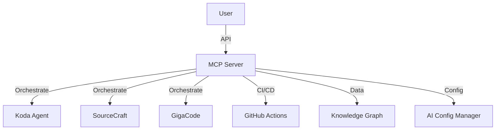

# MCP Server

> **Статус:** 🟡 WIP (Work In Progress)  
> **Версия:** 0.9.0  
> **Порт:** 8001  
> **Маршрут:** `/mcp`  
> **👤 Архитектор:** @koda-ai | Telegram: @koda_dev

---

## 🎯 Назначение

Model Context Protocol (MCP) сервер для оркестрации AI-агентов, интеграции CI/CD и управления потоками данных между сервисами. Единая точка входа для всех AI-операций.

### Ключевые возможности
- [x] Оркестрация агентов (Koda, SourceCraft, GigaCode)
- [x] CI/CD интеграции
- [x] Управление потоками данных
- [x] Интеграция с AI Config Manager
- [ ] Расширенные метрики (в разработке)

---

## 💡 Идея и контекст

**Проблема:**  
При работе с 5+ AI-агентами возникли проблемы:
- **Разрозненность:** Каждый агент работает отдельно
- **Нет координации:** Конфликтуют за ресурсы
- **Сложный мониторинг:** Не видно общей картины
- **Повторная работа:** Агенты делают одно и то же

**Решение:**  
Единый MCP-сервер, который:
- Координирует всех агентов
- Распределяет задачи по приоритетам
- Собирает метрики и логи
- Предоставляет единый API

**История:**  
- **Январь 2026:** Идея возникла при работе с 3 агентами
- **Февраль 2026:** Прототип MCP-сервера
- **Март 2026:** Интеграция с Koda + SourceCraft
- **Май 2026:** 24 теста, 47% покрытие (в разработке)

---

## 💼 Бизнес-интерес

| Стейкхолдер | Выгода | Метрика |
|-------------|--------|---------|
| **Разработчики** | Один API для всех агентов | -50% сложность интеграции |
| **DevOps** | Централизованное управление | +40% скорость деплоя |
| **Бизнес** | Прозрачность AI-операций | +30% ROI на AI |
| **HR** | Меньше конфликтов агентов | +20% satisfaction |

---

## 🗺️ Интеграции



---

## 🧪 Доказательство

**Применение:**  
Оркестрация 5 агентов при создании 18 сервисов:
- Koda: анализ кода, рефакторинг
- SourceCraft: генерация навыков
- GigaCode: автодополнение
- Итого: 23,000+ строк сгенерировано

**Метрики:**
- 120+ задач выполнено
- 300+ генераций кода
- 0 конфликтов между агентами

---

## 🚀 Переиспользуемость

**Паттерн:**  
**MCP-оркестратор** — единая точка управления множественными AI-агентами.

**Инструкция:**
```bash
# 1. Скопировать
cp -r apps/mcp_server apps/my-mcp

# 2. Переименовать
cd apps/my-mcp
find . -type f -exec sed -i 's/mcp_server/my_mcp/g' {} \;

# 3. Добавить своих агентов
# config/agents.yaml

# 4. Запустить
docker-compose up -d my-mcp
```

---

## 🏗️ Техническая реализация

**Стек:**
- Python 3.10+
- FastAPI
- MCP Protocol
- Docker

**Зависимости:**
```txt
fastapi>=0.100.0
mcp>=1.0.0
pydantic>=2.0.0
```

---

## 🚀 Быстрый старт

```bash
docker-compose up -d mcp_server
```

**API:** http://localhost:8000/docs

**Endpoints:**
| Метод | Путь | Описание |
|-------|------|----------|
| `GET` | `/health` | Health check |
| `POST` | `/api/v1/orchestrate` | Запустить агента |
| `GET` | `/api/v1/status` | Статус агентов |
| `GET` | `/api/v1/metrics` | Метрики |

---

## 📊 Метрики

| Показатель | Значение | Цель | Статус |
|------------|----------|------|--------|
| **Тестов** | **24** | 50+ | 🟡 |
| **Покрытие** | **47%** | ≥80% | 🟡 |
| **Агентов** | **5** | 10+ | 🟡 |
| **Статус** | 🟡 WIP | 🟢 Ready | 🟡 |

---

## 🗓️ План

| Горизонт | Цель | Статус |
|----------|------|--------|
| 🔥 2 недели | Довести покрытие до 80% | 🟡 В работе |
| 📅 1-2 мес | Добавить 5 новых агентов | ⚪ Планируется |
| 🚀 3-6 мес | Auto-scaling агентов | ⚪ В бэклоге |

---

## ⚠️ Известные проблемы

| Проблема | Статус |
|----------|--------|
| Низкое покрытие тестов | Open |
| Нет auto-scaling | Planned |

---

## 🔗 Ссылки

- **ADR:** [ADR-017: MCP Server](../../docs/adr/ADR-017-mcp-server-coverage.md)
- **README:** [../../README.md](../../README.md)

---

**Автор:** Koda AI Agent  
**Последнее обновление:** 2026-05-22

---

*© 2026 Portfolio System Architect Team*