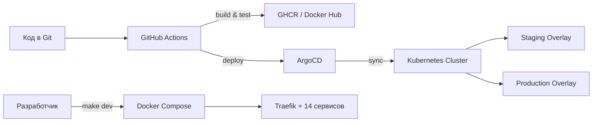

# 🚀 Стратегия деплоя

> «От локального `docker-compose` до GitOps в Kubernetes — деплой масштабируется вместе с проектом.»

## Назначение

- Хранение конфигураций для развертывания приложений
- Управление инфраструктурой как кодом (IaC)
- Автоматизация процессов деплоя и управления окружениями

---

## Уровни развёртывания

| Окружение | Инструмент | Команда | Для кого |
|-----------|-----------|---------|----------|
| 🧪 **Локальное** | Docker Compose + Traefik | `make dev` | Разработчики |
| 🧪 **Staging** | Kustomize + kubectl | `kubectl apply -k deployment/k8s/overlays/staging` | QA, тестирование |
| 🚀 **Production** | GitOps (ArgoCD) + Kustomize | Push в Git → авто-синхронизация | DevOps, SRE |
| ☁️ **Cloud** | Azure Web App (GitHub Actions) | Workflow Dispatch | Продакшен в облаке |

---

## Архитектура деплоя



---

## Структура

- `gitops/` — конфигурации GitOps для управления состоянием кластера (ArgoCD)
- `k8s/` — манифесты Kubernetes для оркестрации контейнеров (Kustomize: base + overlays)
- `secrets/` — конфигурации для управления секретами (Sealed Secrets)

---

## Быстрый старт

### Локально (Docker Compose)
```bash
make dev
# Traefik Dashboard: http://localhost:8080
```

### Staging (Kubernetes)
```bash
kubectl apply -k deployment/k8s/overlays/staging
```

### Production (GitOps)
```bash
# ArgoCD автоматически синхронизирует изменения из Git
# Ручной sync через CLI:
argocd app sync portfolio-system
```

---

## Детали по компонентам

| Компонент | Технология | Особенности |
|-----------|-----------|-------------|
| **API Gateway** | Traefik v3.0 | Локально — Docker-лейблы, в K8s — Ingress |
| **Оркестрация** | Kubernetes 1.27+ | Kustomize overlays: dev / staging / prod |
| **GitOps** | ArgoCD | Авто-sync, self-heal, prune |
| **Масштабирование** | HPA | decision-engine, ml-model-registry |
| **Секреты** | Sealed Secrets | Безопасное хранение в Git |
| **Мониторинг** | Prometheus + Grafana | Встроен в docker-compose.monitoring.yml |

---

## Что это показывает

- ✅ **Полный цикл**: от кода до продакшена
- ✅ **Выбор инструмента под задачу**: Compose для разработки, Kustomize для K8s, ArgoCD для GitOps
- ✅ **Автоматизация**: CI/CD через GitHub Actions
- ✅ **Безопасность**: Sealed Secrets, OIDC для Azure, Network Policies
- ✅ **Масштабируемость**: HPA, multi-environment overlays

👉 **Подробности по Kubernetes:** [k8s/README.md](k8s/README.md)
👉 **Подробности по GitOps:** [gitops/README.md](gitops/README.md)
👉 **Питч для собеседований:** [docs/interview/deployment-pitch.md](../docs/interview/deployment-pitch.md)
