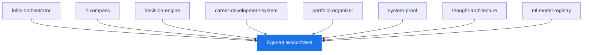

# 🏗️ Архитектура Portfolio System Architect

> **Артефакт единой экосистемы архитектора когнитивных систем**

---

## 🎯 Цель

Создать **единый, целостный, живой репозиторий `portfolio-system-architect`**, который:
- Станет **главным доказательством моей экспертизы**
- Покажет **системное мышление как архитектурную компетенцию**
- Будет готов к подаче на **грант Sourcecraft Open Source**
- Ответит на вопрос:
  > «Кто ты?» →
  > «Я — архитектор когнитивных систем. Я создаю системы, где человек управляет ИИ для проектирования сложных экосистем.»

---

## 🧩 Компоненты

### 1. infra-orchestrator
- **Назначение**: Фреймворк архитектурного компаса
- **Функции**:
  - Определение архитектурных принципов
  - Управление архитектурными решениями
  - Валидация архитектуры

### 2. it-compass
- **Назначение**: Система объективных маркеров IT-компетенций
- **Функции**:
  - Оценка текущих компетенций
  - Планирование развития
  - Самообучение

### 3. decision-engine
- **Назначение**: Система принятия решений на основе AI
- **Функции**:
  - Анализ данных и контекста
  - Принятие архитектурных решений
  - Автоматизация процессов рассуждения

### 4. career-development-system
- **Назначение**: Система развития карьеры
- **Функции**:
  - Планирование карьеры
  - Отслеживание прогресса
  - Поддержка принятия решений

### 5. portfolio-organizer
- **Назначение**: Организатор портфолио
- **Функции**:
  - Структурирование проектов
  - Автоматизация документирования
  - Генерация отчетов

### 6. system-proof
- **Назначение**: Система доказательств
- **Функции**:
  - Сбор доказательств
  - Анализ доказательств
  - Визуализация доказательств

### 7. thought-architecture
- **Назначение**: Архитектура мысли
- **Функции**:
  - Моделирование мышления
  - Анализ когнитивных процессов
  - Оптимизация мышления

### 8. ml-model-registry
- **Назначение**: Реестр версий ML-моделей
- **Функции**:
  - Хранение метаданных моделей
  - Управление версиями
  - Отслеживание экспериментов
  - Интеграция с CI/CD

---

## 🔄 Интеграция

### 1. Единая точка входа
- Все компоненты интегрированы через `portfolio-system-architect`
- Единая документация и методология

### 2. Автоматизация
- Ежедневная генерация карты знаний и сайта
- Автообновление через GitHub Actions

### 3. Живая система
- Постоянное обновление и развитие
- Открытость для вкладов

---

## 🛠️ Техническая реализация

### 1. Языки и фреймворки
- **Python**: основной язык программирования
- **Markdown**: документация
- **Mermaid**: диаграммы
- **HTML/CSS/JS**: веб-сайт

### 2. Инструменты
- **Git**: система контроля версий
- **GitHub Actions**: CI/CD
- **Obsidian**: карта знаний
- **Bootstrap**: фронтенд

### 3. Автоматизация
- **generate_obsidian_map.py**: генератор карты знаний
- **generate_website.py**: генератор сайта
- **run_daily.ps1**: ежедневная автоматизация

---

## 📈 Эволюция

### 1. Итерации
- Постоянное улучшение компонентов
- Адаптация к новым требованиям

### 2. Обратная связь
- Вклад сообщества
- Анализ использования

### 3. Масштабирование
- Расширение функциональности
- Интеграция с новыми инструментами

---

## 🏆 Грант Sourcecraft Open Source

> «Этот репозиторий — результат двух лет экспериментов, ошибок и прорывов.
> Здесь я переопределяю роль архитектора в эпоху ИИ.
> Я не пишу код — я проектирую системы, где человек управляет ИИ для создания новых форм экспертизы.
> Этот проект — мой вклад в будущее профессии.»
