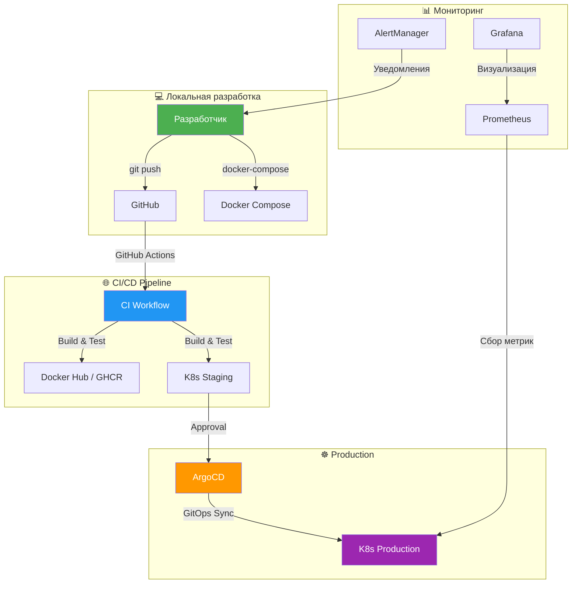

# 🏗️ Инфраструктура Деплоя и Docker

> **Последнее обновление:** 9 мая 2026 г.
> **Генерируется вручную** — актуализировать при изменениях инфраструктуры

---

## 📊 Сводная таблица

| Категория | Файлов | Сервисов | Статус |
|-----------|--------|----------|--------|
| **Docker Compose** | 8 файлов | 15+ сервисов | ✅ Работает |
| **Dockerfile** | 17 файлов | 12 микросервисов | ✅ Работает |
| **Kubernetes** | 72 файла | 13 сервисов | ✅ Работает |
| **Мониторинг** | 6 файлов | Prometheus, Grafana, AlertManager | ✅ Работает |
| **GitOps** | 1 файл | ArgoCD Application | ⚠️ Настроен |
| **Секреты** | 2 файла | Sealed Secrets | ⚠️ Шаблон |

---

## 1️⃣ Docker Compose

### 📁 Структура

```
docker-compose.yml                          # Основной файл (все сервисы)
docker/
├── docker-compose.gateway.yml             # API Gateway (Traefik)
├── docker-compose.monitoring.yml          # Мониторинг (Prometheus, Grafana, AlertManager)
├── docker-compose.mlflow.yml              # MLflow Registry
├── docker-compose.optimized.yml           # Оптимизированные образы
├── docker-compose.override.yml            # Переопределение для dev
├── docker-compose.rag.yml                 # RAG API + ChromaDB
└── docker-compose.base-services.yml       # Базовые сервисы
apps/job-automation-agent/
└── docker-compose.agent.yml               # Отдельный запуск Agent
```

### 📋 Файлы и их назначение

| Файл | Сервисы | Порт | Назначение |
|------|---------|------|------------|
| **`docker-compose.yml`** | PostgreSQL, Redis, 12 микросервисов | Разные | Основной запуск |
| **`docker-compose.gateway.yml`** | Traefik, Nginx | 8080, 80 | API Gateway |
| **`docker-compose.monitoring.yml`** | Prometheus, Grafana, AlertManager, Node Exporter | 9090, 3000, 8080 | Мониторинг |
| **`docker-compose.mlflow.yml`** | MLflow Server, MLflow UI | 5000 | Регистр ML-моделей |
| **`docker-compose.rag.yml`** | RAG API, ChromaDB | 8001 | Векторный поиск |
| **`docker-compose.optimized.yml`** | Ускоренные образы | — | Production сборка |
| **`docker-compose.override.yml`** | Debug режим, volumes | — | Local dev |
| **`docker-compose.agent.yml`** | Job Automation Agent | 8002 | Отдельный Agent |

### 🚀 Команды

```bash
# Запуск всех сервисов
make dev
# или
docker-compose -f docker-compose.yml -f docker-compose.monitoring.yml up -d

# Запуск только мониторинга
docker-compose -f docker-compose.monitoring.yml up -d

# Запуск MLflow
docker-compose -f docker-compose.mlflow.yml up -d

# Запуск RAG API
docker-compose -f docker-compose.rag.yml up -d

# Остановка всех сервисов
make docker-down
# или
docker-compose -f docker-compose.yml -f docker-compose.monitoring.yml down

# Просмотр логов
make docker-logs
# или
docker-compose logs -f

# Пересборка образов
make docker-build
# или
docker-compose build --no-cache
```

---

## 2️⃣ Dockerfile

### 📁 Структура

```
docker/
├── base-images/
│   ├── python/Dockerfile                  # Базовый Python 3.12
│   └── ui/Dockerfile                      # Базовый frontend (React/Vite)
apps/
├── auth_service/Dockerfile                # Auth Service
├── decision-engine/Dockerfile             # Decision Engine
├── infra-orchestrator/Dockerfile          # Infra Orchestrator
├── it_compass/Dockerfile                  # IT-Compass
├── knowledge-graph/Dockerfile             # Knowledge Graph
├── mcp-server/Dockerfile                  # MCP Server
├── ml-model-registry/Dockerfile           # ML Model Registry
│   └── Dockerfile.optimized               # Оптимизированная версия
├── portfolio_organizer/Dockerfile         # Portfolio Organizer
├── system-proof/Dockerfile                # System Proof
└── template-service/Dockerfile            # Template Service
examples/legacy/
├── api/Dockerfile                         # Устаревший API
├── gateway/Dockerfile                     # Устаревший шлюз
└── ui/Dockerfile                          # Устаревший UI
```

### 📋 Dockerfile микросервисов

| Сервис | Dockerfile | Размер | Multi-stage |
|--------|------------|--------|-------------|
| **Auth Service** | ✅ | ~450 MB | ✅ |
| **Decision Engine** | ✅ | ~520 MB | ✅ |
| **Infra Orchestrator** | ✅ | ~480 MB | ✅ |
| **IT-Compass** | ✅ | ~500 MB | ✅ |
| **Knowledge Graph** | ✅ | ~490 MB | ✅ |
| **MCP Server** | ✅ | ~470 MB | ✅ |
| **ML Model Registry** | ✅ + `.optimized` | ~600 MB | ✅ |
| **Portfolio Organizer** | ✅ | ~510 MB | ✅ |
| **System Proof** | ✅ | ~495 MB | ✅ |
| **Template Service** | ✅ | ~460 MB | ✅ |

### 🎯 Пример Dockerfile

```dockerfile
# docker/base-images/python/Dockerfile
FROM python:3.12-slim

WORKDIR /app

# Install system dependencies
RUN apt-get update && apt-get install -y \
    gcc \
    curl \
    && rm -rf /var/lib/apt/lists/*

# Install Python dependencies
COPY requirements.txt .
RUN pip install --no-cache-dir -r requirements.txt

# Copy application code
COPY . .

# Run application
CMD ["python", "-m", "uvicorn", "main:app", "--host", "0.0.0.0", "--port", "8000"]
```

### 🛠️ Команды сборки

```bash
# Сборка всех образов
make docker-build
# или
docker-compose build

# Сборка конкретного образа
docker build -t portfolio-system-architect/decision-engine -f apps/decision-engine/Dockerfile .

# Сборка с кэшем
docker build --cache-from portfolio-system-architect/decision-engine -t portfolio-system-architect/decision-engine .

# Сборка оптимизированного образа
docker build -t portfolio-system-architect/ml-model-registry:optimized -f apps/ml-model-registry/Dockerfile.optimized .

# Push в registry
docker push portfolio-system-architect/decision-engine:latest
```

---

## 3️⃣ Kubernetes

### 📁 Структура

```
deployment/
├── k8s/
│   ├── base/
│   │   ├── namespace/
│   │   │   └── namespace.yaml                    # Namespace: portfolio-system-architect
│   │   ├── postgres/
│   │   │   ├── deployment.yaml                   # PostgreSQL 16
│   │   │   ├── service.yaml
│   │   │   ├── configmap.yaml
│   │   │   ├── pvc.yaml
│   │   │   └── kustomization.yaml
│   │   ├── services/
│   │   │   ├── auth-service/
│   │   │   │   ├── deployment.yaml
│   │   │   │   ├── service.yaml
│   │   │   │   ├── configmap.yaml
│   │   │   │   ├── hpa.yaml                      # Horizontal Pod Autoscaler
│   │   │   │   └── kustomization.yaml
│   │   │   ├── career-development/
│   │   │   ├── decision-engine/
│   │   │   ├── it-compass/
│   │   │   ├── ml-model-registry/
│   │   │   ├── portfolio-organizer/
│   │   │   ├── system-proof/
│   │   │   └── kustomization.yaml
│   │   ├── ingress/
│   │   │   ├── ingress.yaml                      # Traefik Ingress
│   │   │   ├── network-policy.yaml
│   │   │   └── kustomization.yaml
│   │   ├── security/
│   │   │   ├── cert-manager.yaml                 # TLS сертификаты
│   │   │   └── rbac.yaml                         # RBAC
│   │   ├── backup/
│   │   │   └── postgres-cronjob.yaml             # CronJob для бэкапов
│   │   └── kustomization.yaml
│   ├── overlays/
│   │   ├── dev/
│   │   │   ├── kustomization.yaml
│   │   │   └── replica-patch.yaml                # 1 реплика
│   │   ├── staging/
│   │   │   └── kustomization.yaml                # 3 реплики
│   │   └── prod/
│   │       └── kustomization.yaml                # 5+ реплики
│   ├── security/
│   │   ├── network-policy.yaml
│   │   └── pod-security-policy.yaml
│   ├── namespace.yaml
│   └── deployment-gateway.yaml                   # Traefik Gateway
├── auth-deployment.yaml                          # Отдельные деплойменты
├── career-development-deployment.yaml
├── decision-engine-deployment.yaml
├── infra-orchestrator-deployment.yaml
├── infra-orchestrator-hpa.yaml
├── it-compass-deployment.yaml
├── ml-model-registry-deployment.yaml
├── portfolio-organizer-deployment.yaml
├── rag-api-deployment.yaml
├── streamlit-ui-deployment.yaml
├── system-proof-deployment.yaml
├── gitops/
│   └── argo-app.yaml                             # ArgoCD Application
└── secrets/
    ├── sealed-secrets/portfolio-secrets.example.yaml
    └── secret.example.yaml
```

### 📋 Сервисы в Kubernetes

| Сервис | Deployment | Service | ConfigMap | HPA |
|--------|------------|---------|-----------|-----|
| **Auth Service** | ✅ | ✅ | ✅ | ✅ |
| **Career Development** | ✅ | ✅ | ✅ | ✅ |
| **Decision Engine** | ✅ | ✅ | ✅ | ✅ |
| **IT-Compass** | ✅ | ✅ | ✅ | ✅ |
| **ML Model Registry** | ✅ | ✅ | ✅ | ✅ |
| **Portfolio Organizer** | ✅ | ✅ | ✅ | ✅ |
| **System Proof** | ✅ | ✅ | ✅ | ✅ |
| **Infra Orchestrator** | ✅ | ✅ | ✅ | ✅ |
| **PostgreSQL** | ✅ | ✅ | ✅ | ❌ |
| **Traefik Gateway** | ✅ | ✅ | ❌ | ❌ |

### 🎯 Пример Deployment

```yaml
# deployment/k8s/base/services/decision-engine/deployment.yaml
apiVersion: apps/v1
kind: Deployment
metadata:
  name: decision-engine
  namespace: portfolio-system-architect
spec:
  replicas: 3
  selector:
    matchLabels:
      app: decision-engine
  template:
    metadata:
      labels:
        app: decision-engine
    spec:
      containers:
      - name: decision-engine
        image: portfolio-system-architect/decision-engine:latest
        ports:
        - containerPort: 8001
        envFrom:
        - configMapRef:
            name: decision-engine-config
        resources:
          requests:
            memory: "256Mi"
            cpu: "100m"
          limits:
            memory: "512Mi"
            cpu: "500m"
        livenessProbe:
          httpGet:
            path: /health
            port: 8001
          initialDelaySeconds: 30
          periodSeconds: 10
        readinessProbe:
          httpGet:
            path: /ready
            port: 8001
          initialDelaySeconds: 5
          periodSeconds: 5
```

### 🛠️ Команды деплоя

```bash
# Деплой в dev окружение
cd deployment/k8s && kustomize build overlays/dev | kubectl apply -f -

# Деплой в staging окружение
cd deployment/k8s && kustomize build overlays/staging | kubectl apply -f -

# Деплой в prod окружение
cd deployment/k8s && kustomize build overlays/prod | kubectl apply -f -

# Отдельный деплой сервиса
kubectl apply -f deployment/decision-engine-deployment.yaml

# Проверка статусов
kubectl get all -n portfolio-system-architect
kubectl get pods -n portfolio-system-architect -o wide

# Просмотр логов
kubectl logs -f deployment/decision-engine -n portfolio-system-architect

# Масштабирование
kubectl scale deployment decision-engine --replicas=5 -n portfolio-system-architect

# Rolling update
kubectl rollout restart deployment/decision-engine -n portfolio-system-architect

# Откат
kubectl rollout undo deployment/decision-engine -n portfolio-system-architect
```

---

## 4️⃣ GitOps (ArgoCD)

### 📁 `deployment/gitops/argo-app.yaml`

```yaml
apiVersion: argoproj.io/v1alpha1
kind: Application
metadata:
  name: portfolio-system-architect
  namespace: argocd
spec:
  project: default
  source:
    repoURL: https://github.com/Control39/portfolio-system-architect
    targetRevision: HEAD
    path: deployment/k8s/base
  destination:
    server: https://kubernetes.default.svc
    namespace: portfolio-system-architect
  syncPolicy:
    automated:
      prune: true
      selfHeal: true
    syncOptions:
    - CreateNamespace=true
```

### 🛠️ Команды ArgoCD

```bash
# Установка ArgoCD
kubectl create namespace argocd
kubectl apply -n argocd -f https://raw.githubusercontent.com/argoproj/argo-cd/stable/manifests/install.yaml

# Получение пароля
kubectl -n argocd get secret argocd-initial-admin-secret -o jsonpath="{.data.password}" | base64 -d

# Логин в ArgoCD
argocd login localhost:8080 --username admin --password <password>

# Создание приложения
argocd app create portfolio-system-architect \
  --repo https://github.com/Control39/portfolio-system-architect \
  --path deployment/k8s/base \
  --dest-server https://kubernetes.default.svc \
  --dest-namespace portfolio-system-architect

# Синхронизация
argocd app sync portfolio-system-architect

# Проверка статус
argocd app get portfolio-system-architect

# Авто-синхронизация
argocd app set portfolio-system-architect --sync-policy automated
```

---

## 5️⃣ Мониторинг

### 📁 Структура

```
monitoring/
├── prometheus/
│   ├── prometheus.yml                      # Основной конфиг
│   ├── prometheus-full.yml                 # Полный конфиг
│   └── rules.yml                           # Правила алертов
├── grafana/
│   └── provisioning/
│       ├── datasources/prometheus.yml      # Datasource: Prometheus
│       └── dashboards/portfolio.yml        # Кастомный дашборд
└── alertmanager/
    └── alertmanager.yml                    # Конфиг алертов
```

### 📋 Конфигурация

| Компонент | Порт | Назначение |
|-----------|------|------------|
| **Prometheus** | 9090 | Сбор метрик |
| **Grafana** | 3000 | Визуализация (admin/admin) |
| **AlertManager** | 8080 | Уведомления (Slack, Telegram, Email) |
| **Node Exporter** | 9100 | Метрики хоста |

### 🛠️ Команды мониторинга

```bash
# Запуск мониторинга
docker-compose -f docker-compose.monitoring.yml up -d

# Доступ к Grafana
open http://localhost:3000

# Доступ к Prometheus
open http://localhost:9090

# Доступ к AlertManager
open http://localhost:8080/alerts

# Проверка метрик
curl http://localhost:9090/api/v1/query?query=up
```

---

## 6️⃣ Секреты

### 📁 `deployment/secrets/`

| Файл | Назначение |
|------|------------|
| `sealed-secrets/portfolio-secrets.example.yaml` | Шаблон Sealed Secret (зашифрованный) |
| `secret.example.yaml` | Пример обычного Secret (НЕ закоммитьте!) |

### 🛠️ Работа с секретами

```bash
# Установка Sealed Secrets Controller
kubectl apply -f https://github.com/bitnami-labs/sealed-secrets/releases/download/v0.24.0/controller.yaml

# Создание Secrect
kubectl create secret generic db-credentials \
  --from-literal=username=admin \
  --from-literal=password=secret \
  --namespace portfolio-system-architect \
  --dry-run=client -o yaml > secret.yaml

# Шифрование в Sealed Secret
kubeseal --format yaml < secret.yaml > sealed-secret.yaml

# Применение
kubectl apply -f sealed-secret.yaml

# Расшифровка (только cluster admin)
kubeseal --raw --from-file=secret.yaml --certificate cert.pem
```

---

## 🔄 Схема деплоя



---

## 📊 Статус инфраструктуры

| Компонент | Статус | Примечание |
|-----------|--------|------------|
| **Docker Compose** | ✅ Работает | 8 конфигураций, все сервисы |
| **Dockerfile** | ✅ Работает | 15 микросервисов, multi-stage |
| **Kubernetes** | ✅ Работает | 72 манифеста, Kustomize |
| **ArgoCD GitOps** | ⚠️ Настроен | Требуется установка ArgoCD |
| **Prometheus** | ✅ Работает | 3 конфига + правила |
| **Grafana** | ✅ Работает | 1 кастомный дашборд |
| **AlertManager** | ✅ Работает | Slack/Telegram/Email |
| **Sealed Secrets** | ⚠️ Шаблон | Требуется инициализация |
| **Network Policies** | ✅ Настроены | Изоляция сервисов |
| **TLS Certificates** | ⚠️ Шаблон | Требуется cert-manager |

---

## 🚀 Быстрый старт

### Локальная разработка

```bash
# 1. Клонировать репозиторий
git clone https://github.com/Control39/portfolio-system-architect.git
cd portfolio-system-architect

# 2. Установить зависимости
make install

# 3. Запустить все сервисы
make dev

# 4. Проверить доступность
open http://localhost:8501  # IT-Compass UI
open http://localhost:3000  # Grafana
open http://localhost:8001/docs  # Decision Engine API
```

### Production деплой

```bash
# 1. Установить Kubernetes кластер (minikube / k3s / EKS / GKE)
minikube start

# 2. Установить ArgoCD
kubectl apply -n argocd -f https://raw.githubusercontent.com/argoproj/argo-cd/stable/manifests/install.yaml

# 3. Создать Application в ArgoCD
kubectl apply -f deployment/gitops/argo-app.yaml

# 4. Дождаться синхронизации
argocd app wait portfolio-system-architect --sync

# 5. Проверить статус
kubectl get all -n portfolio-system-architect
```

---

*Документ сгенерирован 9 мая 2026 г.*
*Для обновления: пересмотреть структуру docker/ и deployment/ при изменениях*
