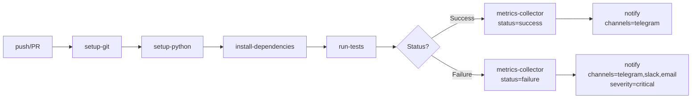

# 🛠️ Карта Custom GitHub Actions

> **Последнее обновление:** 9 мая 2026 г.
> **Расположение:** `.github/actions/`

---

## 📁 Структура

```
.github/actions/
├── setup-python/          # Настройка Python окружения
├── setup-git/             # Настройка Git
├── install-dependencies/  # Установка зависимостей
├── run-tests/             # Запуск тестов
├── metrics-collector/     # Сбор метрик CI/CD
└── notify/                # Отправка уведомлений
```

---

## 🔧 Детальное описание

### 1. `setup-python/` — Настройка Python

**Файл:** `.github/actions/setup-python/action.yml`

**Назначение:**
- Установка Python версии (по умолчанию 3.11)
- Кэширование pip зависимостей
- Вывод информации о версии

**Inputs:**
| Input | Default | Описание |
|-------|---------|----------|
| `python-version` | `'3.11'` | Версия Python |
| `cache-dependency-path` | `'requirements-dev.txt'` | Файл зависимостей для кэша |

**Использование:**
```yaml
- name: Setup Python
  uses: ./.github/actions/setup-python
  with:
    python-version: '3.12'
    cache-dependency-path: 'requirements.txt'
```

---

### 2. `setup-git/` — Настройка Git

**Файл:** `.github/actions/setup-git/action.yml`

**Назначение:**
- Включение поддержки длинных путей (`core.longpaths`)
- Установка имени и email пользователя Git

**Inputs:**
| Input | Default | Описание |
|-------|---------|----------|
| `git-user-name` | `'GitHub Actions'` | Имя пользователя Git |
| `git-user-email` | `'actions@github.com'` | Email пользователя Git |

**Использование:**
```yaml
- name: Setup Git
  uses: ./.github/actions/setup-git
  with:
    git-user-name: 'Bot Name'
    git-user-email: 'bot@example.com'
```

---

### 3. `install-dependencies/` — Установка зависимостей

**Файл:** `.github/actions/install-dependencies/action.yml`

**Назначение:**
- Обновление pip (опционально)
- Установка зависимостей из requirements файла
- Установка production зависимостей, если отличаются от dev

**Inputs:**
| Input | Default | Описание |
|-------|---------|----------|
| `requirements-file` | `'requirements-dev.txt'` | Файл зависимостей |
| `extra-index-url` | `''` | Дополнительный PyPI индекс |
| `upgrade-pip` | `'true'` | Обновлять ли pip |

**Использование:**
```yaml
- name: Install Dependencies
  uses: ./.github/actions/install-dependencies
  with:
    requirements-file: 'requirements.txt'
    upgrade-pip: 'true'
```

---

### 4. `run-tests/` — Запуск тестов

**Файл:** `.github/actions/run-tests/action.yml`

**Назначение:**
- Запуск pytest с покрытием кода
- Генерация отчёта (html/xml/json)
- Загрузка артефактов покрытия

**Inputs:**
| Input | Default | Описание |
|-------|---------|----------|
| `test-path` | `'tests'` | Путь к тестам |
| `coverage-threshold` | `'80'` | Минимальное покрытие (%) |
| `output-format` | `'html'` | Формат отчёта (html/xml/json) |
| `extra-args` | `''` | Дополнительные аргументы pytest |

**Использование:**
```yaml
- name: Run Tests
  uses: ./.github/actions/run-tests
  with:
    test-path: 'tests apps/'
    coverage-threshold: '95'
    output-format: 'xml'
    extra-args: '--ignore=tests/e2e'
```

**Генерируемые артефакты:**
- `coverage.xml` — XML отчёт для Codecov
- `htmlcov/` — HTML отчёт покрытия

---

### 5. `metrics-collector/` — Сбор метрик CI/CD

**Файл:** `.github/actions/metrics-collector/action.yml`

**Назначение:**
- Сбор метрик о длительности и статусе jobs
- Запись в JSON файл
- Загрузка артефактов метрик

**Inputs:**
| Input | Required | Default | Описание |
|-------|----------|---------|----------|
| `job-name` | ✅ | - | Имя job'а |
| `job-status` | ✅ | - | Статус (success/failure/cancelled/skipped) |
| `metrics-file` | ❌ | `'ci-metrics.json'` | Файл для записи метрик |

**Использование:**
```yaml
- name: Collect Metrics
  uses: ./.github/actions/metrics-collector
  with:
    job-name: 'test-job'
    job-status: 'success'
    metrics-file: 'workflow-metrics.json'
```

**Формат записываемых данных:**
```json
{
  "job": "test-job",
  "status": "success",
  "start_time": "2026-05-09T10:00:00Z",
  "end_time": "2026-05-09T10:05:30Z",
  "run_id": "12345",
  "run_number": "42",
  "repository": "Control39/portfolio-system-architect",
  "ref": "refs/heads/main",
  "timestamp": "2026-05-09T10:05:30Z"
}
```

---

### 6. `notify/` — Отправка уведомлений

**Файл:** `.github/actions/notify/action.yml`

**Назначение:**
- Отправка уведомлений на Telegram, Slack, Email
- Поддержка нескольких каналов одновременно
- Разные уровни серьёзности (info/warning/error/critical)

**Inputs:**
| Input | Required | Default | Описание |
|-------|----------|---------|----------|
| `status` | ✅ | - | Статус (success/failure/cancelled/started) |
| `message` | ✅ | - | Текст уведомления |
| `title` | ❌ | `'CI/CD Notification'` | Заголовок |
| `channels` | ❌ | `'telegram'` | Каналы (telegram,slack,email) |
| `severity` | ❌ | `'info'` | Уровень (info/warning/error/critical) |

**Использование:**
```yaml
- name: Notify on Failure
  if: failure()
  uses: ./.github/actions/notify
  with:
    status: 'failure'
    message: 'Tests failed in ${{ github.workflow }}'
    title: '⚠️ Build Failed'
    channels: 'telegram,slack,email'
    severity: 'critical'
```

**Зависимые Actions:**
- `appleboy/telegram-action@master` — Telegram
- `slackapi/slack-github-action@v1.27.0` — Slack
- `dawidd6/action-send-mail@v3` — Email

**Требуемые Secrets:**
| Secret | Назначение |
|--------|------------|
| `TELEGRAM_CHAT_ID` | ID чата Telegram |
| `TELEGRAM_BOT_TOKEN` | Токен бота Telegram |
| `SLACK_WEBHOOK_URL` | Webhook URL Slack |
| `EMAIL_USERNAME` | Email отправителя |
| `EMAIL_PASSWORD` | Пароль приложения Email |
| `EMAIL_RECIPIENTS` | Получатели Email |

---

## 🔄 Зависимости между Actions



---

## 📊 Статус Actions

| Action | Статус | Примечание |
|--------|--------|------------|
| `setup-python` | ✅ OK | Использует actions/setup-python@v5 |
| `setup-git` | ✅ OK | Простой, без внешних зависимостей |
| `install-dependencies` | ✅ OK | Composite action, работает стабильно |
| `run-tests` | ✅ OK | Требует pytest и coverage |
| `metrics-collector` | ⚠️ Проверить | Требует `jq` для работы |
| `notify` | ⚠️ Проверить | Требует внешних secrets |

---

## 🚨 Известные проблемы

### 1. `metrics-collector` — Требует `jq`
**Проблема:** Action использует `jq` для манипуляции JSON, но не устанавливает его.

**Решение:** Добавить установку `jq` перед использованием:
```yaml
- name: Install jq
  run: sudo apt-get install -y jq
```

### 2. `notify` — Внешние зависимости
**Проблема:** Action зависит от сторонних actions (Telegram, Slack, Email).

**Решение:**
- Проверить доступность secrets
- Добавить fallback при отсутствии secrets
- Обновить версии зависимых actions

---

## 🛠️ Рекомендации по улучшению

1. **Добавить `jq` в setup-действия** — установить в `setup-python` или создать отдельный action
2. **Унифицировать версии** — все external actions должны использовать конкретные версии (не `@master`)
3. **Добавить тесты для actions** — создать `.github/actions/*/tests/`
4. **Документировать breaking changes** — добавить CHANGELOG для каждого action

---

## 📋 Пример полного workflow с использованием

```yaml
name: Full CI Pipeline

on: [push, pull_request]

jobs:
  test:
    runs-on: ubuntu-latest
    steps:
      - uses: actions/checkout@v4
      
      - name: Setup Git
        uses: ./.github/actions/setup-git
      
      - name: Setup Python
        uses: ./.github/actions/setup-python
        with:
          python-version: '3.12'
      
      - name: Install Dependencies
        uses: ./.github/actions/install-dependencies
        with:
          requirements-file: 'requirements-dev.txt'
      
      - name: Run Tests
        id: tests
        uses: ./.github/actions/run-tests
        with:
          test-path: 'tests apps/'
          coverage-threshold: '95'
          output-format: 'xml'
      
      - name: Collect Metrics
        uses: ./.github/actions/metrics-collector
        with:
          job-name: 'test-job'
          job-status: ${{ steps.tests.outcome }}
      
      - name: Notify on Failure
        if: failure()
        uses: ./.github/actions/notify
        with:
          status: 'failure'
          message: 'Tests failed: ${{ github.workflow }}'
          channels: 'telegram,slack'
          severity: 'error'
```

---

*Сгенерировано: 9 мая 2026 г.*
*Команда: `find .github/actions -name "action.yml" | xargs cat`*
