# 📊 GitHub Workflows — Визуальная карта

> **Последнее обновление:** 09 May 2026, 02:27
> **Генерируется автоматически:** `scripts/generate-workflow-diagram.py`
> **Режим:** Исправление проблем (не отключение)

---

## 🔄 Общая схема

```mermaid
graph TD
    subgraph "Uncategorized"
        agents-codeassistant-compatibility["ℹ️ Agents and CodeAssistant Compatibility Check<br/><small>manual</small>"]
        style agents-codeassistant-compatibility fill:#2196F3,color:#fff
        architecture-analysis["ℹ️ Architecture Maturity Check<br/><small>manual</small>"]
        style architecture-analysis fill:#2196F3,color:#fff
        auto-update-badges["ℹ️ Auto Update Badges<br/><small>manual</small>"]
        style auto-update-badges fill:#2196F3,color:#fff
        azure-deploy["ℹ️ Deploy to Azure<br/><small>manual</small>"]
        style azure-deploy fill:#2196F3,color:#fff
        badge-health-monitor["ℹ️ Badge Health Monitor<br/><small>manual</small>"]
        style badge-health-monitor fill:#2196F3,color:#fff
        ci["ℹ️ CI / Test & Coverage<br/><small>manual</small>"]
        style ci fill:#2196F3,color:#fff
        code-quality["ℹ️ Code Quality & Lint<br/><small>manual</small>"]
        style code-quality fill:#2196F3,color:#fff
        codeql["ℹ️ CodeQL Advanced<br/><small>manual</small>"]
        style codeql fill:#2196F3,color:#fff
        cognitive-agent-ci["ℹ️ Cognitive Agent CI/CD<br/><small>manual</small>"]
        style cognitive-agent-ci fill:#2196F3,color:#fff
        dependabot-auto-merge["ℹ️ Dependabot Auto Merge<br/><small>manual</small>"]
        style dependabot-auto-merge fill:#2196F3,color:#fff
        deploy-dashboard["ℹ️ Deploy Assistant Orchestrator Dashboard<br/><small>manual</small>"]
        style deploy-dashboard fill:#2196F3,color:#fff
        deploy-k8s["ℹ️ Deploy to Kubernetes<br/><small>manual</small>"]
        style deploy-k8s fill:#2196F3,color:#fff
        deploy-pages["ℹ️ Deploy Documentation to GitHub Pages<br/><small>manual</small>"]
        style deploy-pages fill:#2196F3,color:#fff
        deploy["ℹ️ Deploy MkDocs Site<br/><small>manual</small>"]
        style deploy fill:#2196F3,color:#fff
        docs["ℹ️ Documentation / Generate Documentation<br/><small>manual</small>"]
        style docs fill:#2196F3,color:#fff
        duplicate-check["ℹ️ Duplicate Check<br/><small>manual</small>"]
        style duplicate-check fill:#2196F3,color:#fff
        gitops-argocd["ℹ️ GitOps Sync with ArgoCD<br/><small>manual</small>"]
        style gitops-argocd fill:#2196F3,color:#fff
        mirror-sync-enhanced["ℹ️ Enhanced Mirror Sync & Notification<br/><small>manual</small>"]
        style mirror-sync-enhanced fill:#2196F3,color:#fff
        mirror-to-sourcecraft["ℹ️ Mirror to SourceCraft<br/><small>manual</small>"]
        style mirror-to-sourcecraft fill:#2196F3,color:#fff
        monitor-mirror-discrepancies["ℹ️ Monitor Mirror Discrepancies<br/><small>manual</small>"]
        style monitor-mirror-discrepancies fill:#2196F3,color:#fff
        monitoring-alerts["ℹ️ Monitoring and Alerts<br/><small>manual</small>"]
        style monitoring-alerts fill:#2196F3,color:#fff
        rag-update["ℹ️ RAG System Update<br/><small>manual</small>"]
        style rag-update fill:#2196F3,color:#fff
        release["ℹ️ Release<br/><small>manual</small>"]
        style release fill:#2196F3,color:#fff
        repo-audit["ℹ️ Repository Audit<br/><small>manual</small>"]
        style repo-audit fill:#2196F3,color:#fff
        security-scan["ℹ️ Security Scan<br/><small>manual</small>"]
        style security-scan fill:#2196F3,color:#fff
        test-decision-engine["ℹ️ Test Decision Engine Component<br/><small>manual</small>"]
        style test-decision-engine fill:#2196F3,color:#fff
        update-metrics["ℹ️ Update Metrics & Badges<br/><small>manual</small>"]
        style update-metrics fill:#2196F3,color:#fff
        update["ℹ️ Ежедневное обновление портфолио<br/><small>manual</small>"]
        style update fill:#2196F3,color:#fff
        vscode-extensions-check["ℹ️ VS Code Extensions Compliance Check<br/><small>manual</small>"]
        style vscode-extensions-check fill:#2196F3,color:#fff
        ai-configs["ℹ️ AI Config CI/CD<br/><small>manual</small>"]
        style ai-configs fill:#2196F3,color:#fff
    end

```

---

## 📋 Детальный обзор

| Файл | Категория | Триггеры | Статус | Проблема |
|------|-----------|----------|--------|----------|
| `agents-codeassistant-compatibility` | Uncategorized | manual | ℹ️ Не проверено | - |
| `architecture-analysis` | Uncategorized | manual | ℹ️ Не проверено | - |
| `auto-update-badges` | Uncategorized | manual | ℹ️ Не проверено | - |
| `azure-deploy` | Uncategorized | manual | ℹ️ Не проверено | - |
| `badge-health-monitor` | Uncategorized | manual | ℹ️ Не проверено | - |
| `ci` | Uncategorized | manual | ℹ️ Не проверено | - |
| `code-quality` | Uncategorized | manual | ℹ️ Не проверено | - |
| `codeql` | Uncategorized | manual | ℹ️ Не проверено | - |
| `cognitive-agent-ci` | Uncategorized | manual | ℹ️ Не проверено | - |
| `dependabot-auto-merge` | Uncategorized | manual | ℹ️ Не проверено | - |
| `deploy-dashboard` | Uncategorized | manual | ℹ️ Не проверено | - |
| `deploy-k8s` | Uncategorized | manual | ℹ️ Не проверено | - |
| `deploy-pages` | Uncategorized | manual | ℹ️ Не проверено | - |
| `deploy` | Uncategorized | manual | ℹ️ Не проверено | - |
| `docs` | Uncategorized | manual | ℹ️ Не проверено | - |
| `duplicate-check` | Uncategorized | manual | ℹ️ Не проверено | - |
| `gitops-argocd` | Uncategorized | manual | ℹ️ Не проверено | - |
| `mirror-sync-enhanced` | Uncategorized | manual | ℹ️ Не проверено | - |
| `mirror-to-sourcecraft` | Uncategorized | manual | ℹ️ Не проверено | - |
| `monitor-mirror-discrepancies` | Uncategorized | manual | ℹ️ Не проверено | - |
| `monitoring-alerts` | Uncategorized | manual | ℹ️ Не проверено | - |
| `rag-update` | Uncategorized | manual | ℹ️ Не проверено | - |
| `release` | Uncategorized | manual | ℹ️ Не проверено | - |
| `repo-audit` | Uncategorized | manual | ℹ️ Не проверено | - |
| `security-scan` | Uncategorized | manual | ℹ️ Не проверено | - |
| `test-decision-engine` | Uncategorized | manual | ℹ️ Не проверено | - |
| `update-metrics` | Uncategorized | manual | ℹ️ Не проверено | - |
| `update` | Uncategorized | manual | ℹ️ Не проверено | - |
| `vscode-extensions-check` | Uncategorized | manual | ℹ️ Не проверено | - |
| `ai-configs` | Uncategorized | manual | ℹ️ Не проверено | - |

---

## 📈 Статистика

| Категория | Всего | Работают | Требуют внимания |
|-----------|-------|----------|------------------|
| Uncategorized | 30 | 30 | 0 |
| **Всего** | **30** | **30** | **0** |

---

## 🔧 Рекомендации по исправлению

✅ Нет критических проблем для исправления.

---

## 📝 История изменений

| Дата | Изменения | Автор |
|------|-----------|-------|
| 09.05.2026 | Автоматическая генерация | Koda AI |

---

*Этот документ генерируется автоматически.*
*Для обновления: `python scripts/generate-workflow-diagram.py`*
