# 📊 Настройки Мониторинга: Prometheus, Grafana, AlertManager

> **Последнее обновление:** 9 мая 2026 г.
> **Статус:** ✅ Production Ready

---

## 🏗️ Архитектура Мониторинга

```mermaid
flowchart TB
    subgraph "📈 Сбор метрик"
        Prometheus[Prometheus<br/>localhost:9090]
        NodeExporter[Node Exporter<br/>localhost:9100]
    end

    subgraph "🎯 Цели сбора (Scrape Targets)"
        Decision[Decision Engine<br/>:8001]
        MLRegistry[ML Model Registry<br/>:8001]
        ITCompass[IT-Compass<br/>:8501]
        Career[Career Development<br/>:8000]
        Portfolio[Portfolio Organizer<br/>:8004]
        SystemProof[System Proof<br/>:8003]
        InfraOrch[Infra Orchestrator<br/>:8502]
        Auth[Auth Service<br/>:8100]
        RAGAPI[RAG API<br/>:8000]
        Streamlit[Streamlit UI<br/>:8501]
        ChromaDB[ChromaDB<br/>:8000]
        PostgreSQL[(PostgreSQL<br/>:5432)]
    end

    subgraph "📊 Визуализация"
        Grafana[Grafana<br/>localhost:3000]
        Dashboard[Кастомный дашборд<br/>Portfolio System]
    end

    subgraph "🚨 Уведомления"
        AlertManager[AlertManager<br/>localhost:8080]
        Telegram[Telegram Bot]
        Slack[Slack Webhook]
        Email[Email]
    end

    Prometheus -->|15s| Decision
    Prometheus -->|15s| MLRegistry
    Prometheus -->|15s| ITCompass
    Prometheus -->|15s| Career
    Prometheus -->|15s| Portfolio
    Prometheus -->|15s| SystemProof
    Prometheus -->|15s| InfraOrch
    Prometheus -->|30s| Auth
    Prometheus -->|30s| RAGAPI
    Prometheus -->|30s| Streamlit
    Prometheus -->|60s| ChromaDB
    Prometheus -->|15s| PostgreSQL

    Prometheus -->|HTTP| Grafana
    Grafana --> Dashboard

    Prometheus -->|Alerts| AlertManager
    AlertManager --> Telegram
    AlertManager --> Slack
    AlertManager --> Email

    style Prometheus fill:#E91E63,color:#fff
    style Grafana fill:#F48C06,color:#fff
    style AlertManager fill:#283618,color:#fff
    style Dashboard fill:#7209B7,color:#fff
```



---

## 1️⃣ Prometheus

### 📁 Файлы конфигурации

| Файл | Назначение |
|------|------------|
| `prometheus.yml` | Основной конфиг (12 целей сбора) |
| `prometheus-full.yml` | Полный конфиг (все сервисы + дополнительные) |
| `rules.yml` | Правила алертов (CPU, Memory, Error Rates, SLO/SLI) |
| `alert-rules.yaml` | Дополнительные правила алертов (RAG, Database, Certificates) |

### ⚙️ Основные настройки

```yaml
global:
  scrape_interval: 15s          # Интервал сбора метрик
  evaluation_interval: 15s      # Интервал проверки правил алертов
```

### 🎯 Цели сбора (Scrape Targets)

| Job Name | Target | Порт | Метрики | Интервал |
|----------|--------|------|---------|----------|
| `prometheus` | localhost:9090 | 9090 | Prometheus internal | 15s |
| `decision_engine` | decision-engine:8001 | 8001 | FastAPI /metrics | 15s |
| `ml_model_registry` | ml-model-registry:8001 | 8001 | FastAPI /metrics | 15s |
| `it_compass` | it-compass:8501 | 8501 | Streamlit metrics | 15s |
| `career_development` | career-development:8000 | 8000 | FastAPI /metrics | 15s |
| `portfolio_organizer` | portfolio-organizer:8004 | 8004 | FastAPI /metrics | 15s |
| `system_proof` | system-proof:8003 | 8003 | FastAPI /metrics | 15s |
| `infra_orchestrator` | infra-orchestrator:8502 | 8502 | FastAPI /metrics | 15s |
| `auth_service` | auth-service:8100 | 8100 | FastAPI /metrics | 30s |
| `rag_api` | rag-api:8000 | 8000 | FastAPI /metrics | 30s |
| `streamlit_ui` | streamlit-ui:8501 | 8501 | Streamlit metrics | 30s |
| `chromadb` | chromadb:8000 | 8000 | ChromaDB /metrics | 60s |

### 🚀 Запуск

```bash
# Через Docker Compose
docker-compose -f docker-compose.monitoring.yml up -d

# Проверка доступности
curl http://localhost:9090/-/healthy

# Просмотр целей
curl http://localhost:9090/api/v1/targets

# Проверка алертов
curl http://localhost:9090/api/v1/rules
```

---

## 2️⃣ AlertManager

### 📁 Файл конфигурации

| Файл | Назначение |
|------|------------|
| `alertmanager.yml` | Роутинг, получатели, ингибирование |

### ⚙️ Основные настройки

```yaml
global:
  resolve_timeout: 5m                    # Время до автоматического разрешения
  telegram_api_url: "https://api.telegram.org"

route:
  receiver: 'default'
  group_by: ['alertname', 'cluster', 'service']
  group_wait: 10s                        # Время ожидания группировки
  group_interval: 10s                    # Интервал между группами
  repeat_interval: 12h                   # Повтор уведомлений

  routes:
    # Critical → immediate notification
    - match:
        severity: critical
      receiver: 'critical'
      group_wait: 0s
      repeat_interval: 5m

    # Warning → standard notification
    - match:
        severity: warning
      receiver: 'warning'
      repeat_interval: 1h

receivers:
  - name: 'critical'
    telegram_configs:
      - bot_token: '${TELEGRAM_BOT_TOKEN}'
        chat_id: ${TELEGRAM_CHAT_ID}
        message: '🚨 CRITICAL: {{ .GroupLabels.alertname }}'

  - name: 'warning'
    telegram_configs:
      - bot_token: '${TELEGRAM_BOT_TOKEN}'
        chat_id: ${TELEGRAM_CHAT_ID}
        message: '⚠️ WARNING: {{ .GroupLabels.alertname }}'

inhibit_rules:
  # Critical подавляет Warning для того же алерта
  - source_match:
      severity: 'critical'
    target_match:
      severity: 'warning'
    equal: ['alertname', 'cluster', 'service']
```

### 🚀 Запуск

```bash
# Проверка конфигурации
amtool check-config alertmanager.yml

# Запуск AlertManager
alertmanager --config.file=alertmanager.yml

# Просмотр статусов
curl http://localhost:8080/api/v2/status
curl http://localhost:8080/api/v2/alerts
```

---

## 3️⃣ Alert Rules (Правила Уведомлений)

### 📋 Таблица всех алертов

| Алерт |Severity | Условие | Для | Время |
|-------|---------|---------|-----|-------|
| **HighErrorRate** | critical | Error rate > 5% | API | 5m |
| **ServiceDown** | critical | up == 0 | Все сервисы | 2m |
| **HighResponseTime** | warning | P95 latency > 2s | API | 5m |
| **HighMemoryUsage** | warning | Memory > 80% | Контейнеры | 5m |
| **OutOfMemory** | critical | Memory > 95% | Контейнеры | 1m |
| **HighCPUUsage** | warning | CPU > 80% | Контейнеры | 5m |
| **CriticalCPUUsage** | critical | CPU > 90% | Контейнеры | 30s |
| **LowDiskSpace** | warning | Disk < 20% | Хост | 5m |
| **DatabaseDown** | critical | up{job="postgres"} == 0 | PostgreSQL | 1m |
| **DatabaseConnectionsHigh** | warning | Connections > 50 | PostgreSQL | 5m |
| **RAGIndexError** | warning | Errors > 0 | RAG API | 1m |
| **RAGQueryLatencyHigh** | warning | P95 > 5s | RAG API | 5m |
| **RAGAPIHighLatency** | warning | P95 > 2s | RAG API | 5m |
| **RAGAPIErrorRateHigh** | warning | Error rate > 5% | RAG API | 5m |
| **ChromaDBHighMemory** | warning | Memory > 2GB | ChromaDB | 5m |
| **CertificateExpiringSoon** | warning | Cert < 30 days | TLS | 5m |
| **HPAUnableToScale** | warning | At max replicas | K8s | 10m |
| **SLOAvailabilityBreach** | critical | Availability < 99% | API | 10m |
| **ErrorBudgetExhausted** | warning | 30d error > 1% | API | 30m |

### 🔍 Детальные правила

#### CPU Alerts
```yaml
- alert: HighCPUUsage
  expr: (100 - (avg by (pod) (rate(container_cpu_usage_seconds_total{pod=~"portfolio.*"}[5m])) * 100)) < 30
  for: 2m
  severity: warning
  summary: "High CPU usage on {{ $labels.pod }}"

- alert: CriticalCPUUsage
  expr: (100 - (avg by (pod) (rate(container_cpu_usage_seconds_total{pod=~"portfolio.*"}[1m])) * 100)) < 10
  for: 30s
  severity: critical
  summary: "CRITICAL CPU usage on {{ $labels.pod }}"
```

#### Memory Alerts
```yaml
- alert: HighMemoryUsage
  expr: (container_memory_usage_bytes{pod=~"portfolio.*"} / container_spec_memory_limit_bytes{pod=~"portfolio.*"}) * 100 > 80
  for: 2m
  severity: warning

- alert: OutOfMemory
  expr: (container_memory_usage_bytes{pod=~"portfolio.*"} / container_spec_memory_limit_bytes{pod=~"portfolio.*"}) * 100 > 95
  for: 1m
  severity: critical
```

#### Error Rate Alerts
```yaml
- alert: HighErrorRate
  expr: (rate(http_requests_total{status=~"5.."}[5m]) / rate(http_requests_total[5m])) * 100 > 5
  for: 2m
  severity: warning

- alert: CriticalErrorRate
  expr: (rate(http_requests_total{status=~"5.."}[1m]) / rate(http_requests_total[1m])) * 100 > 10
  for: 1m
  severity: critical
```

#### Service-Specific Alerts
```yaml
- alert: AuthServiceDown
  expr: up{job="auth_service"} == 0
  for: 2m
  severity: critical

- alert: RAGAPIDown
  expr: up{job="rag_api"} == 0
  for: 1m
  severity: critical

- alert: ChromaDBDown
  expr: up{job="chromadb"} == 0
  for: 3m
  severity: critical
```

#### SLO/SLI Alerts
```yaml
- alert: HighLatency
  expr: histogram_quantile(0.95, rate(http_request_duration_seconds_bucket[5m])) > 1
  for: 5m
  severity: warning
  description: "P95 latency is {{ $value | humanize }}s (SLO target: <1s)"

- alert: SLOAvailabilityBreach
  expr: (1 - (rate(http_requests_total{status=~"5.."}[5m]) / rate(http_requests_total[5m]))) < 0.99
  for: 10m
  severity: critical
  description: "Availability is {{ $value | humanizePercentage }} (SLO target: >99%)"

- alert: ErrorBudgetExhausted
  expr: (rate(http_requests_total{status=~"5.."}[30d]) / rate(http_requests_total[30d])) > 0.01
  for: 30m
  severity: warning
  description: "30-day error rate is {{ $value | humanizePercentage }} (budget: <1%)"
```

---

## 4️⃣ Grafana

### 📁 Файлы конфигурации

| Файл | Назначение |
|------|------------|
| `datasources/prometheus.yml` | Подключение Prometheus как источника данных |
| `dashboards/portfolio.yml` | Provisioning кастомного дашборда |

### ⚙️ Настройка Datasource

```yaml
apiVersion: 1

datasources:
  - name: Prometheus
    type: prometheus
    access: proxy
    orgId: 1
    url: http://prometheus:9090
    basicAuth: false
    isDefault: true
    editable: true
```

### 📊 Кастомный дашборд

**Файл:** `monitoring/grafana/provisioning/dashboards/portfolio.json`

**Разделы дашборда:**
1. **Overview** — Общий статус всех сервисов
2. **Performance** — Latency, Throughput, Error Rate
3. **Resources** — CPU, Memory, Disk usage
4. **Business Metrics** — Запросы к RAG, обработка задач
5. **Alerts** — Активные алерты

### 🚀 Запуск

```bash
# Через Docker Compose
docker-compose -f docker-compose.monitoring.yml up -d

# Доступ к Grafana
open http://localhost:3000

# Креденшиалы
Username: admin
Password: admin (или из SECRET_KEY)

# Импорт дашборда
# Если provisioning не работает:
1. Login → Dashboards → Import
2. Загрузить portfolio.json
3. Выбрать datasource: Prometheus
```

---

## 📊 Примеры запросов Prometheus

### Проверка доступности сервисов
```promql
# Все активные сервисы
up

# Сервисы, которые упали
up == 0

# Health check по конкретному сервису
up{job="decision_engine"}
```

### Метрики производительности
```promql
# P95 latency для всех сервисов
histogram_quantile(0.95, rate(http_request_duration_seconds_bucket[5m])) by (job)

# Error rate (5xx responses)
rate(http_requests_total{status=~"5.."}[5m]) / rate(http_requests_total[5m]) * 100

# Requests per second
rate(http_requests_total[1m]) by (job)
```

### Ресурсы
```promql
# Использование CPU (в %)
rate(container_cpu_usage_seconds_total[5m]) * 100

# Использование памяти (в MB)
container_memory_usage_bytes / 1024 / 1024

# Оставшееся место на диске (в %)
(node_filesystem_avail_bytes / node_filesystem_size_bytes) * 100
```

### Business Metrics
```promql
# Запросы к RAG API
rate(rag_api_requests_total[5m])

# Ошибки индексации RAG
rag_index_errors_total

# Активные подключения к PostgreSQL
pg_stat_database_numbackends

# Количество документов в RAG индексе
rag_index_documents_total
```

---

## 🔧 Настройка Telegram уведомлений

### 1. Создать бота через @BotFather
```
1. Откройте @BotFather в Telegram
2. Отправьте /newbot
3. Введите имя и username бота
4. Скопируйте API Token
```

### 2. Получить Chat ID
```
1. Отправьте любое сообщение созданному боту
2. Откройте: https://api.telegram.org/bot<TOKEN>/getUpdates
3. Найдите "chat": {"id": 123456789}
4. Скопируйте Chat ID
```

### 3. Добавить в `.env`
```bash
TELEGRAM_BOT_TOKEN=1234567890:ABCdefGHIjklMNOpqrsTUVwxyz
TELEGRAM_CHAT_ID=-1001234567890
```

### 4. Перезапустить AlertManager
```bash
docker-compose restart alertmanager
```

### 5. Проверить уведомление
```bash
# Отправить тестовый алерт
curl -X POST http://localhost:8080/api/v1/alerts \
  -H 'Content-Type: application/json' \
  -d '{
    "alerts": [{
      "status": "firing",
      "labels": {
        "alertname": "TestAlert",
        "severity": "warning"
      },
      "annotations": {
        "summary": "Тестовое уведомление"
      }
    }]
  }'
```

---

## 📈 Команды для работы с мониторингом

### Prometheus
```bash
# Проверка здоровья
curl http://localhost:9090/-/healthy

# Проверка статусов целей
curl http://localhost:9090/api/v1/targets

# Проверка правил алертов
curl http://localhost:9090/api/v1/rules

# Выполнение запроса
curl 'http://localhost:9090/api/v1/query?query=up'

# Export metrics
curl http://localhost:9090/metrics
```

### AlertManager
```bash
# Проверка конфигурации
amtool check-config alertmanager.yml

# Просмотр статусов
curl http://localhost:8080/api/v2/status

# Просмотр активных алертов
curl http://localhost:8080/api/v2/alerts

# Silence алерт
amtool silence add --alertname=HighErrorRate --duration=1h
```

### Grafana
```bash
# Проверка здоровья
curl http://localhost:3000/api/health

# Список дашбордов
curl -H "Authorization: Bearer $API_KEY" http://localhost:3000/api/search

# Список алертов
curl -H "Authorization: Bearer $API_KEY" http://localhost:3000/api/alerts
```

---

## 🚨 Troubleshooting

### Проблема 1: Сервисы не появляются в Prometheus Targets
```bash
# Проверить, что сервис запущен
docker-compose ps

# Проверить логи сервиса
docker-compose logs decision-engine

# Проверить экспортер метрик
curl http://localhost:8001/metrics

# Проверить конфигурацию scrape
cat prometheus.yml | grep -A5 decision_engine
```

### Проблема 2: Алерт не отправляется в Telegram
```bash
# Проверить переменные окружения
docker exec alertmanager env | grep TELEGRAM

# Проверить логи AlertManager
docker-compose logs alertmanager

# Проверить конфигурацию
amtool check-config alertmanager.yml

# Отправить тестовое уведомление
amtool check-config alertmanager.yml --telegram-chat-id=YOUR_CHAT_ID
```

### Проблема 3: Высокая нагрузка на Prometheus
```bash
# Увеличить интервал скрапа
scrape_interval: 30s  # вместо 15s

# Отключить менее важные цели
# Закомментировать в prometheus.yml

# Проверить размер TSDB
docker exec prometheus du -sh /prometheus

# Очистить старые данные
retention.time: 7d  # в prometheus.yml
```

---

## 📊 SLO/SLI Метрики

### Определения
| Метрика | Тип | Цель |
|---------|-----|------|
| **Availability** | SLI | > 99% uptime |
| **Latency (P95)** | SLI | < 1s response time |
| **Error Budget** | SLO | < 1% errors за 30 дней |

### Формулы
```promql
# Availability (SLI)
(1 - (rate(http_requests_total{status=~"5.."}[30d]) / rate(http_requests_total[30d]))) * 100

# Latency P95 (SLI)
histogram_quantile(0.95, rate(http_request_duration_seconds_bucket[5m]))

# Error Budget (SLO)
(1 - (rate(http_requests_total{status=~"5.."}[30d]) / rate(http_requests_total[30d]))) * 100
```

---

*Документ сгенерирован 9 мая 2026 г.*
*Для обновления: проверить файлы в monitoring/ при изменениях конфигурации*
