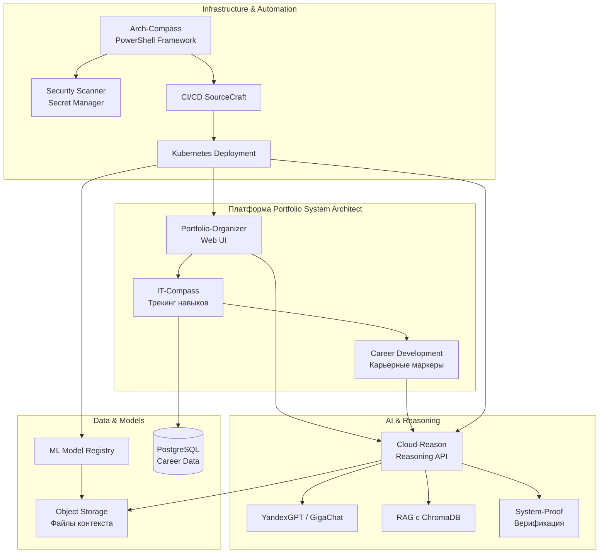
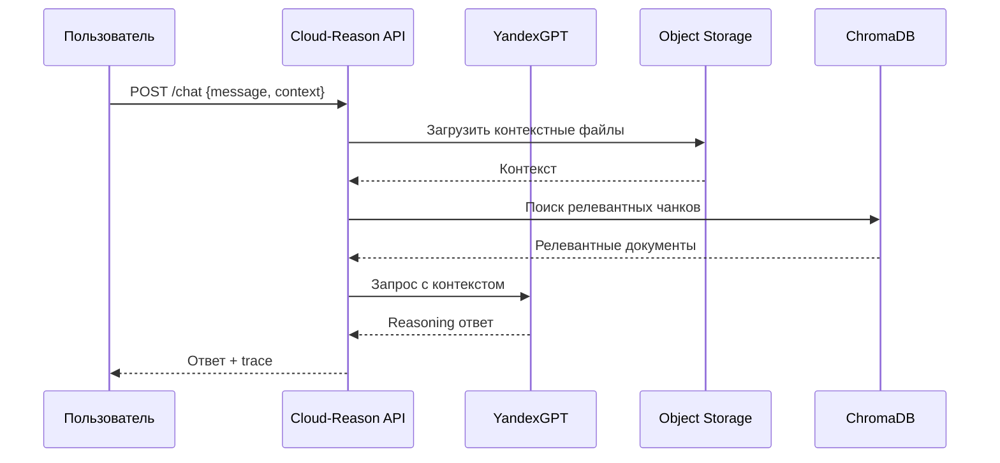

# Архитектурная интеграция проектов

## Общая схема экосистемы



## Детализация Cloud-Reason API



## Интеграция Arch-Compass с Cloud-Reason

Arch-Compass использует Cloud-Reason для анализа архитектурных решений через PowerShell модуль.

```powershell
# Пример использования
$analysis = Invoke-CloudReasonAnalysis -Config "architecture.yaml" -ReasoningAPI "https://cloud-reason.api.yandexcloud.net"
```

## Планируемые улучшения

1. **Расширение Cloud-Reason**:
   - Добавление эндпоинтов `/health`, `/chat`, `/api/v1/reason`, `/api/v1/status`
   - Интеграция с YandexGPT API
   - Загрузка файлов в Object Storage

2. **Расширение Arch-Compass**:
   - Модуль генерации архитектурных диаграмм
   - Интеграция с reasoning API для валидации
   - Поддержка MCP (Model Context Protocol)

3. **Унификация документации**:
   - Единый портал документации с MkDocs
   - Интерактивные диаграммы архитектуры
   - Примеры использования для enterprise

## Следующие шаги

- [ ] Реализовать недостающие эндпоинты в Cloud-Reason
- [ ] Создать PowerShell модуль для интеграции
- [ ] Настроить автоматическое развертывание через SourceCraft
- [ ] Обновить README проектов с новыми возможностями
