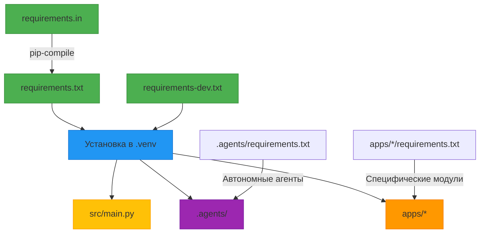

# Архитектурный обзор: Система управления зависимостями

## Общая архитектура управления зависимостями

Проект использует многоуровневую систему управления зависимостями, соответствующую принципам модульной архитектуры и лучшим практикам Python-разработки.

```
portfolio-system-architect/
├── requirements.in               # Ядро: основные зависимости проекта
├── requirements.txt             # Ядро: полный снимок зависимостей (генерируется)
├── requirements-dev.txt         # Ядро: зависимости для разработки
├── .venv/                       # Изолированное окружение
├── src/                         # Основной код приложения
│   └── main.py
├── .agents/                     # Автономные агенты
│   └── requirements.txt
├── apps/                        # Микросервисы/модули
│   ├── portfolio-organizer/
│   ├── ml-model-registry/
│   └── ...
└── docs/                        # Документация
    └── architecture/
        └── dependency-management.md  # Этот документ
```

## Уровни управления зависимостями

### Уровень 1: Ядро проекта (корневой каталог)

Самый высокий уровень управления зависимостями, определяющий основной технологический стек.

**Файлы:**
- `requirements.in` - декларативное описание основных зависимостей
- `requirements.txt` - детализированный снимок всех зависимостей (генерируется автоматически)
- `requirements-dev.txt` - зависимости для разработки и инструментов

**Принципы:**
- `requirements.in` содержит только прямые зависимости
- `requirements.txt` генерируется из `requirements.in` с помощью `pip-compile`
- Версии зависимостей фиксируются для воспроизводимости

### Уровень 2: Специализированные компоненты (.agents, .codeassistant)

Зависимости для специализированных систем и агентов.

**.agents/ (Cognitive Automation Agent)**:
- Имеет собственный `requirements.txt` для автономных функций
- Зависимости сфокусированы на автоматизации и интеллектуальных возможностях
- Может использовать подмножество глобальных зависимостей

**.codeassistant/ (SourceCraft Agent)**:
- Не имеет явных файлов requirements (использует конфигурации в YAML)
- Зависимости управляются через `ai-models.yaml` и `mcp.json`
- Фокус на конфигурации и навыках (skills), а не на коде

### Уровень 3: Приложения (apps/)

Модульная архитектура с независимыми приложениями.

**Принципы:**
- Каждое приложение в `apps/` может иметь свои специфические зависимости
- Приложения могут наследовать или расширять глобальные зависимости
- Возможна изоляция зависимостей для независимого развертывания

## Поток управления зависимостями



## Архитектурные принципы

### Принцип 1: Декларативное управление зависимостями
- `requirements.in` - декларативное описание "что нужно"
- `requirements.txt` - императивное описание "что установлено"
- Разделение ответственности: разработчики редактируют `requirements.in`, система генерирует `requirements.txt`

### Принцип 2: Воспроизводимость и детерминированность
- Все версии зависимостей зафиксированы в `requirements.txt`
- Использование `pip-compile` гарантирует одинаковую установку на всех окружениях
- Хеши пакетов включены для безопасности

### Принцип 3: Модульность и изоляция
- Глобальные зависимости в корне проекта
- Локальные зависимости в подкаталогах по необходимости
- Возможность изоляции приложений для независимого развертывания

### Принцип 4: Разделение окружений
- Основные зависимости: `requirements.in` → `requirements.txt`
- Зависимости разработки: `requirements-dev.txt`
- Зависимости тестирования: включены в `requirements-dev.txt`
- Зависимости продакшена: только `requirements.txt`

## Практическое руководство

### Добавление новой зависимости

```bash
# 1. Добавить в requirements.in
echo "new-package" >> requirements.in

# 2. Сгенерировать обновленный requirements.txt
pip-compile requirements.in

# 3. Установить зависимости
pip install -r requirements.txt
```

### Обновление зависимостей

```bash
# 1. Обновить requirements.in при необходимости
# 2. Перегенерировать requirements.txt
pip-compile --upgrade requirements.in

# 3. Проверить совместимость
pip install -r requirements.txt
pytest
```

### Работа с окружением разработки

```bash
# Установить все зависимости для разработки
pip install -r requirements-dev.txt

# Запустить линтер
ruff check src/

# Запустить тесты
pytest
```

## Интеграция с архитектурой проекта

### Взаимодействие с Cognitive Automation Agent (.agents)

```python
# .agents/ может использовать зависимости из глобального окружения
# или иметь свои специфические зависимости

# Пример использования в .agents/launch-script.py
from apps.career_development.src.main import app  # Использование основного приложения
import requests  # Использование глобальной зависимости
import click     # Использование глобальной зависимости
```

### Взаимодействие с SourceCraft Agent (.codeassistant)

```yaml
# .codeassistant использует конфигурационный подход
# ai-models.yaml
models:
  - name: gpt-4
    endpoint: https://api.openai.com/v1/chat/completions
    dependencies: [openai]  # Зависимости для конкретных навыков
```

## Рекомендации по развитию

### Краткосрочные (1-2 недели)
- [x] Создать этот архитектурный документ
- [ ] Обновить Makefile для управления зависимостями
- [ ] Создать скрипты для автоматического обновления зависимостей

### Среднесрочные (1 месяц)
- [ ] Настроить автоматическое сканирование уязвимостей
- [ ] Реализовать политику обновления зависимостей
- [ ] Создать dashboard для мониторинга состояния зависимостей

### Долгосрочные (3 месяца)
- [ ] Реализовать автоматическое тестирование совместимости зависимостей
- [ ] Создать систему A/B тестирования для обновлений
- [ ] Разработать механизм обратной связи для оценки стабильности зависимостей

## Метрики здоровья системы зависимостей

| Метрика | Цель | Текущее состояние |
|---------|------|------------------|
| Воспроизводимость установки | 100% | ? |
| Время установки зависимостей | < 5 минут | ? |
| Количество уязвимостей | 0 | ? |
| Средний возраст зависимостей | < 6 месяцев | ? |
| Покрытие тестами | > 80% | ? |

---

*Документ создан: 2026-04-16*
*Версия: 1.0*
*Статус: Черновик*
