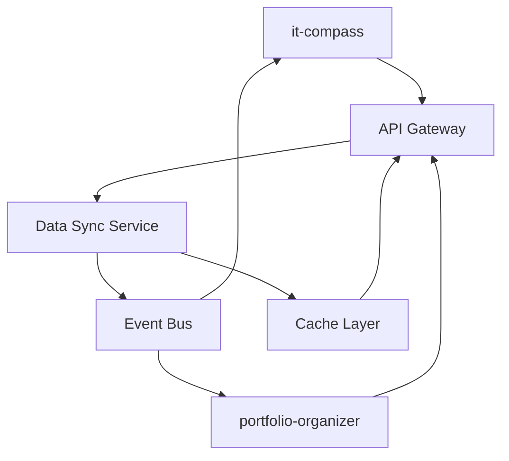

# Кейс 1: Интеграция it-compass и portfolio-organizer

## Описание

Этот кейс демонстрирует интеграцию двух ключевых компонентов экосистемы:
- it-compass: система отслеживания прогресса и развития навыков
- portfolio-organizer: система организации и представления портфолио

## Цели интеграции

1. Создание единой системы отслеживания и представления профессионального развития
2. Автоматизация процесса обновления портфолио на основе достижений в it-compass
3. Обеспечение согласованности данных между двумя системами

## Архитектурные решения

### Компоненты интеграции

1. **API Gateway** - единая точка входа для всех запросов к системе
2. **Data Sync Service** - сервис синхронизации данных между it-compass и portfolio-organizer
3. **Event Bus** - шина событий для асинхронной передачи данных
4. **Cache Layer** - кэширование часто запрашиваемых данных для повышения производительности

### Диаграмма интеграции

## Результаты интеграции

1. Автоматическое обновление портфолио при достижении новых целей в it-compass
2. Единая система аутентификации и авторизации
3. Согласованное представление данных о навыках и достижениях
4. Повышенная эффективность за счет автоматизации рутинных операций
