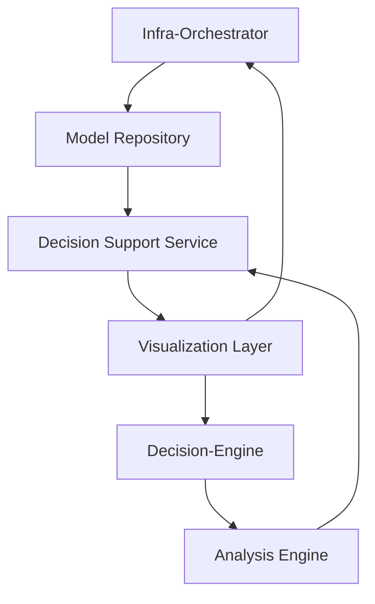

# Кейс 2: Интеграция Infra-Orchestrator и Decision-Engine

## Описание

Этот кейс демонстрирует интеграцию библиотеки инфраструктурной оркестрации с облачной платформой для принятия решений:
- Infra-Orchestrator: библиотека PowerShell для оркестрации инфраструктуры
- Decision-Engine: система принятия решений с RAG и логикой вывода

## Цели интеграции

1. Создание единой среды для архитектурного проектирования и анализа решений
2. Автоматизация процесса верификации архитектурных решений
3. Обеспечение согласованности между архитектурными моделями и аналитическими данными

## Архитектурные решения

### Компоненты интеграции

1. **Model Repository** - репозиторий архитектурных моделей
2. **Analysis Engine** - движок анализа архитектурных решений
3. **Decision Support Service** - сервис поддержки принятия решений
4. **Visualization Layer** - слой визуализации архитектурных моделей и аналитических данных

### Диаграмма интеграции

## Результаты интеграции

1. Автоматическая верификация архитектурных решений на основе аналитических данных
2. Единая среда для проектирования и анализа архитектуры
3. Согласованное представление архитектурных моделей и аналитических данных
4. Повышенная эффективность архитектурного проектирования за счет автоматизации анализа

