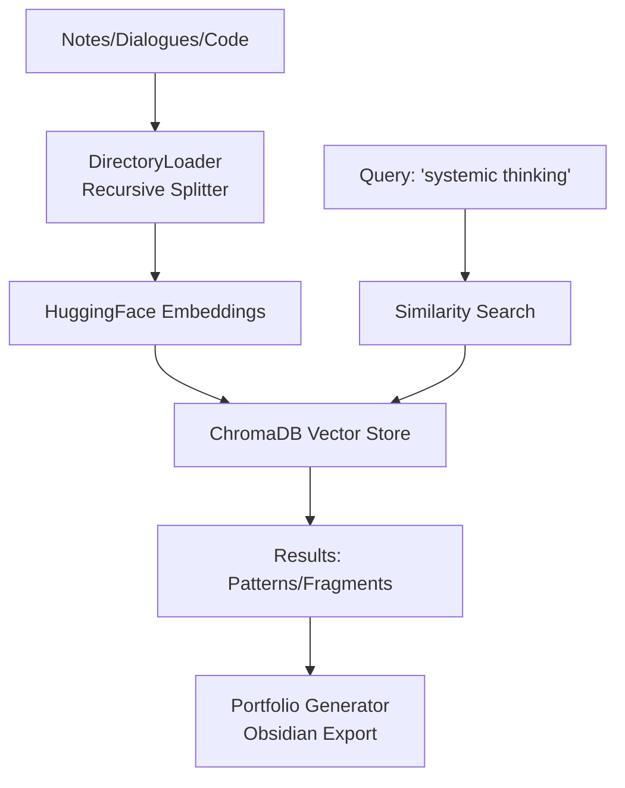

# 06. GigaChain RAG Self-Analysis: Proof of Systemic Thinking

## 🎯 Case Overview
**Problem**: How to objectively measure systemic thinking when traditional metrics (code lines, years experience) don't apply? Solution: Build RAG system to analyze own notes/dialogues/code for patterns.

**Evolution from**: [01_knowledge_management](../01_knowledge_management/) - scales manual knowledge mgmt to automated self-analysis.

**Key Achievement**: 111 fragments evidencing patterns like связи_и_взаимодействия (15, 13.5%), аналитическое_мышление (12, 10.8%).

## 🏗️ Architecture Decisions (Systemic Thinking Proof)
- **GigaChain/LangChain-GigaChat**: Russian LLM integration, offline-capable.
- **ChromaDB**: Local vector store (no cloud dependency).
- **HuggingFace Embeddings**: Free, multilingual (sentence-transformers/paraphrase-multilingual-MiniLM-L12-v2).
- **Trade-offs**:
  | Option | Pros | Cons | Chosen? |
  |--------|------|------|---------|
  | GigaChat Embeddings | Native | Paid tokens | No (cost) |
  | OpenAI Embeddings | High quality | Blocked | No (geoblock) |
  | HuggingFace | Free, local | Slower | ✅ Yes |

## 📊 Sanitized Results
- Indexed: All project folders (thought-architecture, portfolio-organizer, etc.).
- Fragments: 111 unique.
- Top Patterns:
  | Pattern | Count | % |
  |---------|-------|---|
  | связи_и_взаимодействия | 15 | 13.5 |
  | аналитическое_мышление | 12 | 10.8 |
  | критическое_мышление | 11 | 9.9 |

Example (anonymized): Query "выявила взаимосвязи" (score 5.02) → Chronology of breakthrough phases (structuring = connections).

## 🔧 Setup (Template)
1. `pip install langchain-gigachat langchain-chroma langchain-huggingface sentence-transformers`
2. `.env`: `GIGACHAT_API_KEY=your_key`
3. `python index_all_folders.py`
4. Search: `python search_deep.py`

## 💡 Systemic Proof
Building this evidences:
- **Integration**: Combined free/paid, local/cloud trade-offs.
- **Scalability**: Incremental indexing, recursive folders.
- **UX**: Telegram notifications, Obsidian graphs.
- Links: [IT-Compass Markers](../02_METHODOLOGY/markers/systemic-thinking-markers.md)

*See [ARCHITECTURE_DECISIONS.md], [RESULTS_SANITIZED.md].*
