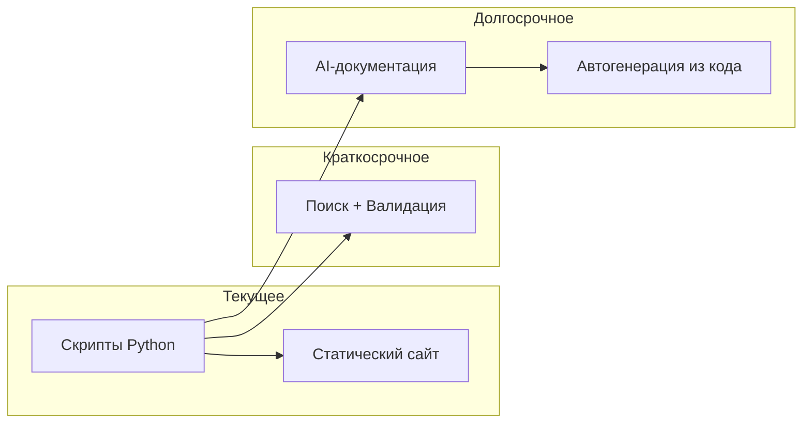

# Дальнейшие шаги

## Улучшения

### 1. Расширенная функциональность

- [ ] **Генерация оглавления** — автоматическое создание TOC для каждого файла
- [ ] **Поиск по сайту** — добавить клиентский поиск (Lunr.js или Fuse.js)
- [ ] **Sitemap** — генерация sitemap.xml для SEO
- [ ] **RSS-лента** — автоматическое создание RSS-фида

### 2. Улучшение качества

- [ ] **Валидация ссылок** — проверка битых ссылок между документами
- [ ] **Проверка орфографии** — интеграция spell-checking
- [ ] **Linter для Markdown** — автоматическое форматирование
- [ ] **Тесты покрытия** — добавить unit-тесты для скриптов

### 3. Интеграции

- [ ] **Obsidian Plugins** — создание плагина для автоматического импорта
- [ ] **VSCode Extension** — генерация прямо из IDE
- [ ] **Slack-уведомления** — оповещения об обновлениях
- [ ] **Telegram Bot** — отправка документации в мессенджер

### 4. CI/CD

- [ ] **PR Preview** — автоматическийpreview для Pull Requests
- [ ] **Branch-specific generation** — разные сайты для разных веток
- [ ] **Performance monitoring** — отслеживание времени генерации
- [ ] **Cache** — кэширование для ускорения

## Долгосрочное видение

### Уровень 1: Стабилизация
- Добавить тесты
- Улучшить обработку ошибок
- Документировать API

### Уровень 2: Расширение
- Поиск по сайту
- Генерация sitemap
- Интеграция с Obsidian

### Уровень 3: AI-документация
- Генерация документации из кода (docstrings)
- Автоматическое создание API-документации
- ИИ-анализ качества документации

## Исследовательские направления

### 1. Semantic Documentation
- Использование LLM для генерации описаний
- Автоматическое создание примеров использования
- Генерация документации из тестов

### 2. Interactive Documentation
- Живые примеры кода
- Интерактивные диаграммы
- Встроенные песочницы

### 3. Multi-language Support
- Автоматический перевод документации
- Поддержка нескольких языков
- Локализация интерфейса сайта

## Приоритеты

| Приоритет | Задача | Время |
|-----------|--------|-------|
| 🔴 Высокий | Поиск по сайту | 1 неделя |
| 🔴 Высокий | Валидация ссылок | 1 неделя |
| 🟡 Средний | Sitemap + RSS | 2 недели |
| 🟡 Средний | Тесты для скриптов | 2 недели |
| 🟢 Низкий | AI-документация | 1 месяц |

## Как принять участие

1. **Fork** репозитория
2. **Создайте ветку** для новой функциональности
3. **Добавьте изменения** с тестами
4. **Pull Request** с описанием изменений

## Ресурсы

- [Документация Bootstrap](https://getbootstrap.com/)
- [Mermaid.js](https://mermaid.js.org/)
- [Python Markdown](https://python-markdown.github.io/)
- [GitHub Actions](https://docs.github.com/en/actions)

## Заключение

Система автоматизации документации — это фундамент для масштабируемого документирования проекта. Дальнейшее развитие позволит:

- Сократить время на поддержку документации
- Улучшить качество и доступность
- Интегрировать современные AI-технологии

Следующие шаги зависят от приоритетов проекта и обратной связи пользователей.
