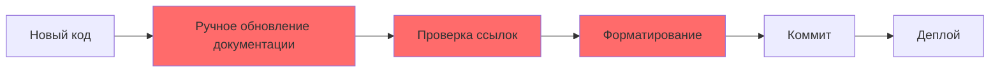
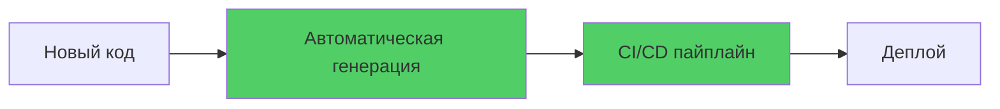

# Проблема

## Контекст

При ведении крупного проекта с множеством компонентов, кейсов и документации возникает ряд проблем:

1. **Масштабируемость документации**
   - Ручное обновление документации занимает много времени
   - При добавлении новых компонентов нужно вручную обновлять все связанные документы
   - Легко пропустить обновление важных разделов

2. **Консистентность**
   - Разные файлы могут иметь разный формат
   - Трудно поддерживать единый стиль оформления
   - Ссылки между документами могут устаревать

3. **Доступность**
   - Трудно найти нужную информацию в большом количестве файлов
   - Нет единой точки входа для новых участников
   - Сложно представить проект внешним аудиториям

4. **Автоматизация**
   - Отсутствие автоматического обновления при изменениях в коде
   - Нет интеграции с CI/CD
   - Ручной процесс подвержен ошибкам

## Анализ проблемы

### Традиционный подход

Проблемы традиционного подхода:
- ❌ Занимает много времени
- ❌ Подвержен ошибкам
- ❌ Не масштабируется
- ❌ Нет автоматизации

### Целевое состояние

Преимущества автоматизации:
- ✅ Экономия времени
- ✅ Консистентность
- ✅ Масштабируемость
- ✅ Интеграция с GitHub

## Критерии успешного решения

1. **Время на обновление** — сократить с часов до минут
2. **Покрытие документацией** — 100% файлов должны быть задокументированы
3. **Автоматизация** — генерация без ручного вмешательства
4. **Качество** — единый формат и стиль
5. **Доступность** — легкий поиск и навигация
