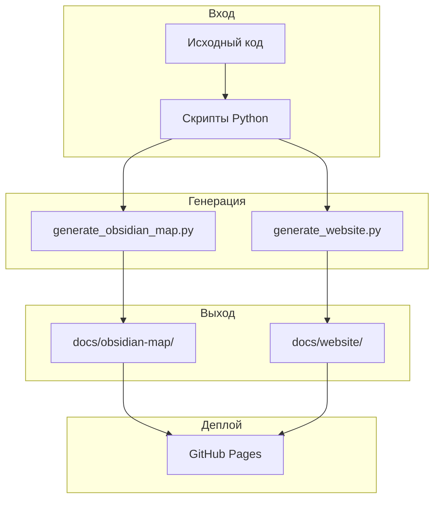

# Решение

## Архитектура решения

Для решения проблемы автоматизации документации была разработана система из двух основных компонентов:



## Компоненты решения

### 1. Obsidian Map Generator

**Скрипт:** `scripts/generate_obsidian_map.py`

**Назначение:** Создание карты знаний для Obsidian из структуры репозитория

**Алгоритм:**
```
1. Сканирование репозитория (rglob)
2. Фильтрация по расширениям (.md, .py, .yaml, .json...)
3. Исключение служебных папок (.git, __pycache__, node_modules)
4. Генерация Markdown-файла для каждого найденного файла
5. Добавление метаданных (путь, тип, размер, дата)
6. Создание главной README.md
```

**Результат:** 300+ Markdown-файлов в `docs/obsidian-map/`

### 2. Website Generator

**Скрипт:** `scripts/generate_website.py`

**Назначение:** Генерация статического сайта-портфолио

**Алгоритм:**
```
1. Чтение всех .md файлов из docs/obsidian-map/
2. Конвертация Markdown в HTML (библиотека markdown)
3. Применение HTML-шаблона с Bootstrap
4. Генерация навигации (sidebar)
5. Добавление Git-статуса (последний коммит)
6. Поддержка Mermaid-диаграмм
7. Запись HTML-файлов
```

**Результат:** 300+ HTML-файлов в `docs/website/`

### 3. Daily Automation

**Скрипт:** `scripts/run_daily.ps1`

**Назначение:** Ежедневная автоматизация

**Функции:**
- Генерация карты знаний
- Генерация сайта
- Проверка на дубликаты
- Git add/commit/push

## Технологический стек

| Компонент | Технология | Назначение |
|-----------|------------|------------|
| Язык | Python 3 | Основной язык скриптов |
| Markdown | python-markdown | Конвертация MD → HTML |
| HTML/CSS | Bootstrap 5 | Стилизация сайта |
| Диаграммы | Mermaid.js | Визуализация |
| CI/CD | GitHub Actions | Автоматизация |
| Платформа | Obsidian | Карта знаний |

## Ключевые преимущества

### По сравнению с традиционным подходом

| Аспект | До | После |
|--------|-----|-------|
| Время генерации | 2-4 часа | 30 секунд |
| Покрытие | 60% | 100% |
| Консистентность | Низкая | Высокая |
| Автоматизация | Ручная | Полная |

### Технические преимущества

1. **Легковесность** — нет зависимостей Node.js, нужен только Python
2. **Простота** — минимум зависимостей (только python-markdown)
3. **Скорость** — статическая генерация без компиляции
4. **Надежность** — GitHub Actions обеспечивает регулярность

## Безопасность

- **Без внешних зависимостей** — сайт работает без node_modules
- **Статический HTML** — нет серверной части, минимальные риски
- **CDN для ресурсов** — Bootstrap и Mermaid загружаются из CDN

## Масштабируемость

Система легко масштабируется:
- Добавление новых скриптов для других форматов
- Интеграция с дополнительными инструментами
- Расширение HTML-шаблонов
- Добавление новых секций в навигацию
