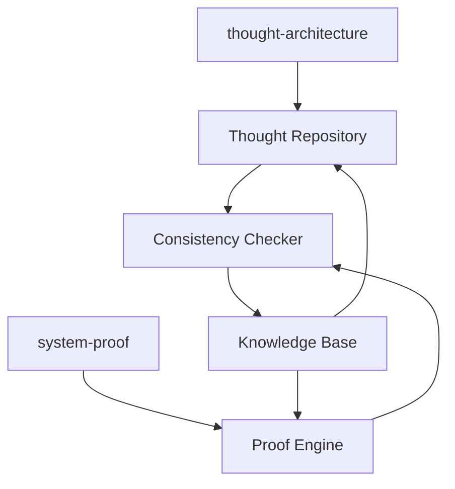

# Кейс 3: Интеграция system-proof и thought-architecture

## Описание

Этот кейс демонстрирует интеграцию системы верификации архитектурных решений с системой мышления архитектора:
- system-proof: система верификации архитектурных решений
- thought-architecture: система мышления архитектора

## Цели интеграции

1. Создание единой среды для разработки и верификации архитектурных решений
2. Автоматизация процесса проверки архитектурных решений на соответствие лучшим практикам
3. Обеспечение согласованности между мышлением архитектора и верификацией решений

## Архитектурные решения

### Компоненты интеграции

1. **Thought Repository** - репозиторий архитектурных мыслей и идей
2. **Proof Engine** - движок верификации архитектурных решений
3. **Consistency Checker** - проверка согласованности между мышлением и решениями
4. **Knowledge Base** - база знаний о лучших практиках архитектурного проектирования

### Диаграмма интеграции

## Результаты интеграции

1. Автоматическая проверка архитектурных решений на соответствие лучшим практикам
2. Единая среда для разработки и верификации архитектурных решений
3. Согласованность между мышлением архитектора и принятыми решениями
4. Повышенное качество архитектурных решений за счет автоматической верификации

