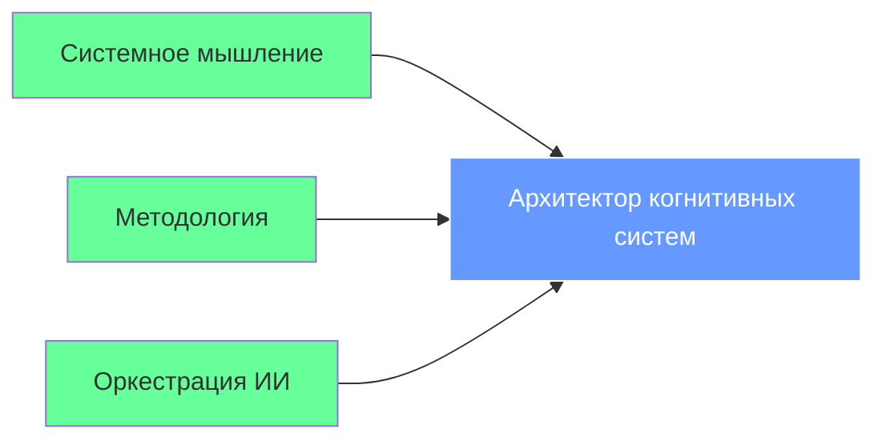
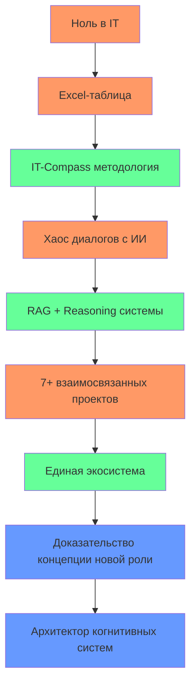

# Презентация: Екатерина Куделя — Архитектор когнитивных систем

> **Документальный фильм о рождении новой профессии в эпоху ИИ**

---

## Слайд 1: Заглавный слайд

# **Екатерина Куделя**
## Архитектор когнитивных систем

> "Я не пишу код. Я проектирую системы, в которых ИИ пишет код под моим руководством."

---

## Слайд 2: Кто я

### **Я — архитектор когнитивных систем**

Моя профессиональная роль создана в эпоху ИИ и существует на стыке:



- **Системное мышление** как фундаментальная архитектурная компетенция
- **Методология** как основной продукт (IT-Compass, Arch-Compass)
- **Оркестрация ИИ** как профессиональный инструмент

---

## Слайд 3: Моя уникальная ценность

| Что делает классический IT-специалист | Что делаю я |
|-------------------------------------|-------------|
| Пишет код | **Проектирую системы, где ИИ пишет код** |
| Собирает данные | **Создаю RAG-системы, которые автоматически анализируют мой digital footprint** |
| Планирует проект | **Создаю циклы Reasoning, где ИИ анализирует ИИ, извлекая мета-инсайты** |
| Ведет документацию | **Автоматизирую генерацию документации и портфолио** |

**Я не вписываюсь в старые роли, потому что создаю новую.**

---

## Слайд 4: Путь от хаоса к порядку



**Это не карьера. Это археологическое собрание моего пути.**

---

## Слайд 5: Ключевые проекты

### 🔧 IT-Compass
**Методология объективных маркеров компетенций**
- Преобразует личный опыт в измеримые показатели
- Автоматически генерирует портфолио

### 🧭 Arch-Compass-Framework
**PowerShell фреймворк для архитекторов**
- Инструмент оркестрации сложных процессов
- Включает механизмы безопасности и управления секретами

### 📊 Portfolio Organizer
**Система автоматического портфолио**
- Структурирует и анализирует проекты
- Генерирует интерактивные отчеты и аналитику

---

## Слайд 6: Доказательство концепции

### `portfolio-system-architect`- мой документальный фильм

```
cognitive-architect-manifesto/
├── 01_JOURNEY/    → **Путь** (доказательство эволюции)
├── 02_METHODOLOGY/ → **Ядро** (то, что создано)
├── 03_EVIDENCE/    → **Доказательства** (что работает)
├── 04_ARTIFACTS/   → **Артефакты** (результаты)
└── 05_MANIFEST/    → **Манифест** (кто я теперь)
```

**Это не код. Это повествование о рождении новой профессии.**

---

## Слайд 7: Грант Sourcecraft Open Source

> "Этот репозиторий- мое доказательство концепции.
> За два года я прошла путь от Excel-таблички до архитектора когнитивных систем.
> Я не пишу код- я проектирую системы, в которых ИИ становится моим агентом.
> Моя работа- это вклад в будущее профессии, где ценность создается через системное мышление и оркестрацию технологий."

**Цель гранта**: Довести доказательство концепции до завершения и предъявить его миру.

---

## Слайд 8: Заключение

### **Я создала новую профессиональную категорию**

- **Новая роль**: Архитектор когнитивных систем
- **Новая ценность**: Объективация субъективного опыта
- **Новый подход**: Проектирование систем, где человек управляет ИИ

> "Я не ищу работу. Я создаю новую профессию и приглашаю мир стать ее свидетелем."

---

## Слайд 9: Контакты

### Связаться со мной

- **Email**: leadarchitect@yandex.ru
- **GitHub**: [github.com/leadarchitect-ai](https://github.com/leadarchitect-ai)
- **Профиль в экосистеме**: [portfolio-system-architect](https://github.com/leadarchitect-ai/portfolio-system-architect)

### Материалы

- **Личный профиль**: [about-me.md](about-me.md)
- **Резюме**: [personal-resume.md](personal-resume.md)
- **Полная заявка на грант**: [cognitive-architect-manifesto/04_ARTIFACTS/grants/grant-proposal.md](cognitive-architect-manifesto/04_ARTIFACTS/grants/grant-proposal.md)

> Спасибо за внимание!
