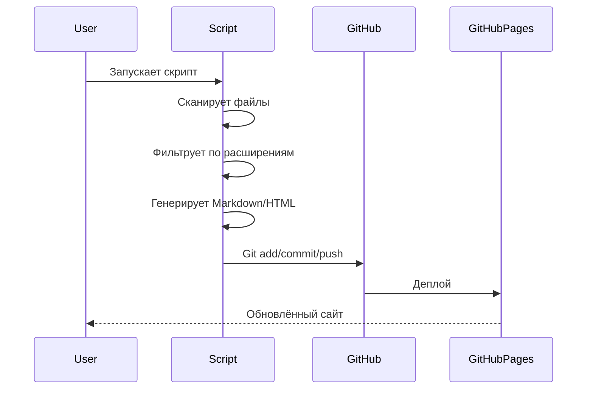

# Реализация

## Структура файлов

```
scripts/
├── generate_obsidian_map.py   # Генерация карты знаний
├── generate_website.py         # Генерация сайта
├── run_daily.ps1               # Ежедневная автоматизация
└── ...
```

## Детали реализации

### generate_obsidian_map.py

```python
# Основные параметры
REPO_ROOT: Path = Path(".")           # Корень репозитория
OUTPUT_DIR: Path = Path("docs/obsidian-map")  # Выходная директория

# Игнорируемые директории
IGNORED_DIRS: Set[str] = {
    ".git", "__pycache__", "node_modules", 
    "venv", "env", ".vscode", ".idea"
}

# Включаемые расширения
INCLUDE_EXTENSIONS: Set[str] = {
    ".md", ".py", ".ps1", ".sh", 
    ".yaml", ".yml", ".json", ".toml"
}
```

**Функции:**
1. `get_all_files()` — рекурсивное сканирование
2. `generate_note_content()` — создание содержимого заметки
3. `main()` — основная логика

### generate_website.py

```python
# Параметры
INPUT_DIR: Path = Path("docs/obsidian-map")   # Вход
OUTPUT_DIR: Path = Path("docs/website")        # Выход

# HTML-шаблон (упрощённо)
HTML_TEMPLATE = """
<!DOCTYPE html>
<html lang="ru">
<head>
    <title>{title} — portfolio</title>
    <link href="https://cdn.jsdelivr.net/npm/bootstrap@5.3.0/...">
    <script type="module">
        import mermaid from 'https://cdn.jsdelivr.net/...';
    </script>
</head>
<body>
    <nav class="sidebar">{navigation}</nav>
    <main>{content}</main>
</body>
</html>
"""
```

**Функции:**
1. `generate_nav_links()` — создание навигации
2. `md_to_html()` — конвертация Markdown в HTML
3. `convert()` — основная логика

## Пайплайн обработки



## Примеры использования

### Локальный запуск

```bash
# Генерация карты знаний
python scripts/generate_obsidian_map.py

# Генерация сайта
python scripts/generate_website.py

# Ежедневная автоматизация
.\scripts\run_daily.ps1
```

### GitHub Actions

```yaml
# .github/workflows/generate-docs.yml
name: Generate Documentation

on:
  push:
    branches: [main]
  schedule:
    - cron: '0 0 * * *'  # Ежедневно

jobs:
  generate:
    runs-on: ubuntu-latest
    steps:
      - uses: actions/checkout@v3
      - name: Setup Python
        uses: actions/setup-python@v4
        with:
          python-version: '3.11'
      - name: Install dependencies
        run: pip install markdown
      - name: Generate Obsidian map
        run: python scripts/generate_obsidian_map.py
      - name: Generate website
        run: python scripts/generate_website.py
      - name: Commit and push
        run: |
          git config --local user.email "action@github.com"
          git config --local user.name "GitHub Action"
          git add -A
          git commit -m "docs: auto-generate documentation" || exit 0
          git push
```

## Результат работы

### Генерируемые файлы

| Директория | Файлов | Тип |
|------------|--------|-----|
| `docs/obsidian-map/` | 300+ | .md |
| `docs/website/` | 300+ | .html |

### Содержимое заметки Obsidian

```markdown
# ARCHITECTURE.md

- **Путь**: `ARCHITECTURE.md`
- **Тип**: .MD
- **Размер**: 15234 байт
- **Последнее изменение**: 1709234567.123

## Предпросмотр

```
# Portfolio System Architect

> Система для проектирования...
...
```
```

### HTML-страница сайта

- Bootstrap 5 стилизация
- Sidebar с навигацией
- Mermaid.js для диаграмм
- Адаптивный дизайн
- Git-статус в подвале

## Обработка ошибок

Скрипты включают базовую обработку ошибок:

```python
try:
    with open(md_file, "r", encoding="utf-8") as f:
        content = f.read()
except Exception as e:
    print(f"[!] Не удалось прочитать {md_file}: {e}")
```

## Расширяемость

Система легко расширяется:

1. **Новые форматы** — добавить в `INCLUDE_EXTENSIONS`
2. **Новые шаблоны** — изменить `HTML_TEMPLATE`
3. **Новые скрипты** — создать аналогичные генераторы
4. **CI/CD** — добавить новые GitHub Actions


